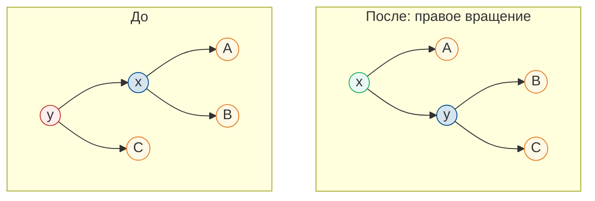

АВЛ-дерево (названо в честь изобретателей Адельсона-Вельского и Ландиса, 1962) — это первое самобалансирующееся двоичное дерево поиска. Оно гарантирует высоту $O(\log n)$ для любых операций. АВЛ-дерево строится на основе [операций BST]({}), дополненных вращениями для поддержания баланса.

## Определение и условие балансировки

>[!def]
>**АВЛ-дерево** — это двоичное дерево поиска, в котором для каждой вершины высоты её левого и правого поддеревьев различаются не более чем на 1.

>[!def]
>**Баланс-фактор** вершины $v$ — это разность высот правого и левого поддеревьев:
>$$
>BF(v) = h(v.\text{right}) - h(v.\text{left})
>$$
>
>В АВЛ-дереве баланс-фактор каждой вершины принимает значения из множества $\{-1, 0, 1\}$.

```
Пример АВЛ-дерева:
        8
       / \
      4   10
     / \    \
    2   6    12
   /
  1

Баланс-факторы:
Узел 8: h(правое) - h(левое) = 2 - 3 = -1  ✓
Узел 4: h(правое) - h(левое) = 1 - 2 = -1  ✓
Узел 10: h(правое) - h(левое) = 1 - 0 = 1   ✓
Узел 2: 0 - 1 = -1  ✓
Узел 6: 0 - 0 = 0   ✓
Узел 12: 0 - 0 = 0  ✓
Узел 1: 0 - 0 = 0   ✓
```

## Оценка высоты АВЛ-дерева

>[!theorem]
>АВЛ-дерево с $n$ вершинами имеет высоту $h < c \log_2 n$, где $c \approx 1.44$. Точнее:
>$$
>h < \frac{\log_2(n+1)}{\log_2 \phi} \approx 1.44 \log_2(n+1)
>$$
>где $\phi = \frac{1+\sqrt{5}}{2}$ — золотое сечение.
>{}
Пусть $N_h$ — минимальное количество вершин в АВЛ-дереве высоты $h$.

Очевидно, $N_0 = 1$ (одна вершина), $N_1 = 2$ (корень и один ребёнок).

Для дерева высоты $h \geqslant 2$: одно поддерево имеет высоту $h-1$, а другое — либо $h-1$, либо $h-2$ (по условию балансировки). Минимум вершин достигается, когда одно поддерево имеет высоту $h-1$, а другое — $h-2$:

$$
N_h = 1 + N_{h-1} + N_{h-2}
$$

Это рекуррентное соотношение для чисел Фибоначчи! Точное решение:

$$
N_h = F_{h+2} - 1
$$

где $F_k$ — $k$-е число Фибоначчи.

Используя формулу Бине $F_n \approx \frac{\phi^n}{\sqrt{5}}$:

$$
n \geqslant N_h \approx \frac{\phi^{h+2}}{\sqrt{5}} - 1
$$

Откуда:

$$
h \lesssim \log_\phi(n+1) = \frac{\log_2(n+1)}{\log_2 \phi} \approx 1.44 \log_2(n+1)
$$
{}

>[!corollar]
>Все операции в АВЛ-дереве (поиск, вставка, удаление) работают за $O(\log n)$.

## Структура узла


{}
```python
class AVLNode:
    def __init__(self, key):
        self.key = key
        self.left = None
        self.right = None
        self.parent = None
        self.height = 1  # Высота поддерева

    def balance_factor(self):
        """Вычисление баланс-фактора"""
        left_height = self.left.height if self.left else 0
        right_height = self.right.height if self.right else 0
        return right_height - left_height

    def update_height(self):
        """Обновление высоты узла"""
        left_height = self.left.height if self.left else 0
        right_height = self.right.height if self.right else 0
        self.height = max(left_height, right_height) + 1
```
{}
{}
```cpp
template<typename T>
struct AVLNode {
    T key;
    AVLNode* left;
    AVLNode* right;
    AVLNode* parent;
    int height;

    AVLNode(T k) : key(k), left(nullptr), right(nullptr), parent(nullptr), height(1) {}

    int balanceFactor() const {
        int leftHeight = left ? left->height : 0;
        int rightHeight = right ? right->height : 0;
        return rightHeight - leftHeight;
    }

    void updateHeight() {
        int leftHeight = left ? left->height : 0;
        int rightHeight = right ? right->height : 0;
        height = std::max(leftHeight, rightHeight) + 1;
    }
};
```
{}


## Вращения

Для восстановления баланса используются вращения — локальные операции, меняющие структуру дерева без нарушения свойства BST.

### Правое вращение (LL-случай)

Применяется, когда баланс-фактор узла равен -2, а баланс-фактор левого ребёнка ≤ 0.



Текстовая схема:

```
        y                x
       / \              / \
      x   C    →       A   y
     / \                  / \
    A   B                B   C
```


{}
```python
def rotate_right(self, y):
    """Правое вращение вокруг узла y"""
    x = y.left

    # Переносим поддерево
    y.left = x.right
    if x.right:
        x.right.parent = y

    # Обновляем родителя x
    x.parent = y.parent
    if y.parent is None:
        self.root = x
    elif y == y.parent.left:
        y.parent.left = x
    else:
        y.parent.right = x

    # Завершаем вращение
    x.right = y
    y.parent = x

    # Обновляем высоты
    y.update_height()
    x.update_height()

    return x
```
{}
{}
```cpp
AVLNode<T>* rotateRight(AVLNode<T>* y) {
    AVLNode<T>* x = y->left;

    // Переносим поддерево
    y->left = x->right;
    if (x->right) {
        x->right->parent = y;
    }

    // Обновляем родителя x
    x->parent = y->parent;
    if (y->parent == nullptr) {
        root = x;
    } else if (y == y->parent->left) {
        y->parent->left = x;
    } else {
        y->parent->right = x;
    }

    // Завершаем вращение
    x->right = y;
    y->parent = x;

    // Обновляем высоты
    y->updateHeight();
    x->updateHeight();

    return x;
}
```
{}


### Левое вращение (RR-случай)

Применяется, когда баланс-фактор узла равен 2, а баланс-фактор правого ребёнка ≥ 0.

```
      x                  y
     / \                / \
    A   y      →       x   C
       / \            / \
      B   C          A   B
```


{}
```python
def rotate_left(self, x):
    """Левое вращение вокруг узла x"""
    y = x.right

    # Переносим поддерево
    x.right = y.left
    if y.left:
        y.left.parent = x

    # Обновляем родителя y
    y.parent = x.parent
    if x.parent is None:
        self.root = y
    elif x == x.parent.left:
        x.parent.left = y
    else:
        x.parent.right = y

    # Завершаем вращение
    y.left = x
    x.parent = y

    # Обновляем высоты
    x.update_height()
    y.update_height()

    return y
```
{}
{}
```cpp
AVLNode<T>* rotateLeft(AVLNode<T>* x) {
    AVLNode<T>* y = x->right;

    // Переносим поддерево
    x->right = y->left;
    if (y->left) {
        y->left->parent = x;
    }

    // Обновляем родителя y
    y->parent = x->parent;
    if (x->parent == nullptr) {
        root = y;
    } else if (x == x->parent->left) {
        x->parent->left = y;
    } else {
        x->parent->right = y;
    }

    // Завершаем вращение
    y->left = x;
    x->parent = y;

    // Обновляем высоты
    x->updateHeight();
    y->updateHeight();

    return y;
}
```
{}


### Двойные вращения

**LR-случай** (баланс-фактор узла = -2, баланс-фактор левого ребёнка = 1):

```
        z              z              x
       / \            / \            / \
      y   D   →      x   D   →     y   z
     / \            / \            / \ / \
    A   x          y   C          A  B C  D
       / \        / \
      B   C      A   B
```

Сначала левое вращение вокруг $y$, затем правое вокруг $z$.

**RL-случай** (баланс-фактор узла = 2, баланс-фактор правого ребёнка = -1):

```
      z              z                x
     / \            / \              / \
    A   y    →     A   x     →     z   y
       / \            / \          / \ / \
      x   D          B   y        A  B C  D
     / \                / \
    B   C              C   D
```

Сначала правое вращение вокруг $y$, затем левое вокруг $z$.


{}
```python
def rebalance(self, node):
    """Балансировка узла"""
    node.update_height()

    balance = node.balance_factor()

    # Левое поддерево тяжелее
    if balance < -1:
        if node.left.balance_factor() > 0:
            # LR-случай
            node.left = self.rotate_left(node.left)
        return self.rotate_right(node)

    # Правое поддерево тяжелее
    if balance > 1:
        if node.right.balance_factor() < 0:
            # RL-случай
            node.right = self.rotate_right(node.right)
        return self.rotate_left(node)

    return node
```
{}
{}
```cpp
AVLNode<T>* rebalance(AVLNode<T>* node) {
    node->updateHeight();

    int balance = node->balanceFactor();

    // Левое поддерево тяжелее
    if (balance < -1) {
        if (node->left->balanceFactor() > 0) {
            // LR-случай
            node->left = rotateLeft(node->left);
        }
        return rotateRight(node);
    }

    // Правое поддерево тяжелее
    if (balance > 1) {
        if (node->right->balanceFactor() < 0) {
            // RL-случай
            node->right = rotateRight(node->right);
        }
        return rotateLeft(node);
    }

    return node;
}
```
{}


## Вставка


{}
```python
class AVLTree:
    def __init__(self):
        self.root = None

    def insert(self, key):
        self.root = self._insert(self.root, key)

    def _insert(self, node, key):
        # Стандартная вставка BST
        if node is None:
            return AVLNode(key)

        if key < node.key:
            node.left = self._insert(node.left, key)
            node.left.parent = node
        else:
            node.right = self._insert(node.right, key)
            node.right.parent = node

        # Балансировка
        return self._rebalance(node)

    def _rebalance(self, node):
        node.update_height()
        balance = node.balance_factor()

        # LL-случай
        if balance < -1 and node.left.balance_factor() <= 0:
            return self._rotate_right(node)

        # LR-случай
        if balance < -1 and node.left.balance_factor() > 0:
            node.left = self._rotate_left(node.left)
            return self._rotate_right(node)

        # RR-случай
        if balance > 1 and node.right.balance_factor() >= 0:
            return self._rotate_left(node)

        # RL-случай
        if balance > 1 and node.right.balance_factor() < 0:
            node.right = self._rotate_right(node.right)
            return self._rotate_left(node)

        return node

    def _rotate_right(self, y):
        x = y.left
        y.left = x.right
        if x.right:
            x.right.parent = y
        x.parent = y.parent
        x.right = y
        y.parent = x
        y.update_height()
        x.update_height()
        return x

    def _rotate_left(self, x):
        y = x.right
        x.right = y.left
        if y.left:
            y.left.parent = x
        y.parent = x.parent
        y.left = x
        x.parent = y
        x.update_height()
        y.update_height()
        return y
```
{}
{}
```cpp
template<typename T>
class AVLTree {
private:
    AVLNode<T>* root;

    AVLNode<T>* insert(AVLNode<T>* node, const T& key) {
        // Стандартная вставка BST
        if (node == nullptr) {
            return new AVLNode<T>(key);
        }

        if (key < node->key) {
            node->left = insert(node->left, key);
            node->left->parent = node;
        } else {
            node->right = insert(node->right, key);
            node->right->parent = node;
        }

        // Балансировка
        return rebalance(node);
    }

    AVLNode<T>* rebalance(AVLNode<T>* node) {
        node->updateHeight();
        int balance = node->balanceFactor();

        // LL-случай
        if (balance < -1 && node->left->balanceFactor() <= 0) {
            return rotateRight(node);
        }

        // LR-случай
        if (balance < -1 && node->left->balanceFactor() > 0) {
            node->left = rotateLeft(node->left);
            return rotateRight(node);
        }

        // RR-случай
        if (balance > 1 && node->right->balanceFactor() >= 0) {
            return rotateLeft(node);
        }

        // RL-случай
        if (balance > 1 && node->right->balanceFactor() < 0) {
            node->right = rotateRight(node->right);
            return rotateLeft(node);
        }

        return node;
    }

public:
    AVLTree() : root(nullptr) {}

    void insert(const T& key) {
        root = insert(root, key);
    }

    // ... остальные методы
};
```
{}


## Удаление


{}
```python
def delete(self, key):
    self.root = self._delete(self.root, key)

def _delete(self, node, key):
    if node is None:
        return None

    if key < node.key:
        node.left = self._delete(node.left, key)
    elif key > node.key:
        node.right = self._delete(node.right, key)
    else:
        # Нашли узел для удаления
        if node.left is None:
            return node.right
        elif node.right is None:
            return node.left
        else:
            # Узел с двумя детьми
            successor = self._minimum(node.right)
            node.key = successor.key
            node.right = self._delete(node.right, successor.key)

    return self._rebalance(node)

def _minimum(self, node):
    while node.left:
        node = node.left
    return node
```
{}
{}
```cpp
AVLNode<T>* deleteNode(AVLNode<T>* node, const T& key) {
    if (node == nullptr) return nullptr;

    if (key < node->key) {
        node->left = deleteNode(node->left, key);
    } else if (key > node->key) {
        node->right = deleteNode(node->right, key);
    } else {
        // Нашли узел для удаления
        if (node->left == nullptr) {
            AVLNode<T>* temp = node->right;
            delete node;
            return temp;
        } else if (node->right == nullptr) {
            AVLNode<T>* temp = node->left;
            delete node;
            return temp;
        }

        // Узел с двумя детьми
        AVLNode<T>* successor = minimum(node->right);
        node->key = successor->key;
        node->right = deleteNode(node->right, successor->key);
    }

    return rebalance(node);
}

AVLNode<T>* minimum(AVLNode<T>* node) {
    while (node->left) {
        node = node->left;
    }
    return node;
}
```
{}


## Полная реализация


{}
```python
class AVLNode:
    def __init__(self, key):
        self.key = key
        self.left = None
        self.right = None
        self.height = 1

    def balance_factor(self):
        left_h = self.left.height if self.left else 0
        right_h = self.right.height if self.right else 0
        return right_h - left_h

    def update_height(self):
        left_h = self.left.height if self.left else 0
        right_h = self.right.height if self.right else 0
        self.height = max(left_h, right_h) + 1


class AVLTree:
    def __init__(self):
        self.root = None

    def insert(self, key):
        self.root = self._insert(self.root, key)

    def _insert(self, node, key):
        if not node:
            return AVLNode(key)

        if key < node.key:
            node.left = self._insert(node.left, key)
        else:
            node.right = self._insert(node.right, key)

        return self._rebalance(node)

    def delete(self, key):
        self.root = self._delete(self.root, key)

    def _delete(self, node, key):
        if not node:
            return None

        if key < node.key:
            node.left = self._delete(node.left, key)
        elif key > node.key:
            node.right = self._delete(node.right, key)
        else:
            if not node.left:
                return node.right
            if not node.right:
                return node.left

            succ = self._min_node(node.right)
            node.key = succ.key
            node.right = self._delete(node.right, succ.key)

        return self._rebalance(node)

    def _min_node(self, node):
        while node.left:
            node = node.left
        return node

    def _rotate_right(self, y):
        x = y.left
        y.left = x.right
        x.right = y
        y.update_height()
        x.update_height()
        return x

    def _rotate_left(self, x):
        y = x.right
        x.right = y.left
        y.left = x
        x.update_height()
        y.update_height()
        return y

    def _rebalance(self, node):
        node.update_height()
        bf = node.balance_factor()

        if bf < -1:
            if node.left.balance_factor() > 0:
                node.left = self._rotate_left(node.left)
            return self._rotate_right(node)

        if bf > 1:
            if node.right.balance_factor() < 0:
                node.right = self._rotate_right(node.right)
            return self._rotate_left(node)

        return node

    def inorder(self):
        result = []
        self._inorder(self.root, result)
        return result

    def _inorder(self, node, result):
        if node:
            self._inorder(node.left, result)
            result.append(node.key)
            self._inorder(node.right, result)


# Тестирование
avl = AVLTree()
for key in [10, 20, 30, 40, 50, 25]:
    avl.insert(key)

print("Inorder:", avl.inorder())  # [10, 20, 25, 30, 40, 50]
print("Root height:", avl.root.height)  # Должно быть небольшое число

avl.delete(30)
print("After deleting 30:", avl.inorder())
```
{}
{}
```cpp
#include <iostream>
#include <vector>
#include <algorithm>

template<typename T>
struct AVLNode {
    T key;
    AVLNode* left;
    AVLNode* right;
    int height;

    AVLNode(T k) : key(k), left(nullptr), right(nullptr), height(1) {}

    int balanceFactor() {
        int leftH = left ? left->height : 0;
        int rightH = right ? right->height : 0;
        return rightH - leftH;
    }

    void updateHeight() {
        int leftH = left ? left->height : 0;
        int rightH = right ? right->height : 0;
        height = std::max(leftH, rightH) + 1;
    }
};

template<typename T>
class AVLTree {
private:
    AVLNode<T>* root;

    AVLNode<T>* rotateRight(AVLNode<T>* y) {
        AVLNode<T>* x = y->left;
        y->left = x->right;
        x->right = y;
        y->updateHeight();
        x->updateHeight();
        return x;
    }

    AVLNode<T>* rotateLeft(AVLNode<T>* x) {
        AVLNode<T>* y = x->right;
        x->right = y->left;
        y->left = x;
        x->updateHeight();
        y->updateHeight();
        return y;
    }

    AVLNode<T>* rebalance(AVLNode<T>* node) {
        node->updateHeight();
        int bf = node->balanceFactor();

        if (bf < -1) {
            if (node->left->balanceFactor() > 0) {
                node->left = rotateLeft(node->left);
            }
            return rotateRight(node);
        }

        if (bf > 1) {
            if (node->right->balanceFactor() < 0) {
                node->right = rotateRight(node->right);
            }
            return rotateLeft(node);
        }

        return node;
    }

    AVLNode<T>* insert(AVLNode<T>* node, const T& key) {
        if (!node) return new AVLNode<T>(key);

        if (key < node->key) {
            node->left = insert(node->left, key);
        } else {
            node->right = insert(node->right, key);
        }

        return rebalance(node);
    }

    AVLNode<T>* minNode(AVLNode<T>* node) {
        while (node->left) node = node->left;
        return node;
    }

    AVLNode<T>* deleteNode(AVLNode<T>* node, const T& key) {
        if (!node) return nullptr;

        if (key < node->key) {
            node->left = deleteNode(node->left, key);
        } else if (key > node->key) {
            node->right = deleteNode(node->right, key);
        } else {
            if (!node->left) {
                AVLNode<T>* temp = node->right;
                delete node;
                return temp;
            }
            if (!node->right) {
                AVLNode<T>* temp = node->left;
                delete node;
                return temp;
            }

            AVLNode<T>* succ = minNode(node->right);
            node->key = succ->key;
            node->right = deleteNode(node->right, succ->key);
        }

        return rebalance(node);
    }

    void inorder(AVLNode<T>* node, std::vector<T>& result) {
        if (node) {
            inorder(node->left, result);
            result.push_back(node->key);
            inorder(node->right, result);
        }
    }

public:
    AVLTree() : root(nullptr) {}

    void insert(const T& key) { root = insert(root, key); }
    void remove(const T& key) { root = deleteNode(root, key); }
    std::vector<T> inorder() {
        std::vector<T> result;
        inorder(root, result);
        return result;
    }
    int height() { return root ? root->height : 0; }
};

int main() {
    AVLTree<int> avl;
    for (int key : {10, 20, 30, 40, 50, 25}) {
        avl.insert(key);
    }

    auto result = avl.inorder();
    std::cout << "Inorder: ";
    for (int val : result) std::cout << val << " ";
    std::cout << "\nHeight: " << avl.height() << std::endl;

    avl.remove(30);
    result = avl.inorder();
    std::cout << "After deleting 30: ";
    for (int val : result) std::cout << val << " ";
    std::cout << std::endl;

    return 0;
}
```
{}


## Сложность операций

>[!props]
>Сложность операций в АВЛ-дереве:

| Операция | Время |
|----------|-------|
| Поиск | $O(\log n)$ |
| Минимум/Максимум | $O(\log n)$ |
| Вставка | $O(\log n)$ |
| Удаление | $O(\log n)$ |
| Память | $O(n)$ |

>[!theorem]
>**Вставка:** для восстановления баланса достаточно не более одного вращения (или одного двойного вращения). После вращения высота поддерева восстанавливается, и перебалансировка выше не нужна.
>
>**Удаление:** вращение на одном уровне может уменьшить высоту поддерева, вызывая дисбаланс выше. В худшем случае требуется $O(\log n)$ вращений — по одному на каждом уровне от удалённого узла до корня. Это важное отличие от вставки.

## Преимущества и недостатки

>[!props]
>**Преимущества АВЛ-деревьев:**
>- Гарантированная высота $O(\log n)$
>- Более строго сбалансированы, чем красно-чёрные деревья
>- Лучший поиск (меньшая высота)
>
>**Недостатки:**
>- Больше вращений при вставке/удалении
>- Дополнительная память для хранения высоты
>- Более сложная реализация

АВЛ-деревья предпочтительны, когда операции поиска преобладают над модификациями.
