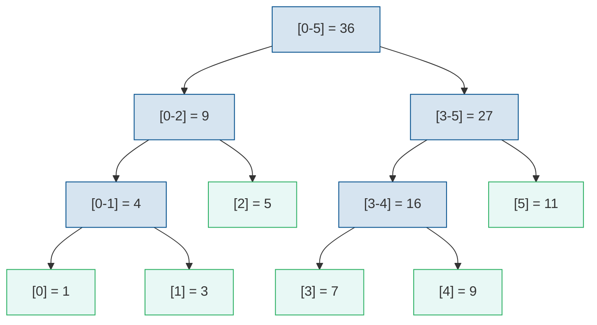

Дерево отрезков (Segment Tree) — это структура данных для эффективного выполнения запросов на отрезках массива: суммы, минимума, максимума и других ассоциативных операций.

## Мотивация

Пусть есть массив $a[0], a[1], \ldots, a[n-1]$, и нужно поддерживать две операции:

1. **Запрос на отрезке**: найти сумму/минимум/максимум на отрезке $[l, r]$
2. **Обновление элемента**: изменить значение $a[i]$

| Структура | Запрос на отрезке | Обновление |
|-----------|------------------|------------|
| Массив | $O(n)$ | $O(1)$ |
| Префиксные суммы | $O(1)$ | $O(n)$ |
| Дерево отрезков | $O(\log n)$ | $O(\log n)$ |

Дерево отрезков обеспечивает логарифмическое время для обеих операций.

## Структура дерева отрезков

>[!def]
>**Дерево отрезков** — это полное бинарное дерево, в котором:
>- Листья соответствуют элементам исходного массива
>- Каждая внутренняя вершина хранит агрегированное значение (сумму, минимум и т.д.) для отрезка, соответствующего её поддереву

Массив: `[1, 3, 5, 7, 9, 11]`



Каждый внутренний узел хранит сумму своего отрезка. Листья соответствуют элементам исходного массива.

## Построение


{}
```python
class SegmentTree:
    def __init__(self, data):
        self.n = len(data)
        # Размер дерева: ближайшая степень двойки * 2
        self.size = 1
        while self.size < self.n:
            self.size *= 2

        # Дерево хранится в массиве размера 2*size
        self.tree = [0] * (2 * self.size)

        # Заполняем листья
        for i in range(self.n):
            self.tree[self.size + i] = data[i]

        # Строим внутренние узлы
        for i in range(self.size - 1, 0, -1):
            self.tree[i] = self.tree[2 * i] + self.tree[2 * i + 1]


    def build(self, data, node, left, right):
        """Рекурсивное построение"""
        if left == right:
            self.tree[node] = data[left]
        else:
            mid = (left + right) // 2
            self.build(data, 2 * node, left, mid)
            self.build(data, 2 * node + 1, mid + 1, right)
            self.tree[node] = self.tree[2 * node] + self.tree[2 * node + 1]
```
{}
{}
```cpp
#include <vector>

class SegmentTree {
private:
    std::vector<long long> tree;
    int n;
    int size;

public:
    SegmentTree(const std::vector<int>& data) {
        n = data.size();
        size = 1;
        while (size < n) size *= 2;

        tree.assign(2 * size, 0);

        // Заполняем листья
        for (int i = 0; i < n; i++) {
            tree[size + i] = data[i];
        }

        // Строим внутренние узлы
        for (int i = size - 1; i > 0; i--) {
            tree[i] = tree[2 * i] + tree[2 * i + 1];
        }
    }

    void build(const std::vector<int>& data, int node, int left, int right) {
        if (left == right) {
            tree[node] = data[left];
        } else {
            int mid = (left + right) / 2;
            build(data, 2 * node, left, mid);
            build(data, 2 * node + 1, mid + 1, right);
            tree[node] = tree[2 * node] + tree[2 * node + 1];
        }
    }
};
```
{}


Сложность построения: $O(n)$.

## Запрос на отрезке


{}
```python
def query(self, l, r):
    """Сумма на отрезке [l, r]"""
    return self._query(1, 0, self.size - 1, l, r)


def _query(self, node, node_left, node_right, l, r):
    """Рекурсивный запрос"""
    # Отрезок запроса не пересекается с отрезком узла
    if r < node_left or l > node_right:
        return 0

    # Отрезок запроса полностью содержит отрезок узла
    if l <= node_left and node_right <= r:
        return self.tree[node]

    # Частичное пересечение
    mid = (node_left + node_right) // 2
    left_sum = self._query(2 * node, node_left, mid, l, r)
    right_sum = self._query(2 * node + 1, mid + 1, node_right, l, r)

    return left_sum + right_sum


# Итеративная версия (быстрее):
# Идея: l и r — указатели на листья в массиве tree[size..2*size-1].
# На каждом шаге поднимаемся на уровень вверх (l //= 2, r //= 2).
# Если l — правый ребёнок (l % 2 == 1), его родитель покрывает
# лишние элементы слева, поэтому берём tree[l] отдельно и сдвигаем l вправо.
# Аналогично для r: если r — левый ребёнок (r % 2 == 0), берём tree[r]
# и сдвигаем r влево. Так на каждом уровне O(1) работы, всего O(log n).
def query_iterative(self, l, r):
    """Итеративный запрос суммы на [l, r]"""
    l += self.size
    r += self.size
    result = 0

    while l <= r:
        if l % 2 == 1:
            result += self.tree[l]
            l += 1
        if r % 2 == 0:
            result += self.tree[r]
            r -= 1
        l //= 2
        r //= 2

    return result
```
{}
{}
```cpp
long long query(int node, int nodeLeft, int nodeRight, int l, int r) {
    // Отрезок запроса не пересекается с отрезком узла
    if (r < nodeLeft || l > nodeRight) {
        return 0;
    }

    // Отрезок запроса полностью содержит отрезок узла
    if (l <= nodeLeft && nodeRight <= r) {
        return tree[node];
    }

    // Частичное пересечение
    int mid = (nodeLeft + nodeRight) / 2;
    return query(2 * node, nodeLeft, mid, l, r) +
           query(2 * node + 1, mid + 1, nodeRight, l, r);
}

long long query(int l, int r) {
    return query(1, 0, size - 1, l, r);
}

// Итеративная версия
long long queryIterative(int l, int r) {
    l += size;
    r += size;
    long long result = 0;

    while (l <= r) {
        if (l % 2 == 1) {
            result += tree[l];
            l++;
        }
        if (r % 2 == 0) {
            result += tree[r];
            r--;
        }
        l /= 2;
        r /= 2;
    }

    return result;
}
```
{}


Сложность запроса: $O(\log n)$.

## Обновление элемента


{}
```python
def update(self, index, value):
    """Установка значения a[index] = value"""
    self._update(1, 0, self.size - 1, index, value)


def _update(self, node, node_left, node_right, index, value):
    if node_left == node_right:
        self.tree[node] = value
    else:
        mid = (node_left + node_right) // 2
        if index <= mid:
            self._update(2 * node, node_left, mid, index, value)
        else:
            self._update(2 * node + 1, mid + 1, node_right, index, value)
        self.tree[node] = self.tree[2 * node] + self.tree[2 * node + 1]


# Итеративная версия:
def update_iterative(self, index, value):
    """Итеративное обновление"""
    index += self.size
    self.tree[index] = value

    while index > 1:
        index //= 2
        self.tree[index] = self.tree[2 * index] + self.tree[2 * index + 1]
```
{}
{}
```cpp
void update(int node, int nodeLeft, int nodeRight, int index, long long value) {
    if (nodeLeft == nodeRight) {
        tree[node] = value;
    } else {
        int mid = (nodeLeft + nodeRight) / 2;
        if (index <= mid) {
            update(2 * node, nodeLeft, mid, index, value);
        } else {
            update(2 * node + 1, mid + 1, nodeRight, index, value);
        }
        tree[node] = tree[2 * node] + tree[2 * node + 1];
    }
}

void update(int index, long long value) {
    update(1, 0, size - 1, index, value);
}

// Итеративная версия
void updateIterative(int index, long long value) {
    index += size;
    tree[index] = value;

    while (index > 1) {
        index /= 2;
        tree[index] = tree[2 * index] + tree[2 * index + 1];
    }
}
```
{}


Сложность обновления: $O(\log n)$.

## Дерево отрезков для минимума


{}
```python
class MinSegmentTree:
    def __init__(self, data):
        self.n = len(data)
        self.size = 1
        while self.size < self.n:
            self.size *= 2

        self.tree = [float('inf')] * (2 * self.size)

        for i in range(self.n):
            self.tree[self.size + i] = data[i]

        for i in range(self.size - 1, 0, -1):
            self.tree[i] = min(self.tree[2 * i], self.tree[2 * i + 1])

    def query_min(self, l, r):
        """Минимум на отрезке [l, r]"""
        l += self.size
        r += self.size
        result = float('inf')

        while l <= r:
            if l % 2 == 1:
                result = min(result, self.tree[l])
                l += 1
            if r % 2 == 0:
                result = min(result, self.tree[r])
                r -= 1
            l //= 2
            r //= 2

        return result

    def update(self, index, value):
        index += self.size
        self.tree[index] = value

        while index > 1:
            index //= 2
            self.tree[index] = min(self.tree[2 * index], self.tree[2 * index + 1])
```
{}
{}
```cpp
#include <vector>
#include <algorithm>
#include <climits>

class MinSegmentTree {
private:
    std::vector<int> tree;
    int n;
    int size;

public:
    MinSegmentTree(const std::vector<int>& data) {
        n = data.size();
        size = 1;
        while (size < n) size *= 2;

        tree.assign(2 * size, INT_MAX);

        for (int i = 0; i < n; i++) {
            tree[size + i] = data[i];
        }

        for (int i = size - 1; i > 0; i--) {
            tree[i] = std::min(tree[2 * i], tree[2 * i + 1]);
        }
    }

    int queryMin(int l, int r) {
        l += size;
        r += size;
        int result = INT_MAX;

        while (l <= r) {
            if (l % 2 == 1) {
                result = std::min(result, tree[l]);
                l++;
            }
            if (r % 2 == 0) {
                result = std::min(result, tree[r]);
                r--;
            }
            l /= 2;
            r /= 2;
        }

        return result;
    }

    void update(int index, int value) {
        index += size;
        tree[index] = value;

        while (index > 1) {
            index /= 2;
            tree[index] = std::min(tree[2 * index], tree[2 * index + 1]);
        }
    }
};
```
{}


## Обобщённое дерево отрезков

Дерево отрезков работает для любой **ассоциативной** операции (операции, для которой $(a \circ b) \circ c = a \circ (b \circ c)$):

- Сумма: $a + b$
- Минимум: $\min(a, b)$
- Максимум: $\max(a, b)$
- Произведение: $a \cdot b$
- НОД: $\gcd(a, b)$
- Побитовое И/ИЛИ/XOR

>[!def]
>Для обобщённого дерева отрезков нужна **нейтральный элемент** $e$, такой что $a \circ e = e \circ a = a$:
>- Сумма: $0$
>- Минимум: $+\infty$
>- Максимум: $-\infty$
>- Произведение: $1$
>- НОД: $0$
>- Побитовое И: все биты равны 1
>- Побитовое ИЛИ: все биты равны 0

## Полная реализация


{}
```python
class SegmentTree:
    """Дерево отрезков для сумм"""

    def __init__(self, data):
        self.n = len(data)
        self.size = 1
        while self.size < self.n:
            self.size *= 2
        self.tree = [0] * (2 * self.size)

        # Построение
        for i in range(self.n):
            self.tree[self.size + i] = data[i]
        for i in range(self.size - 1, 0, -1):
            self.tree[i] = self.tree[2 * i] + self.tree[2 * i + 1]

    def query(self, l, r):
        """Сумма на отрезке [l, r]"""
        l += self.size
        r += self.size
        result = 0

        while l <= r:
            if l % 2 == 1:
                result += self.tree[l]
                l += 1
            if r % 2 == 0:
                result += self.tree[r]
                r -= 1
            l //= 2
            r //= 2

        return result

    def update(self, index, value):
        """Обновление элемента"""
        index += self.size
        self.tree[index] = value

        while index > 1:
            index //= 2
            self.tree[index] = self.tree[2 * index] + self.tree[2 * index + 1]

    def get(self, index):
        """Получить значение элемента"""
        return self.tree[self.size + index]


# Пример использования
data = [1, 3, 5, 7, 9, 11]
st = SegmentTree(data)

print("Сумма [1, 4]:", st.query(1, 4))  # 3 + 5 + 7 + 9 = 24

st.update(2, 10)  # Заменяем a[2] = 10
print("Сумма [1, 4] после обновления:", st.query(1, 4))  # 3 + 10 + 7 + 9 = 29
```
{}
{}
```cpp
#include <iostream>
#include <vector>

class SegmentTree {
private:
    std::vector<long long> tree;
    int n;
    int size;

public:
    SegmentTree(const std::vector<int>& data) {
        n = data.size();
        size = 1;
        while (size < n) size *= 2;
        tree.assign(2 * size, 0);

        // Построение
        for (int i = 0; i < n; i++) {
            tree[size + i] = data[i];
        }
        for (int i = size - 1; i > 0; i--) {
            tree[i] = tree[2 * i] + tree[2 * i + 1];
        }
    }

    long long query(int l, int r) {
        l += size;
        r += size;
        long long result = 0;

        while (l <= r) {
            if (l % 2 == 1) {
                result += tree[l];
                l++;
            }
            if (r % 2 == 0) {
                result += tree[r];
                r--;
            }
            l /= 2;
            r /= 2;
        }

        return result;
    }

    void update(int index, long long value) {
        index += size;
        tree[index] = value;

        while (index > 1) {
            index /= 2;
            tree[index] = tree[2 * index] + tree[2 * index + 1];
        }
    }

    long long get(int index) {
        return tree[size + index];
    }
};

int main() {
    std::vector<int> data = {1, 3, 5, 7, 9, 11};
    SegmentTree st(data);

    std::cout << "Сумма [1, 4]: " << st.query(1, 4) << std::endl;  // 24

    st.update(2, 10);
    std::cout << "Сумма [1, 4] после обновления: " << st.query(1, 4) << std::endl;  // 29

    return 0;
}
```
{}


## Сложность

>[!props]
>Сложность операций в дереве отрезков:

| Операция | Время | Память |
|----------|-------|--------|
| Построение | $O(n)$ | $O(n)$ |
| Запрос на отрезке | $O(\log n)$ | — |
| Обновление элемента | $O(\log n)$ | — |

## Применения

>[!props]
>Деревья отрезков используются для:
>- Сумма/минимум/максимум на отрезке
>- Подсчёт элементов, удовлетворяющих условию
>- Нахождение $k$-й статистики на отрезке (с расширением)
>- Поддержка операций на отрезке (с ленивым распространением — lazy propagation)

Деревья отрезков — одна из самых важных структур данных в спортивном программировании и на олимпиадах по информатике.
