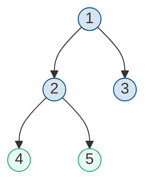

Обход дерева — систематический способ посещения всех вершин дерева. Существует несколько основных способов обхода бинарного дерева, каждый из которых имеет свои применения.

## Виды обходов

Основные виды обхода бинарного дерева:

| Название | Порядок посещения | Применение |
|----------|-------------------|------------|
| Прямой (preorder) | Корень → Лево → Право | Копирование дерева, префиксные выражения |
| Центрированный (inorder) | Лево → Корень → Право | Сортировка, вывод BST по возрастанию |
| Обратный (postorder) | Лево → Право → Корень | Удаление дерева, постфиксные выражения |
| В ширину (level-order) | По уровням сверху вниз | Поиск в ширину, вывод по уровням |

### Сравнение обходов на одном дереве

Рассмотрим дерево:



| Обход | Порядок | Результат |
|-------|---------|-----------|
| Preorder | Корень → Лево → Право | **1**, 2, 4, 5, 3 |
| Inorder | Лево → Корень → Право | 4, **2**, 5, **1**, 3 |
| Postorder | Лево → Право → Корень | 4, 5, 2, 3, **1** |
| Level-order | По уровням | **1**, 2, 3, 4, 5 |

## Прямой обход (Preorder)

При прямом обходе сначала посещается корень, затем рекурсивно обходится левое поддерево, затем правое.

### Рекурсивная реализация


{}
```python
def preorder_recursive(root, result=None):
    """Прямой обход: корень → лево → право"""
    if result is None:
        result = []

    if root is None:
        return result

    result.append(root.value)       # 1. Посетить корень
    preorder_recursive(root.left, result)   # 2. Обойти левое поддерево
    preorder_recursive(root.right, result)  # 3. Обойти правое поддерево

    return result


class TreeNode:
    def __init__(self, value):
        self.value = value
        self.left = None
        self.right = None


# Пример:
#       1
#      / \
#     2   3
#    / \
#   4   5

root = TreeNode(1)
root.left = TreeNode(2)
root.right = TreeNode(3)
root.left.left = TreeNode(4)
root.left.right = TreeNode(5)

print(preorder_recursive(root))  # [1, 2, 4, 5, 3]
```
{}
{}
```cpp
#include <vector>
#include <iostream>

struct TreeNode {
    int value;
    TreeNode* left;
    TreeNode* right;

    TreeNode(int val) : value(val), left(nullptr), right(nullptr) {}
};

void preorderRecursive(TreeNode* root, std::vector<int>& result) {
    if (root == nullptr) return;

    result.push_back(root->value);     // 1. Посетить корень
    preorderRecursive(root->left, result);   // 2. Обойти левое поддерево
    preorderRecursive(root->right, result);  // 3. Обойти правое поддерево
}

std::vector<int> preorder(TreeNode* root) {
    std::vector<int> result;
    preorderRecursive(root, result);
    return result;
}

int main() {
    //       1
    //      / \
    //     2   3
    //    / \
    //   4   5

    auto* root = new TreeNode(1);
    root->left = new TreeNode(2);
    root->right = new TreeNode(3);
    root->left->left = new TreeNode(4);
    root->left->right = new TreeNode(5);

    auto result = preorder(root);
    for (int val : result) {
        std::cout << val << " ";  // 1 2 4 5 3
    }
    std::cout << std::endl;

    return 0;
}
```
{}


### Итеративная реализация


{}
```python
def preorder_iterative(root):
    """Итеративный прямой обход с использованием стека"""
    if root is None:
        return []

    result = []
    stack = [root]

    while stack:
        node = stack.pop()
        result.append(node.value)

        # Правого ребёнка добавляем первым (LIFO)
        if node.right:
            stack.append(node.right)
        if node.left:
            stack.append(node.left)

    return result
```
{}
{}
```cpp
#include <vector>
#include <stack>

std::vector<int> preorderIterative(TreeNode* root) {
    std::vector<int> result;
    if (root == nullptr) return result;

    std::stack<TreeNode*> stack;
    stack.push(root);

    while (!stack.empty()) {
        TreeNode* node = stack.top();
        stack.pop();
        result.push_back(node->value);

        // Правого ребёнка добавляем первым (LIFO)
        if (node->right) stack.push(node->right);
        if (node->left) stack.push(node->left);
    }

    return result;
}
```
{}


## Центрированный обход (Inorder)

При центрированном обходе сначала рекурсивно обходится левое поддерево, затем посещается корень, затем правое поддерево.

### Рекурсивная реализация


{}
```python
def inorder_recursive(root, result=None):
    """Центрированный обход: лево → корень → право"""
    if result is None:
        result = []

    if root is None:
        return result

    inorder_recursive(root.left, result)   # 1. Обойти левое поддерево
    result.append(root.value)              # 2. Посетить корень
    inorder_recursive(root.right, result)  # 3. Обойти правое поддерево

    return result


# Для дерева из примера выше:
print(inorder_recursive(root))  # [4, 2, 5, 1, 3]
```
{}
{}
```cpp
void inorderRecursive(TreeNode* root, std::vector<int>& result) {
    if (root == nullptr) return;

    inorderRecursive(root->left, result);   // 1. Обойти левое поддерево
    result.push_back(root->value);          // 2. Посетить корень
    inorderRecursive(root->right, result);  // 3. Обойти правое поддерево
}

std::vector<int> inorder(TreeNode* root) {
    std::vector<int> result;
    inorderRecursive(root, result);
    return result;
}
```
{}


### Итеративная реализация


{}
```python
def inorder_iterative(root):
    """Итеративный центрированный обход"""
    result = []
    stack = []
    current = root

    while current or stack:
        # Спускаемся к самому левому узлу
        while current:
            stack.append(current)
            current = current.left

        # Обрабатываем узел
        current = stack.pop()
        result.append(current.value)

        # Переходим к правому поддереву
        current = current.right

    return result
```
{}
{}
```cpp
#include <vector>
#include <stack>

std::vector<int> inorderIterative(TreeNode* root) {
    std::vector<int> result;
    std::stack<TreeNode*> stack;
    TreeNode* current = root;

    while (current || !stack.empty()) {
        // Спускаемся к самому левому узлу
        while (current) {
            stack.push(current);
            current = current->left;
        }

        // Обрабатываем узел
        current = stack.top();
        stack.pop();
        result.push_back(current->value);

        // Переходим к правому поддереву
        current = current->right;
    }

    return result;
}
```
{}


## Обратный обход (Postorder)

При обратном обходе сначала рекурсивно обходится левое поддерево, затем правое, затем посещается корень.

### Рекурсивная реализация


{}
```python
def postorder_recursive(root, result=None):
    """Обратный обход: лево → право → корень"""
    if result is None:
        result = []

    if root is None:
        return result

    postorder_recursive(root.left, result)   # 1. Обойти левое поддерево
    postorder_recursive(root.right, result)  # 2. Обойти правое поддерево
    result.append(root.value)                # 3. Посетить корень

    return result


# Для дерева из примера выше:
print(postorder_recursive(root))  # [4, 5, 2, 3, 1]
```
{}
{}
```cpp
void postorderRecursive(TreeNode* root, std::vector<int>& result) {
    if (root == nullptr) return;

    postorderRecursive(root->left, result);   // 1. Обойти левое поддерево
    postorderRecursive(root->right, result);  // 2. Обойти правое поддерево
    result.push_back(root->value);            // 3. Посетить корень
}

std::vector<int> postorder(TreeNode* root) {
    std::vector<int> result;
    postorderRecursive(root, result);
    return result;
}
```
{}


### Итеративная реализация


{}
```python
def postorder_iterative(root):
    """Итеративный обратный обход"""
    if root is None:
        return []

    result = []
    stack = [root]
    prev = None

    while stack:
        current = stack[-1]

        # Спускаемся вниз
        if prev is None or prev.left == current or prev.right == current:
            if current.left:
                stack.append(current.left)
            elif current.right:
                stack.append(current.right)
        # Поднимаемся от левого ребёнка
        elif current.left == prev:
            if current.right:
                stack.append(current.right)
        # Поднимаемся от правого ребёнка или это лист
        else:
            result.append(current.value)
            stack.pop()

        prev = current

    return result


def postorder_iterative_simple(root):
    """Упрощённая версия через модифицированный preorder"""
    if root is None:
        return []

    result = []
    stack = [root]

    while stack:
        node = stack.pop()
        result.append(node.value)

        # Обратный порядок: левый, потом правый
        if node.left:
            stack.append(node.left)
        if node.right:
            stack.append(node.right)

    return result[::-1]  # Разворачиваем результат
```
{}
{}
```cpp
#include <vector>
#include <stack>
#include <algorithm>

std::vector<int> postorderIterativeSimple(TreeNode* root) {
    std::vector<int> result;
    if (root == nullptr) return result;

    std::stack<TreeNode*> stack;
    stack.push(root);

    while (!stack.empty()) {
        TreeNode* node = stack.top();
        stack.pop();
        result.push_back(node->value);

        // Обратный порядок: левый, потом правый
        if (node->left) stack.push(node->left);
        if (node->right) stack.push(node->right);
    }

    std::reverse(result.begin(), result.end());
    return result;
}
```
{}


## Обход в ширину (Level-order)

При обходе в ширину вершины посещаются по уровням: сначала корень, затем все вершины уровня 1, затем уровня 2 и т.д.


{}
```python
from collections import deque

def level_order(root):
    """Обход в ширину с использованием очереди"""
    if root is None:
        return []

    result = []
    queue = deque([root])

    while queue:
        node = queue.popleft()
        result.append(node.value)

        if node.left:
            queue.append(node.left)
        if node.right:
            queue.append(node.right)

    return result


def level_order_by_levels(root):
    """Обход в ширину с группировкой по уровням"""
    if root is None:
        return []

    result = []
    queue = deque([root])

    while queue:
        level_size = len(queue)
        level = []

        for _ in range(level_size):
            node = queue.popleft()
            level.append(node.value)

            if node.left:
                queue.append(node.left)
            if node.right:
                queue.append(node.right)

        result.append(level)

    return result


# Для дерева из примера выше:
print(level_order(root))  # [1, 2, 3, 4, 5]
print(level_order_by_levels(root))  # [[1], [2, 3], [4, 5]]
```
{}
{}
```cpp
#include <vector>
#include <queue>

std::vector<int> levelOrder(TreeNode* root) {
    std::vector<int> result;
    if (root == nullptr) return result;

    std::queue<TreeNode*> queue;
    queue.push(root);

    while (!queue.empty()) {
        TreeNode* node = queue.front();
        queue.pop();
        result.push_back(node->value);

        if (node->left) queue.push(node->left);
        if (node->right) queue.push(node->right);
    }

    return result;
}

std::vector<std::vector<int>> levelOrderByLevels(TreeNode* root) {
    std::vector<std::vector<int>> result;
    if (root == nullptr) return result;

    std::queue<TreeNode*> queue;
    queue.push(root);

    while (!queue.empty()) {
        int levelSize = queue.size();
        std::vector<int> level;

        for (int i = 0; i < levelSize; ++i) {
            TreeNode* node = queue.front();
            queue.pop();
            level.push_back(node->value);

            if (node->left) queue.push(node->left);
            if (node->right) queue.push(node->right);
        }

        result.push_back(level);
    }

    return result;
}
```
{}


## Сложность обходов

>[!props]
>Для всех видов обхода бинарного дерева:
>- Время: $O(n)$, где $n$ — количество вершин
>- Память (рекурсия): $O(h)$, где $h$ — высота дерева
>- Память (итерация): $O(h)$ для DFS-обходов, $O(w)$ для BFS, где $w$ — максимальная ширина уровня

## Применения обходов

### Вычисление выражений

Деревья выражений: операторы во внутренних вершинах, операнды в листьях.

```
Выражение: (4 + 5) * 2

      *
     / \
    +   2
   / \
  4   5
```

- **Preorder** (префиксная запись): `* + 4 5 2`
- **Inorder** (инфиксная запись): `4 + 5 * 2` (требует скобок)
- **Postorder** (постфиксная запись): `4 5 + 2 *`


{}
```python
def evaluate_expression_tree(root):
    """Вычисление значения выражения, представленного деревом"""
    if root is None:
        return 0

    # Если лист — это операнд
    if root.left is None and root.right is None:
        return root.value

    # Рекурсивно вычисляем поддеревья
    left_val = evaluate_expression_tree(root.left)
    right_val = evaluate_expression_tree(root.right)

    # Применяем оператор
    if root.value == '+':
        return left_val + right_val
    elif root.value == '-':
        return left_val - right_val
    elif root.value == '*':
        return left_val * right_val
    elif root.value == '/':
        return left_val / right_val
```
{}
{}
```cpp
#include <string>
#include <stdexcept>

// Узел дерева выражений хранит строку: число или оператор
struct ExprNode {
    std::string value;
    ExprNode* left = nullptr;
    ExprNode* right = nullptr;
    ExprNode(const std::string& v) : value(v) {}
};

int evaluateExpressionTree(ExprNode* root) {
    if (root == nullptr) return 0;

    // Если лист — это операнд (число)
    if (root->left == nullptr && root->right == nullptr) {
        return std::stoi(root->value);
    }

    // Рекурсивно вычисляем поддеревья
    int leftVal = evaluateExpressionTree(root->left);
    int rightVal = evaluateExpressionTree(root->right);

    // Применяем оператор
    char op = root->value[0];
    switch (op) {
        case '+': return leftVal + rightVal;
        case '-': return leftVal - rightVal;
        case '*': return leftVal * rightVal;
        case '/': return leftVal / rightVal;
        default: throw std::invalid_argument("Unknown operator");
    }
}
```
{}


### Сериализация и десериализация дерева


{}
```python
def serialize(root):
    """Сериализация дерева в строку (preorder с маркерами None)"""
    if root is None:
        return "#"

    return f"{root.value},{serialize(root.left)},{serialize(root.right)}"


def deserialize(data):
    """Десериализация строки в дерево"""
    values = iter(data.split(','))

    def build():
        val = next(values)
        if val == '#':
            return None
        node = TreeNode(int(val))
        node.left = build()
        node.right = build()
        return node

    return build()


# Пример:
#       1
#      / \
#     2   3
serialized = serialize(root)  # "1,2,#,#,3,#,#"
deserialized_root = deserialize(serialized)
```
{}
{}
```cpp
#include <string>
#include <sstream>

std::string serialize(TreeNode* root) {
    if (root == nullptr) return "#";

    return std::to_string(root->value) + "," +
           serialize(root->left) + "," +
           serialize(root->right);
}

TreeNode* deserializeHelper(std::istringstream& iss) {
    std::string val;
    if (!std::getline(iss, val, ',')) return nullptr;

    if (val == "#") return nullptr;

    TreeNode* node = new TreeNode(std::stoi(val));
    node->left = deserializeHelper(iss);
    node->right = deserializeHelper(iss);
    return node;
}

TreeNode* deserialize(const std::string& data) {
    std::istringstream iss(data);
    return deserializeHelper(iss);
}
```
{}


### Удаление дерева

Для корректного удаления дерева нужно сначала удалить детей, затем родителя — используется postorder обход.


{}
```python
def delete_tree(root):
    """Удаление дерева с освобождением памяти"""
    if root is None:
        return

    delete_tree(root.left)
    delete_tree(root.right)
    # В Python сборщик мусора освободит память автоматически
    # В явном удалении нет необходимости, но для примера:
    root.left = None
    root.right = None
```
{}
{}
```cpp
void deleteTree(TreeNode* root) {
    if (root == nullptr) return;

    deleteTree(root->left);
    deleteTree(root->right);
    delete root;
}
```
{}

