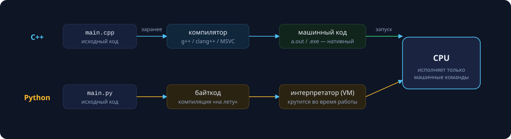
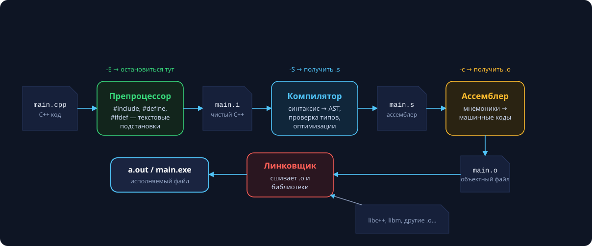
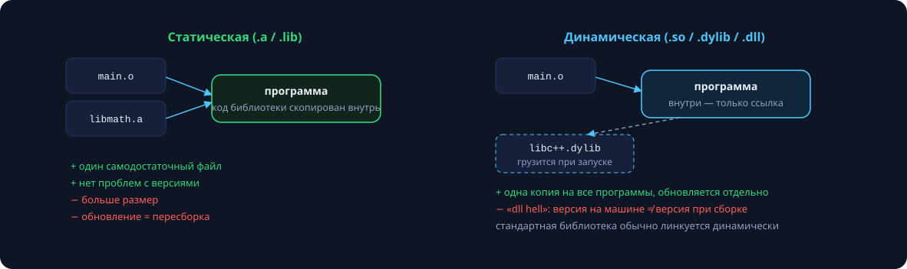
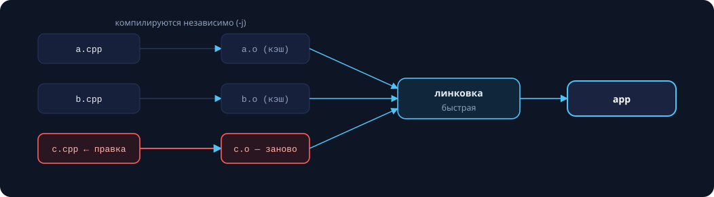
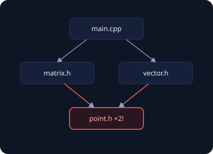

Курс начинается не с синтаксиса, а с ответа на вопрос, который обычно откладывают «на потом» — и зря: **что происходит между текстом программы и её запуском?** Это знание превращает загадочные ошибки сборки в понятные сообщения с конкретным виновником и делает осмысленным всё, что мы будем писать дальше.

## Компиляция и интерпретация

Процессор исполняет только машинные команды. Все языки программирования отличаются, по большому счёту, тем, **в какой момент и кто** переводит текст программы в эти команды.



**C++ — компилируемый язык:** перевод происходит заранее, один раз, и на выходе получается нативный исполняемый файл. Мы платим временем сборки и получаем скорость: между программой и процессором нет посредников.

**Python — интерпретируемый:** исходник на лету транслируется в байткод, который исполняет виртуальная машина. Мгновенный старт разработки, но интерпретатор работает при *каждом* запуске программы.

Между этими полюсами — JIT-компиляция (Java, C#, PyPy, JavaScript/V8): байткод докомпилируется в машинный код прямо во время исполнения, на «горячих» участках.

>[!tip] Зачем это знать
> Многие свойства C++, которые поначалу раздражают — раздельная компиляция, заголовочные файлы, ошибки линковки, — прямые следствия компилируемой модели. Понимая модель, вы понимаете и их.

## Одна команда — четыре стадии

Минимальная программа:

```cpp
#include <iostream>

int main() {
    std::cout << "Привет, СПбГУ!\n";
    return 0;
}
```

```bash
g++ hello.cpp -o hello && ./hello
```

Команда `g++` выглядит как один шаг, но это **драйвер**, запускающий конвейер из четырёх стадий. Каждую можно остановить флагом и рассмотреть промежуточный результат.



| Стадия | Вход → выход | Остановиться здесь |
|---|---|---|
| Препроцессор | `.cpp` → «расшитый» текст `.i` | `g++ -E` |
| Компилятор | `.i` → ассемблер `.s` | `g++ -S` |
| Ассемблер | `.s` → объектный файл `.o` | `g++ -c` |
| Линковщик | `.o` + библиотеки → исполняемый файл | — |

## Стадия 1. Препроцессор

Препроцессор — это **текстовый редактор без понятия о C++**. Он выполняет директивы, начинающиеся с `#`, до того, как компилятор увидит хоть одну строку:

- `#include` — дословно вставляет содержимое файла в это место;
- `#define` — подстановка макросов, поиск-замена по токенам;
- `#ifdef / #if / #endif` — условно вырезает куски текста.

Масштаб текстовых подстановок легко недооценить:

```bash
$ g++ -E hello.cpp -o hello.i
$ wc -l hello.cpp hello.i
       6 hello.cpp
   59349 hello.i
```

Шесть строк превратились в **59 349** — столько тащит за собой один `#include <iostream>` (замер: Apple Clang 21). Отсюда практическое следствие: каждая единица трансляции заново компилирует все свои заголовки, и лишние `#include` — это минуты жизни на больших проектах.

### #include: кавычки и скобки

```cpp
#include <iostream>   // системный заголовок: стандартная библиотека, API ОС
#include "matrix.h"   // ваш заголовок: сначала ищется рядом с текущим файлом
```

Дополнительные каталоги поиска подключаются флагом `-I include/`. Формально точный порядок поиска — implementation-defined, но GCC, Clang и MSVC ведут себя одинаково: `"file"` — от каталога текущего файла, затем как `<file>`; `<file>` — по системным путям и `-I`.

### Макросы: сила и проклятие

Макрос — текстовая подстановка, и в этом вся его опасность:

```cpp
#define SQR(x) x * x

int a = SQR(3);       // 3 * 3 = 9        — ок
int b = SQR(2 + 1);   // 2 + 1 * 2 + 1 = 5 — сюрприз!
int c = 100 / SQR(5); // 100 / 5 * 5 = 100 — снова сюрприз

#define SQR2(x) ((x) * (x))   // «исправленный» вариант…
int d = SQR2(i++);    // ((i++) * (i++)) — UB: i++ дважды!
```

Современный C++ решает те же задачи средствами языка — с проверкой типов и однократным вычислением аргумента:

```cpp
constexpr double pi = 3.141592653589793;
constexpr int sqr(int x) { return x * x; }
```

Легитимные ниши макросов сегодня: include guards, условная компиляция под платформы, `__LINE__` / `__FILE__` в логировании.

### Условная компиляция

```cpp
#if defined(_WIN32)
    #include <windows.h>
#elif defined(__APPLE__) || defined(__linux__)
    #include <unistd.h>
#endif

#ifdef DEBUG
    std::cerr << "x = " << x << '\n';   // включается флагом: g++ -DDEBUG
#endif
```

Макросы `_WIN32`, `__APPLE__`, `__linux__` определяет сам компилятор — код «знает», где его собирают. Вырезанный текст не доходит даже до компилятора: нулевая цена в рантайме. Так устроены все кроссплатформенные библиотеки. (С C++17 часть таких задач решает `if constexpr` — ветвление на этапе компиляции внутри языка.)

## Стадия 2. Компилятор

Компилятор — самая сложная часть конвейера, три больших блока:


1. **Фронтенд**: лексер и парсер строят синтаксическое дерево (AST), проверяются типы — здесь рождаются сообщения об ошибках компиляции.
2. **Оптимизатор**: inlining, свёртка констант, удаление мёртвого кода и десятки других преобразований.
3. **Бэкенд**: выбор машинных инструкций и распределение регистров под целевую архитектуру (x86-64, ARM64…).

Уровни оптимизации: `-O0` (без оптимизаций, для отладки), `-O2` (стандарт для релиза), `-O3`/`-Os` (агрессивнее / компактнее).

>[!tip] Привычка с первого дня
> собирайте с `-Wall -Wextra -Werror`. Предупреждение компилятора — это почти всегда найденный за вас баг. `-Werror` не даёт «потом посмотрю» превратиться в «никогда».

Пара «исходник + все его заголовки» называется **единицей трансляции**. Компилятор видит только её — что происходит в соседних `.cpp`, ему неизвестно. Это ключ к пониманию линковки.

### Заглянем в ассемблер

```cpp
int square(int x) { return x * x; }
```

```bash
$ clang++ -S -O2 square.cpp -o -
__Z6squarei:
        mul     w0, w0, w0
        ret
```

Вся функция — две инструкции ARM64: перемножить регистр сам на себя и вернуться. Имя `__Z6squarei` — не опечатка, о нём ниже.

>[!tip] Инструмент недели
> [Compiler Explorer (godbolt.org)](https://godbolt.org) — пишете C++ слева, видите ассемблер любого компилятора справа. Лучший способ развить интуицию «во что превращается мой код». Сравните `-O0` и `-O2` на своей функции.

## Стадия 3. Объектный файл

Ассемблер превращает `.s` в объектный файл — контейнер с секциями:

| Секция | Содержимое |
|---|---|
| `.text` | машинный код функций |
| `.rodata` | константы и строковые литералы |
| `.data` | глобальные переменные с инициализацией |
| `.bss` | глобальные, заполняемые нулями |
| таблица символов | «что я определяю, что мне нужно снаружи» |

Таблицу символов можно посмотреть утилитой `nm`:

```bash
$ clang++ -c hello.cpp && nm hello.o
0000000000000000 T _main            # T — определён здесь
                 U __ZNSt3__14coutE # U — undefined: «найдётся где-то ещё»
```

Разрешить все `U`-символы — работа линковщика.

### Name mangling

В C++ разрешена перегрузка — несколько функций с одним именем. Линковщик различает только строки, поэтому компилятор «вшивает» типы аргументов прямо в символ:

```cpp
int    square(int x);     // __Z6squarei
long   square(long x);    // __Z6squarel
double square(double x);  // __Z6squared
```

Расшифровать имя обратно умеет `c++filt`; `extern "C"` отключает манглинг (и перегрузку) — так C++ стыкуется с C-библиотеками и FFI других языков. Схемы манглинга у GCC/Clang и MSVC разные — ещё одна причина, почему объектники разных компиляторов несовместимы.

## Стадия 4. Линковщик

Линковщик собирает все `.o` и библиотеки в исполняемый файл: сшивает секции, разрешает каждый undefined-символ ровно одним определением, расставляет адреса.



**Статическая** линковка (`.a`/`.lib`) копирует код библиотеки внутрь программы: один самодостаточный файл, нет проблем с версиями, но больше размер. **Динамическая** (`.so`/`.dylib`/`.dll`) оставляет в программе только ссылку — библиотека загружается при запуске: одна копия на все программы, обновляется отдельно, но появляется зависимость от окружения («dll hell»).

## Читаем ошибки: кто именно ругается?

Умение отличить ошибку компиляции от ошибки линковки — половина успеха в диагностике:

```
# 1. Компилятор: файл и строка, синтаксис/типы
bad.cpp:3:5: error: use of undeclared identifier 'prinf'; did you mean 'printf'?

# 2. Линковщик: объявлено, но нигде не определено
Undefined symbols for architecture arm64:
  "foo(int)", referenced from: _main in undef-a4e21f.o

# 3. Линковщик: определение попало в программу дважды
duplicate symbol 'f()' in: a.o, b.o
```

| Симптом | Стадия | Типовая причина |
|---|---|---|
| `error:` + файл:строка | компилятор | опечатка, типы, забытая `;` |
| `undefined symbol` | линковщик | забыли `.cpp` в команде сборки |
| `duplicate symbol` | линковщик | определение в заголовке |

## Заголовочные файлы

### Объявление и определение

**Объявление** сообщает сигнатуру — его можно повторять сколько угодно раз. **Определение** порождает код или память — оно должно быть ровно одно на программу:

```cpp
int gcd(int a, int b);              // объявление (прототип)
int gcd(int a, int b) {             // определение
    return b ? gcd(b, a % b) : a;
}
```

Идея заголовка: в `.h` кладём объявления — «интерфейс», который раздаётся всем желающим через `#include`; определения живут в `.cpp` и компилируются один раз.

### Канонический мини-проект

```cpp
// gcd.h
#pragma once
int gcd(int a, int b);
```

```cpp
// gcd.cpp
#include "gcd.h"
int gcd(int a, int b) { return b ? gcd(b, a % b) : a; }
```

```cpp
// main.cpp
#include <iostream>
#include "gcd.h"
int main() { std::cout << gcd(1071, 462); }   // 21
```

```bash
g++ -c gcd.cpp     # → gcd.o
g++ -c main.cpp    # → main.o
g++ gcd.o main.o -o app
```

`main.cpp` ничего не знает о реализации `gcd` — только объявление. Обещание «найдётся при линковке» выполняет `gcd.o`.

### Раздельная компиляция



Каждый `.cpp` компилируется независимо (хоть параллельно, `make -j`). Изменили один файл — пересобрали один `.o` и перелинковали: на проекте в миллион строк это разница между секундами и часами. Обратная сторона: правка **заголовка** перекомпилирует все включившие его `.cpp` — поэтому заголовки держат минимальными и стабильными.

### ODR — правило одного определения

Заголовок вставляется в несколько `.cpp`, а значит, всё его содержимое «размножается». One Definition Rule: каждая функция и переменная определяется **ровно один раз на программу**.

Нельзя в заголовке:

```cpp
int counter = 0;                    // duplicate symbol при линковке
int next() { return ++counter; }    // duplicate symbol
```

Можно в заголовке:

```cpp
int next();                          // объявление
extern int counter;                  // объявление переменной
inline int sq(int x) { return x*x; } // inline разрешает дубли
constexpr double eps = 1e-9;         // constexpr — неявно inline
template <class T> T mx(T a, T b);   // шаблоны — особые правила
class Point { /* ... */ };           // определение типа — можно
```

> Современный смысл `inline` — не «встроить код», а «разрешаю несколько одинаковых определений; линковщик, оставь одно».

## Защита от повторного включения

### Проблема: ромб включений



`main.cpp` включает `matrix.h` и `vector.h`, оба включают `point.h` — препроцессор честно вставляет его дважды, и компилятор видит два определения `struct Point` в одной единице трансляции:

```
point.h:1:8: error: redefinition of 'struct Point'
```

### Include guards

```cpp
#ifndef POINT_H
#define POINT_H

struct Point { double x, y; };

#endif  // POINT_H
```

Первое включение: `POINT_H` не определён → тело вставляется и определяет его. Второе включение в той же единице трансляции: всё до `#endif` вырезается. В другой единице трансляции препроцессор начинает «с чистого листа» — и это правильно. Имя стража должно быть уникальным во всём проекте (`ПРОЕКТ_ПУТЬ_ФАЙЛ_H`) — коллизия имён означает тихо пропавший заголовок и очень странные ошибки.

### #pragma once

```cpp
#pragma once
struct Point { double x, y; };
```

|  | `#pragma once` | include guards |
|---|---|---|
| стандарт C++ | нет (но поддержан GCC/Clang/MSVC) | да |
| ошибки автора | исключены | коллизия/опечатка имени |
| краевые случаи | файл виден по двум путям (симлинки) | нет |

**В курсе используем `#pragma once`** — коротко и безопасно. Но guards обязаны уметь читать: ими написана вся стандартная библиотека.

### Циклические зависимости и forward-декларации

Если `user.h` и `group.h` включают друг друга, guards не спасут — цикл надо разорвать. Часто полное определение и не нужно:

```cpp
// user.h
#pragma once
class Group;              // forward-декларация вместо #include

class User {
    Group* group_;        // указателю достаточно объявления
public:
    void join(Group& g);  // ссылке — тоже
};
```

| Достаточно `class G;` | Нужно полное определение |
|---|---|
| указатель `G*`, ссылка `G&` | член по значению `G g;` |
| параметр/возврат в объявлении | вызов методов, `sizeof(G)` |
| `std::vector<G*>` | наследование `: public G` |

Правило стиля: в заголовках — минимум включений и forward-декларации; полные `#include` — в `.cpp`. Бонус — быстрее компиляция.

## Окружение: три ОС

| | Linux | macOS | Windows |
|---|---|---|---|
| установка | `sudo apt install g++ gdb make` | `xcode-select --install` | Visual Studio **или WSL2** |
| компилятор | GCC (Clang — рядом) | Apple Clang (`g++` — псевдоним clang!) | MSVC / GCC в WSL |
| примечание | эталон для автотестов курса | настоящий GCC — `brew install gcc` | рекомендуем WSL2: та же среда, что у тестов |

Редактор — на вкус: VS Code (+ clangd), CLion (бесплатно по студенческой лицензии JetBrains), Visual Studio. Важно одно: уметь собрать проект **руками из терминала** — IDE делает то же самое, но за шторкой.

Боевой набор флагов для всего кода курса:

```bash
g++ -std=c++20 -Wall -Wextra -Werror -g -fsanitize=address,undefined main.cpp -o main
```

- `-std=c++20` — стандарт языка курса;
- `-g` — отладочная информация для gdb/lldb;
- `-fsanitize=address` — ловит выход за границы массива, use-after-free;
- `-fsanitize=undefined` — ловит UB: переполнение знаковых, null-разыменование.

Когда файлов станет много, сборку возьмёт на себя CMake (минимальный `CMakeLists.txt` — пять строк); познакомимся с ним при первом многофайловом проекте.

## Самопроверка

1. Почему ошибка «undefined symbol» *принципиально* не может быть обнаружена компилятором?
2. Что произойдёт, если два `.cpp` включат заголовок со строкой `int x = 0;`? А со строкой `extern int x;`?
3. Почему изменение `.h` пересобирает пол-проекта, а изменение `.cpp` — один файл?
4. Зачем в C++ манглинг имён, а в C его нет?

## Практика

1. Настроить окружение под свою ОС и собрать hello с полным набором флагов.
2. Разнести программу на `.h` + два `.cpp`, собрать вручную через `-c` и линковку.
3. Сломать сборку тремя способами — ошибка компиляции, undefined symbol, duplicate symbol — и прочитать сообщения.
4. Посмотреть свою функцию на godbolt.org при `-O0` и `-O2`.
