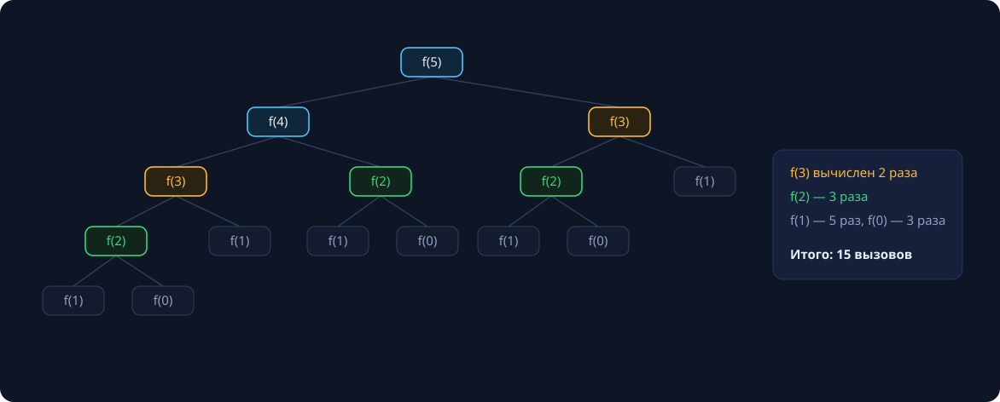
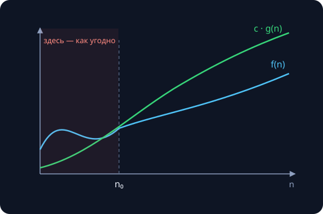
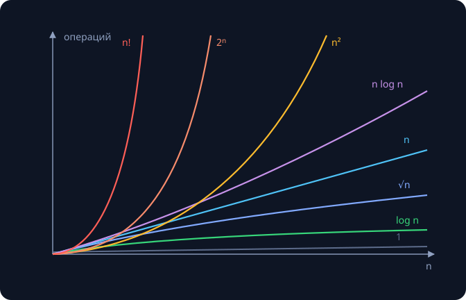

Обе программы из этого конспекта решают одну и ту же задачу, обе корректны — и отличаются по времени работы на **шесть порядков** уже при небольших входах. Разница не в железе и не в языке, а в алгоритме. Сегодняшняя цель — научиться *предсказывать* такие разрывы до запуска, а в идеале — до написания кода.

Все замеры в тексте — реальные: Apple M-серия, `clang++ -O2`.

## Задача дня: числа Фибоначчи

$$F_0 = 0, \quad F_1 = 1, \quad F_n = F_{n-1} + F_{n-2}$$

Последовательность 0, 1, 1, 2, 3, 5, 8, 13, 21, 34, 55, 89, 144, … — задача Леонардо Пизанского о кроликах (1202 год), а сегодня — стандартный полигон для разговора о рекурсии и сложности. Числа Фибоначчи всплывают в анализе алгоритма Евклида (его худший случай — соседние $F_n$), в фибоначчиевых кучах, в филлотаксисе — спиралях подсолнуха; отношение соседних членов стремится к золотому сечению $\varphi \approx 1.618$.

## Способ 1: наивная рекурсия

Прямой перевод определения в код:

```cpp
#include <cstdint>

uint64_t fib(int n) {
    if (n < 2) return n;
    return fib(n - 1) + fib(n - 2);
}
```

Красиво: три строки, дословно повторяющие математику. Но каждый вызов порождает **два** подвызова, и одинаковые значения вычисляются заново — никакого запоминания.



Уже для `fib(5)` дерево содержит 15 вызовов: `f(3)` вычисляется 2 раза, `f(2)` — 3 раза, `f(1)` — 5 раз. Обратите внимание: счётчики повторов — 2, 3, 5 — **сами числа Фибоначчи**. Дерево растёт с той же скоростью, что и значения, которые мы считаем.

### Замеры

| $n$ | время `fib(n)` | рост |
|---|---|---|
| 30 | 1.4 мс | |
| 35 | 15 мс | ×11 |
| 40 | 177 мс | ×11 |
| 45 | **1.89 с** | ×11 |
| 50 | ≈ 21 с | прогноз |
| 60 | ≈ 43 мин | прогноз |
| 90 | **≈ 150 лет** | прогноз |

Каждые +5 к $n$ — рост в ~11 раз. Почему именно 11?

$$\varphi^5 = \left(\frac{1+\sqrt{5}}{2}\right)^{5} \approx 1.618^5 \approx 11.09$$

Время растёт как степень золотого сечения — геометрическая прогрессия, то есть **экспоненциальный рост**.

>[!tip] Проверка интуиции
> Спасёт ли компьютер в 10 раз быстрее? Нет: $10 \approx \varphi^{4.8}$, выигрыш — всего **+5 к посильному n**. Против экспоненты железо бессильно; помогает только смена алгоритма.

### Почему $\varphi^n$: считаем вызовы

Пусть $C(n)$ — число вызовов `fib(n)`. Каждый вызов делает два подвызова и $O(1)$ собственной работы:

$$C(n) = C(n-1) + C(n-2) + 1, \qquad C(0) = C(1) = 1$$

Индукцией проверяется точное решение $C(n) = 2F_{n+1} - 1$ (для $n=5$: $2 \cdot 8 - 1 = 15$ — ровно как на дереве). А сами числа Фибоначчи растут как $F_n = \varphi^n/\sqrt{5}$ с округлением (докажем строго на занятии 6 про рекуррентные соотношения). Итого время наивной рекурсии:

$$T(n) = \Theta(\varphi^n) \approx \Theta(1.618^n)$$

## Способ 2: итерация

Идём снизу вверх, храня только два последних числа:

```cpp
uint64_t fib(int n) {
    uint64_t a = 0, b = 1;            // F(0), F(1)
    for (int i = 0; i < n; ++i) {
        uint64_t t = a + b;
        a = b;                        // окно (F(i), F(i+1))
        b = t;                        // едет вправо
    }
    return a;
}
```

Каждое значение вычисляется ровно один раз: $\Theta(n)$ времени, $\Theta(1)$ памяти. Итог очной ставки:

| | вызовов/итераций | fib(45) | fib(90) | асимптотика |
|---|---|---|---|---|
| рекурсия | $2F_{n+1}-1 \approx 2.7 \cdot 10^9$ | 1.89 с | ≈ 150 лет | $\Theta(\varphi^n)$ |
| цикл | $n$ | < 1 мкс | 42 нс | $\Theta(n)$ |

>[!tip] Деталь
> `uint64_t` переполнится уже на F(94). Что делать с F(1000) — тема занятия 4 (длинная арифметика).

## Способ 3: мемоизация

Рекурсию можно вылечить, не отказываясь от неё, — кэшем:

```cpp
uint64_t fib(int n, std::vector<uint64_t>& memo) {
    if (n < 2) return n;
    if (memo[n] != 0) return memo[n];        // уже считали
    return memo[n] = fib(n - 1, memo) + fib(n - 2, memo);
}
```

Каждое значение считается один раз, повторные обращения отвечают из кэша за $O(1)$: время $\Theta(n)$, память $\Theta(n)$. Это первый шаг к **динамическому программированию** — «рекурсия + таблица результатов» (большая тема второго семестра). Цикл из способа 2 — та же идея, но таблица заполняется явно снизу вверх, и хранить можно лишь два значения.

## Способ 4: матрицы и $O(\log n)$

Шаг Фибоначчи — линейное преобразование пары соседних чисел, значит, $n$ шагов — степень матрицы:

$$\begin{pmatrix} F_{n+1} & F_n \\ F_n & F_{n-1} \end{pmatrix} = \begin{pmatrix} 1 & 1 \\ 1 & 0 \end{pmatrix}^{n}$$

Степень считается **быстрым возведением**: $A^{10} = (A^5)^2$, $A^5 = A \cdot (A^2)^2$ — показатель каждый раз делится пополам, итого $\Theta(\log n)$ матричных умножений. Тот же трюк для чисел встретится в криптографии (второй семестр).

| способ | время | память |
|---|---|---|
| рекурсия | $\Theta(\varphi^n)$ | $\Theta(n)$ стек |
| мемоизация | $\Theta(n)$ | $\Theta(n)$ |
| цикл | $\Theta(n)$ | $\Theta(1)$ |
| матрицы | $\Theta(\log n)$ | $\Theta(1)$ |

### Ложный способ 5: формула Бине

$$F_n = \frac{\varphi^n - \psi^n}{\sqrt{5}}, \qquad \psi = \frac{1-\sqrt{5}}{2} \approx -0.618$$

Выглядит как $O(1)$, но не работает: `double` хранит ~15–16 значащих цифр, и уже $F_{72} > 10^{14}$ вычисляется с ошибкой округления — ответ просто неверный. Да и честное возведение в степень — всё равно $\Theta(\log n)$ умножений. Урок: асимптотика — про количество операций, но операции бывают неточными (устройство `double` — на занятии 3).

## Формализуем: O-символика

Секунды зависят от процессора, компилятора и погоды. Чтобы сравнивать **алгоритмы**, а не компьютеры, договариваемся о модели RAM: память с доступом за $O(1)$, элементарные операции (арифметика, сравнение, присваивание) стоят по единице; время алгоритма = число операций как функция размера входа $n$. Константы и младшие члены — свойства машины, а не алгоритма, поэтому смотрим только на **порядок роста**.

### Определение

$$f(n) = O(g(n)) \;\Longleftrightarrow\; \exists\, c > 0,\ \exists\, n_0: \quad \forall n \ge n_0 \quad f(n) \le c \cdot g(n)$$



С некоторого места $n_0$ функция $f$ зажата под графиком $c \cdot g$; что происходит до $n_0$ — не важно. Константа $c$ «поглощает» множители: $5n^2 + 3n = O(n^2)$ (возьмите $c = 6$, $n_0 = 3$). Запись $f = O(g)$ — историческая вольность: корректнее $f \in O(g)$, ведь $O(g)$ — множество функций.

### Семейство асимптотик

| запись | смысл | аналогия | пример |
|---|---|---|---|
| $f = O(g)$ | растёт не быстрее $g$ | ≤ | $n = O(n^2)$ |
| $f = \Omega(g)$ | растёт не медленнее $g$ | ≥ | $n^2 = \Omega(n)$ |
| $f = \Theta(g)$ | тот же порядок (O и Ω сразу) | = | $5n^2 + 3n = \Theta(n^2)$ |
| $f = o(g)$ | строго медленнее: $f/g \to 0$ | < | $n = o(n^2)$ |
| $f = \omega(g)$ | строго быстрее: $f/g \to \infty$ | > | $n^2 = \omega(n)$ |

В устной речи «O» часто используют в смысле «Θ» («сортировка за O(n log n)» — имеется в виду точный порядок). На письме и в задачах — различайте. И помните: сказать про итеративный fib «он $O(2^n)$» — корректно (не быстрее экспоненты — чистая правда), но бесполезно; содержательная оценка — $\Theta(n)$.

### Правила арифметики O

- константы: $O(c \cdot f) = O(f)$;
- сумма (последовательные куски кода): $O(f) + O(g) = O(\max(f, g))$;
- произведение (вложенные циклы): $O(f) \cdot O(g) = O(f \cdot g)$;
- транзитивность: $f = O(g),\ g = O(h) \Rightarrow f = O(h)$.

Пример: чтение входа $\Theta(n)$ + сортировка $\Theta(n \log n)$ + вывод $\Theta(n)$ = $\Theta(n \log n)$.

Типичные ошибки: писать $O(2n)$ или $O(n^2 + n)$ (то же, что $O(n)$ и $O(n^2)$); думать, что «$O(1)$ всегда быстрее $O(n)$» ($10^9$ операций — это тоже $O(1)$); указывать основание логарифма (смена основания — умножение на константу: $\log_a n = \log_b n / \log_b a$).

## Иерархия скоростей роста

$$1 \prec \log n \prec \sqrt{n} \prec n \prec n \log n \prec n^2 \prec n^3 \prec 2^n \prec n!$$



Интуиция по классам: до $n \log n$ — «быстрые» алгоритмы, миллионы элементов не страшны; полиномы $n^2$, $n^3$ терпимы на тысячах; экспонента и факториал — только крошечные $n$, и обычно это сигнал «ищи другой алгоритм».

### Какой n потянем за секунду?

Ориентир: современный CPU — порядка $10^8$–$10^9$ простых операций в секунду.

| сложность | максимальный n за ~1 с | пример |
|---|---|---|
| $\log n$ | практически любой ($10^{18}$ — это 60 шагов) | двоичный поиск |
| $n$ | $\approx 10^8$ | проход по массиву |
| $n \log n$ | $\approx 5 \cdot 10^6$ | хорошие сортировки |
| $n^2$ | $\approx 10^4$ | пузырёк, наивное умножение матриц |
| $n^3$ | $\approx 500$ | Флойд–Уоршелл |
| $2^n$ | $\approx 26$ | перебор подмножеств |
| $n!$ | $\approx 11$ | перебор перестановок |

Это таблица-компас: по ограничению на $n$ в условии задачи сразу видно, алгоритм какого класса от вас ждут.

### Логарифм — лучший друг программиста

$\log_2 n$ — «сколько раз поделить $n$ пополам до единицы»: $\log_2 10^6 \approx 20$, $\log_2 10^9 \approx 30$, $\log_2 10^{18} \approx 60$. Миллиард элементов — 30 шагов двоичного поиска; рост входа в 1000 раз добавляет лишь ~10 шагов. Пригодятся свойства: $\log(ab) = \log a + \log b$, $\log(a^k) = k \log a$, $a^{\log_a n} = n$.

### Почему экспонента всегда обгонит многочлен

$$\lim_{n \to \infty} \frac{n^k}{c^n} = 0 \quad (c > 1), \qquad \lim_{n \to \infty} \frac{\log^k n}{n^{\varepsilon}} = 0 \quad (\varepsilon > 0)$$

Интуиция без пределов: при шаге $n \to n+1$ экспонента $c^n$ умножается на константу $c > 1$, а многочлен $n^k$ — на $(1 + 1/n)^k \to 1$. Один множится на константу, другой почти на единицу — исход предрешён. Но на *конкретном* $n$ всё решают константы: $1.001^n$ обгонит $n^{10}$ лишь при астрономических $n$. Асимптотика — про «в конце концов».

## Что O-символика не расскажет

- **Лучший / средний / худший случай.** Одна программа — три функции роста: линейный поиск — лучший $O(1)$, худший $O(n)$; быстрая сортировка — средний $\Theta(n \log n)$, худший $\Theta(n^2)$. Уточняйте, о каком случае речь.
- **Скрытые константы.** $\Theta(n)$ с тяжёлой константой может проигрывать $\Theta(n \log n)$ на всех практических $n$; Карацуба (занятие 4) окупается лишь с сотен цифр.
- **Амортизация.** Отдельная операция бывает дорогой, но в среднем по серии — дешёвой: `push_back` в динамический массив — $\Theta(1)$ амортизированно (строго — на занятии 10).
- **Память.** Кроме времени есть space complexity: мемоизация платит $\Theta(n)$ памяти, цикл — $\Theta(1)$. И кэши процессора: «одинаковые» $\Theta(n)$ различаются в разы.

## Задачи семинара

Определите $\Theta$ для каждого фрагмента:

```cpp
// A
for (int i = 0; i < n; ++i)
    for (int j = 0; j < n; ++j)
        ++count;

// B
while (n > 1) n /= 2;

// C
for (int i = 0; i < n; ++i)
    for (int j = 0; j < i; ++j)   // j < i!
        ++count;

// D
for (int i = 1; i * i <= n; ++i)
    ++count;
```

{}
A — $\Theta(n^2)$; B — $\Theta(\log n)$; C — $\Theta(n^2)$ (сумма $0+1+\dots+(n{-}1) = n(n{-}1)/2$); D — $\Theta(\sqrt{n})$.
{}

## См. также

- [Анализ сложности алгоритмов (теория, весенний семестр)]({}) — та же тема с другой стороны: лемма о скорости роста чисел Фибоначчи с доказательством по индукции и строгие оценки.
- [Рекуррентные соотношения]({}) — мастер-теорема, которой мы пользовались «на глаз» для $T(n) = 3T(n/2) + \Theta(n)$; строгая формулировка — на занятии 6.

## Домашнее задание

1. Реализовать fib рекурсивно и итеративно, измерить времена для $n = 30 \dots 45$, построить таблицу роста.
2. Доказать индукцией: $C(n) = 2F_{n+1} - 1$.
3. Упорядочить по скорости роста: $n \log n$, $2^{\log n}$, $n^{1.5}$, $\log^2 n$, $2^{2^{10}}$.
4. Оценить $\Theta$ выданных фрагментов кода.
5. \* Реализовать fib за $\Theta(\log n)$ матричным возведением в степень.
