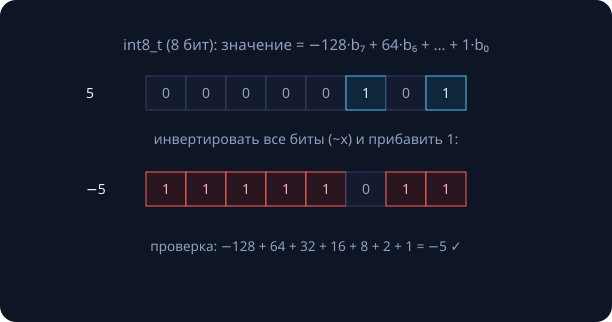
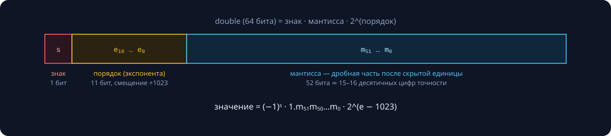
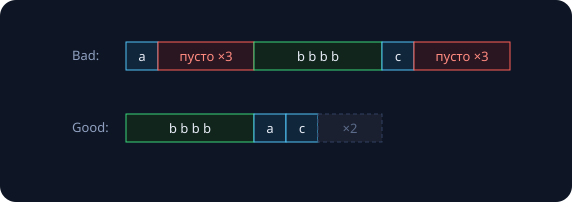
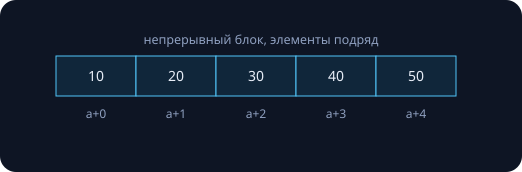
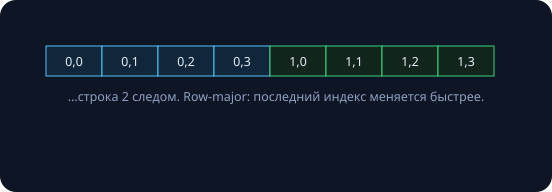
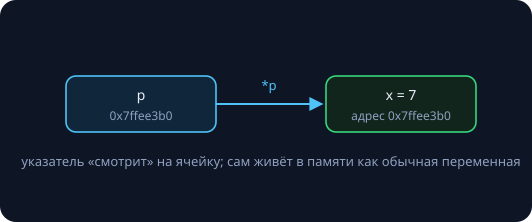

Двойное занятие с одним сквозным сюжетом: **тип — это контракт с компилятором** о том, сколько байт занять, как их интерпретировать и какие операции разрешить. Часть I — примитивные типы и их битовое устройство; часть II — составные: массивы, указатели, ссылки. Все размеры и результаты в примерах — реальные замеры (arm64 macOS, LP64; на других платформах отмечено особо).

## Часть I. Примитивные типы

### Типы — очки, через которые читают байты

Память не хранит «числа» — только биты. Одни и те же четыре байта `0x3F800000` — это `int` 1 065 353 216, `float` 1.0f или четыре отдельных байта — смотря каким типом на них посмотреть.

Сравните две модели типизации:

| | C++ (статическая) | Python (динамическая) |
|---|---|---|
| тип знает | компилятор, до запуска | объект, во время работы |
| ошибка типа | не скомпилируется | `TypeError` в рантайме |
| цена | 0 байт накладных | заголовок у каждого объекта |
| гибкость | ниже | выше |

Статическая типизация — это «бесплатные тесты», которые компилятор прогоняет при каждой сборке.

### Память — лента пронумерованных байтов


Переменная после компиляции — это **адрес + тип**; имена существуют только в исходнике. На x86 и ARM порядок байтов **little-endian**: младший байт числа лежит по младшему адресу (42 = `2A 00 00 00`) — заметно при работе с байтами напрямую и в сетевых протоколах.

### Целые типы

| тип | байт* | диапазон |
|---|---|---|
| `char` | 1 | −128…127 (или 0…255) |
| `short` | 2 | ±3.2·10⁴ |
| `int` | 4 | ±2.1·10⁹ |
| `long long` | 8 | ±9.2·10¹⁸ |
| `uint64_t` | 8 | 0…1.8·10¹⁹ |

\* Столбец «байт» — конкретно эта машина. Стандарт гарантирует лишь минимумы (`int` ≥ 16 бит, `long` ≥ 32, `long long` ≥ 64); знаменитая ловушка — `long`: 4 байта на Windows, 8 на Linux/macOS. Когда размер важен, берите точные типы из `<cstdint>`:

```cpp
#include <cstdint>
int32_t  a;   // ровно 32 бита
int64_t  b;   // ровно 64 бита
uint8_t  c;   // байт 0..255
```

Практика курса: `int` для мелочи, `int64_t` — для всего серьёзного. И помните предел: $F_{93} = 1.2 \cdot 10^{19}$ уже не влезает в `uint64_t` — граница типов задаёт границу задач (решение — на занятии 4).

### Дополнительный код: как хранят минус



В дополнительном коде (two's complement) старший бит имеет вес $-2^{63}$ (для int64), остальные — обычные веса. Получить $-x$: инвертировать все биты и прибавить 1. Следствия:

- сложение **одно для знаковых и беззнаковых** — процессору не нужны разные схемы;
- ровно один ноль; диапазон несимметричен: $-2^{63} \dots 2^{63}{-}1$;
- с C++20 дополнительный код — единственное разрешённое стандартом представление;
- отсюда битовые трюки вроде `x & (-x)` — выделить младший единичный бит.

### Переполнение: две очень разные истории

**Знаковое переполнение — undefined behavior:**

```cpp
int x = INT_MAX;
x + 1;                   // UB: не «минус много», а «что угодно»
if (x + 1 < x) { ... }   // компилятор ВЕРИТ, что UB не бывает:
                         // на -O2 может удалить проверку целиком
```

**Беззнаковое — определённая стандартом арифметика по модулю $2^n$:**

```cpp
unsigned u = 0;
u - 1;        // 4294967295 — законная «обёртка»
uint8_t h = 250;
h += 10;      // 4 — тоже норма
```

Правило курса: для количества и арифметики — знаковый тип с запасом (`int64_t`); беззнаковые — для битовой семантики (хеши, маски, криптография) и там, где требует интерфейс (`size_t` у контейнеров). Знаковый UB ловится флагом `-fsanitize=undefined` — держите его включённым.

### bool и char

`bool` занимает **байт**, не бит (битовую упаковку даёт `std::bitset`). Указатели и числа неявно преобразуются в `bool` — отсюда идиома `if (ptr)`. Классическая ловушка `while (x = next())` — присваивание вместо сравнения — компилируется; её ловит `-Wall`.

`char` — число-код символа: `'A'` это 65, `'9' - '0'` это 9 (классика парсинга). Тонкости: знаковость `char` — implementation-defined (на ARM исторически unsigned!); кириллица в UTF-8 занимает 2 байта, поэтому `char r = 'Я'` не сделает ничего хорошего — строки и Unicode разберём на занятии 9.

### IEEE 754: научная запись в битах



`double` — 64 бита: 1 бит знака, 11 бит порядка (со смещением +1023), 52 бита мантиссы:

$$x = (-1)^s \cdot 1.m_{51}m_{50}\dots m_0 \cdot 2^{\,e-1023}$$

52 бита мантиссы ≈ 15–16 десятичных цифр точности. `float` — 1+8+23, ~7 цифр. Специальные значения: `±inf` (результат 1/0.0), `NaN` (0.0/0.0; единственное значение, не равное самому себе), ±0, денормализованные числа около нуля. Ключевое свойство: **шаг сетки растёт с величиной** — около $10^{16}$ соседние double отличаются уже на 2.

### Ловушки плавающей точки

```cpp
printf("%.17f\n", 0.1 + 0.2);   // 0.30000000000000004
0.1 + 0.2 == 0.3;               // false!
```

0.1 в двоичной системе — бесконечная периодическая дробь, обрезанная до 52 бит; ошибки округления складываются. Правила выживания:

- сравнивайте с допуском: `fabs(a - b) < eps` (или относительный eps);
- деньги и точные счётчики в `double` не храните — целые копейки;
- не вычитайте близкие числа — «катастрофическое сокращение» съедает значащие цифры;
- миллионы слагаемых суммируйте аккуратно (от меньших к большим, алгоритм Кэхэна).

Помните формулу Бине с прошлого занятия? Она ломалась на $F_{72}$ ровно из-за этих 52 бит.

### Литералы

```cpp
42        // int          0x2A      // hex: 42
42u       // unsigned     0b101010  // бинарный: 42
42ll      // long long    052       // ВОСЬМЕРИЧНЫЙ: 42, не 52!
3.14      // double       1'000'000'007  // разделители
3.14f     // float        1e9       // double
```

Две классические ловушки: ведущий ноль делает литерал восьмеричным; `1 << 40` — сдвиг `int` на 40 бит — UB (нужно `1LL << 40`). Аналогично `2'000'000'000 * 2` переполнит `int` ещё до присваивания в `long long`.

### Неявные преобразования

```cpp
-1 < 1u;             // false! int -1 -> unsigned: 4294967295 > 1
double d = 10 / 4;   // 2.0 — деление уже было целым
int i = 3.99;        // 3 — дробь молча отброшена
char c = 300;        // 44 — обрезано до байта
```

Правила, которые стоит знать по именам: **integer promotion** (`char`, `short`, `bool` в выражениях растут до `int`) и **usual arithmetic conversions** (разные типы приводятся к «старшему»; смешение signed и unsigned приводит **к unsigned** — отсюда `-1 > 1u`). Сужающие преобразования молчат при `=`, но запрещены в фигурных скобках: `int x{3.99};` — ошибка компиляции. Явное преобразование — `static_cast<T>(x)`: видно глазами и ищется грепом; C-style каст `(T)x` в курсе не используем.

### sizeof и выравнивание

```cpp
struct Bad  { char a; int b; char c; };   // sizeof == 12
struct Good { int b; char a; char c; };   // sizeof == 8 — та же информация!
```



`int` хочет лежать по адресу, кратному четырём, — компилятор вставляет **padding**; размер структуры добивается до кратности самого строгого члена (чтобы работали массивы). Порядок полей «от крупных к мелким» экономит память — на миллионе объектов это мегабайты. `sizeof` — оператор времени компиляции; возвращает он `size_t`, о котором — часть II.

### Мини-практика I

Что напечатает каждый фрагмент?

```cpp
// A                            // B                       // C
double d = 1e16;                unsigned u = 5;            char c = '5';
std::cout << (d + 1 == d);      int i = -10;               int x = c - '0';
                                std::cout << u + i;        std::cout << x * 2;
```

{}
A → `1` (шаг сетки double около $10^{16}$ равен 2, прибавление единицы теряется); B → `4294967291` (сложение ушло в unsigned); C → `10` (коды цифр в ASCII идут подряд).
{}

## Часть II. Составные типы

### Массив C-style

```cpp
int a[5] = {10, 20, 30, 40, 50};
a[2];        // 30 — буквально *(a + 2)
sizeof(a);   // 20 байт
a[7];        // компилируется. UB.
```



Массив — непрерывный блок памяти: доступ по индексу за $O(1)$ (адрес = база + i·sizeof(T)), но **границы не проверяются** — выход за них компилируется и молча портит чужую память (или ловится ASan'ом). Размер фиксирован на этапе компиляции; `int b[n]` с переменным `n` — не стандартный C++ (это VLA из C).

### std::array — тот же массив с манерами

```cpp
#include <array>
std::array<int, 5> a = {10, 20, 30, 40, 50};
a.size();    // 5 — размер не теряется
a.at(7);     // бросит std::out_of_range
auto b = a;  // копируется целиком
```

По памяти и скорости идентичен C-массиву (тот же блок на стеке), но знает свой размер, умеет копироваться и сравниваться и не «распадается» при передаче в функцию. Динамический размер — это уже `std::vector` (занятие 8).

Для двумерных массивов помните про **row-major**: `m[i][j]` лежит по смещению `i*COLS + j`, строки подряд — обход «по строкам» дружит с кэшем процессора, на больших матрицах разница в разы.



### Указатели

```cpp
int x = 42;
int* p = &x;       // & — взять адрес
*p = 7;            // * — разыменовать: x теперь 7
int* q = nullptr;  // «никуда»; *q — UB
sizeof(p);         // 8 — размер адреса, не значения
```



Указатель — переменная, хранящая **адрес**; его тип (`int*`) говорит, *что* лежит по адресу. «Пустой» указатель — `nullptr` (не `0` и не макрос `NULL`).

**Арифметика указателей** измеряется элементами, не байтами: `p + 1` сдвигает адрес на `sizeof(T)`. Отсюда тождество `a[i] == *(a + i)` — и то, как массивы попадают в функции: имя массива в выражениях «распадается» (decay) в указатель на первый элемент, а размер передают отдельно: `f(int* p, size_t n)`. Пара «указатель + длина» — прообраз итераторов STL. Легально двигаться только внутри массива и на позицию «за последним» (one-past-the-end); дальше — UB даже без разыменования.

Три классических способа прострелить ногу:

```cpp
int* f() {                 int* p = find(x);         int a[5];
    int local = 5;         *p = 1;  // если p null    for (int i = 0; i <= 5; ++i)
    return &local;         // — segfault               a[i] = 0;   // i == 5:
}   // адрес «трупа»                                   // чужая память
```

Страховка на время обучения: `-fsanitize=address,undefined -g` — ASan печатает точное место преступления вместо «иногда падает по пятницам».

### Ссылки

```cpp
int x = 42;
int& r = x;   // r — второе имя x
r = 7;        // это x = 7, без всяких *
int& bad;     // ошибка: ссылка обязана быть инициализирована

int z = 1;
r = z;        // ВНИМАНИЕ: не перепривязка, а x = z
```

Ссылка — псевдоним объекта: обязана быть инициализирована, всегда смотрит на один и тот же объект, не бывает «пустой», не имеет арифметики. Под капотом это обычно тот же адрес — «указатель с хорошим воспитанием».

| | указатель `T*` | ссылка `T&` |
|---|---|---|
| может быть «пустым» | да, `nullptr` | нет |
| можно перенацелить | да | нет |
| арифметика | да | нет |
| доступ | `*p`, `p->f` | `r`, `r.f` |

Выбор за 10 секунд: нужна опциональность («может отсутствовать») или перенацеливание — указатель; всё остальное — ссылка, у неё меньше способов ошибиться.

### Передача аргументов в функции

```cpp
void byValue(BigMatrix m);           // копия — дорого
void byRef(BigMatrix& m);            // функция изменит оригинал
void byConstRef(const BigMatrix& m); // читает без копии — выбор по умолчанию
void byPtr(BigMatrix* m);            // может быть null; у вызова видно &x
```

Ориентиры: мелкие типы (до ~16 байт: `int`, `double`, указатели) — по значению; крупные объекты только читаем — `const T&`; функция должна изменить аргумент — `T&`; аргумент опционален или API в стиле C — `T*`.

### const и указатели: читаем справа налево

```cpp
const int* p1;        // указатель на const int:   *p1 менять нельзя, p1 — можно
int* const p2 = &x;   // const-указатель на int:   p2 менять нельзя, *p2 — можно
const int* const p3;  // нельзя ни то, ни другое
```

Приём: читайте объявление справа налево («p2 — const-указатель на int»). Const-корректность — документация, которую проверяет компилятор: сигнатура `size_t count(const int* data, size_t n)` обещает не трогать данные. Сужать права (передать обычную переменную туда, где ждут `const`) можно; расширять — нельзя.

### size_t и вечный спор signed vs unsigned

`size_t` — беззнаковый тип размера: его возвращают `sizeof` и `.size()` всех контейнеров, 8 байт на 64-битных платформах. Расстояние между указателями — знаковый `ptrdiff_t`.

Классика жанра — обратный цикл:

```cpp
for (size_t i = n - 1; i >= 0; --i)   // ВЕЧНЫЙ цикл: беззнаковый
    ...                               // не бывает < 0; после 0 идёт 2^64-1
```

Правильно: `for (size_t i = n; i-- > 0; )` — трюк «goes to», — или знаковый счётчик. Другие мины: `v.size() - 4` при коротком векторе даёт гигантское число, `v.size() > -1` — всегда false.

Договорённости курса: арифметика и счётчики — знаковые (`int`/`int64_t`); индексы при работе со стандартной библиотекой — `size_t` без смешения со знаковыми в одном выражении; смешанные сравнения не пишем (C++20 даёт честные `std::cmp_less` и компанию); предупреждения `-Wall -Wextra` не глушим кастами.

### auto и инициализация

```cpp
auto n = v.size();    // size_t — тип выведен без сюрпризов
auto  a = v[0];       // КОПИЯ элемента
auto& b = v[0];       // ссылка на элемент
```

`auto` берёт тип из инициализатора на этапе компиляции (это не динамическая типизация!) и спасает от нечаянных сужений. Помните: сам по себе `auto` всегда копирует — ссылку нужно попросить (`auto&`, `const auto&`). Стиль: `auto` — где тип очевиден или громоздок (итераторы); где тип — часть смысла (`int64_t` в арифметике), пишем явно.

Инициализация:

```cpp
int a;        // МУСОР: чтение — UB (локальные примитивы не зануляются!)
int c{};      // 0
int e{3.7};   // ошибка компиляции: narrowing запрещён в {}
int f = 3.7;  // 3 — молча
```

Привычка курса: инициализируй при объявлении, объявляй как можно ближе к использованию.

### Взгляд со стороны: Python

```python
x = 2 ** 200          # int произвольной точности — из коробки
0.1 + 0.2             # 0.30000000000000004 — тот же IEEE 754 double!
sys.getsizeof(1)      # 28 байт на «int»
```

`int` в Python — длинная арифметика из коробки (как она устроена — следующее занятие!); `float` — ровно тот же IEEE 754 double со всеми ловушками; цена универсальности — 28 байт на число и списки указателей вместо плоских массивов. Потому numpy хранит данные «по-сишному».

### Мини-практика II

Найдите проблему в каждом фрагменте:

```cpp
// A                     // B                                // C
int* p;                  std::vector<int> v;                 void inc(int x) { x += 1; }
if (cond) p = &x;        for (size_t i = 0;                  int a = 5;
*p = 5;                       i < v.size() - 1; ++i)         inc(a);   // a == ?
                             use(v[i], v[i+1]);
```

{}
A — при `cond == false` указатель не инициализирован, разыменование — UB. B — для пустого вектора `v.size() - 1` = $2^{64}-1$: почти вечный цикл с выходами за границы. C — `a` осталось 5: передача по значению; нужна `int& x`.
{}

## См. также

- [Базовые структуры данных (теория)]({}) — что вырастает из массивов: динамический массив, связный список, стек, очередь и дек; на занятии 8 разберём с реализацией.

## Итоги

- Тип = размер + интерпретация битов + допустимые операции; статическая типизация ловит ошибки до запуска.
- Целые: гарантии стандарта против `<cstdint>`; дополнительный код; знаковое переполнение — UB, беззнаковое — по модулю.
- IEEE 754: 52 бита мантиссы; сравнение с eps; деньгам в double не место.
- Неявные преобразования тянут в unsigned и молча сужают — фигурные скобки и `-Wall` в помощь.
- Массив — непрерывная память без проверок; `std::array` — то же + манеры.
- Указатель хранит адрес (шаг арифметики — `sizeof(T)`); ссылка — псевдоним без «пустоты»; параметры по умолчанию — `const T&`.
- `const` читаем справа налево; `size_t` беззнаковый — обратные циклы и вычитания требуют внимания.

## Практика

1. Напечатайте `sizeof` всех примитивов на своей машине; сравните с соседом по ОС.
2. Переупорядочите поля структуры из трёх типов так, чтобы `sizeof` стал минимальным.
3. Напишите `swap` двумя способами — через указатели и через ссылки — и объясните, почему версия «по значению» не работает.
4. Найдите три бага в выданном коде (смешение signed/unsigned, мусорная инициализация, висячий указатель); ASan разрешён.
