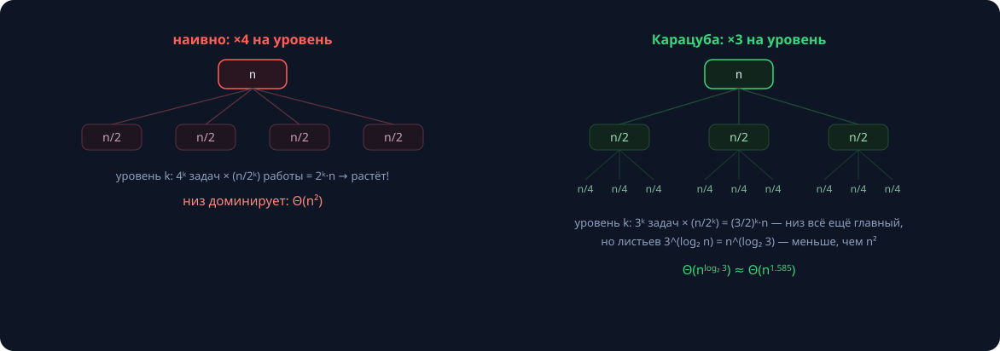
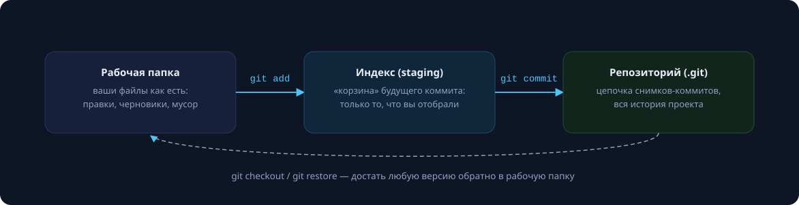
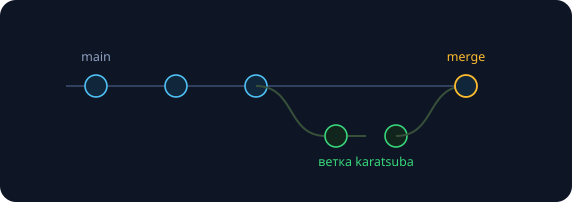

Потолок «железной» арифметики — `uint64_t`: $2^{64} - 1 \approx 1.8 \cdot 10^{19}$, всего 20 цифр. При этом $F_{500}$ — 105 цифр, $1000!$ — 2568 цифр, ключ RSA — 617 цифр. Python делает вид, что проблемы нет: его `int` безразмерный. Сегодня узнаем, что у него внутри, и соберём то же самое руками — а заодно освоим Git, через который будем сдавать домашние задания.

## Представление: число — это вектор цифр

```cpp
// 1 048 576 при основании 10:
std::vector<int> d = {6, 7, 5, 8, 4, 0, 1};
// d[0] — единицы, d[1] — десятки, …, d[i] — цифра при 10^i
```

Порядок **little-endian** (младшие разряды в начале) удобен: сложение и умножение идут от младших разрядов — то есть от начала вектора. Держим инварианты: $0 \le d[i] < 10$ и никаких ведущих нулей (кроме самого числа 0).

Основание не обязано быть десяткой: продакшен-вариант — база $10^9$, одна «цифра» — целый `int` (в 9 раз меньше памяти и итераций; печать — по 9 знаков с ведущими нулями). На семинаре пишем базу 10 — её прозрачнее отлаживать.

## Сложение: школьный столбик


```cpp
std::vector<int> add(const std::vector<int>& a, const std::vector<int>& b) {
    std::vector<int> res;
    int carry = 0;
    for (size_t i = 0; i < std::max(a.size(), b.size()) || carry; ++i) {
        int cur = carry;
        if (i < a.size()) cur += a[i];
        if (i < b.size()) cur += b[i];
        res.push_back(cur % 10);   // цифра
        carry = cur / 10;          // перенос
    }
    return res;
}
```

Обратите внимание на условие `|| carry`: оно дотягивает последний перенос, когда результат длиннее обоих слагаемых (958 + 147 = 1105). Время — $\Theta(\max(n, m))$: каждый разряд трогаем один раз. Вычитание устроено так же, но с *заёмом* (borrow) и предусловием $a \ge b$; сравнение идёт со старших разрядов с учётом длин.

## Умножение столбиком

```cpp
std::vector<int> mul(const std::vector<int>& a, const std::vector<int>& b) {
    std::vector<int> res(a.size() + b.size(), 0);
    for (size_t i = 0; i < a.size(); ++i) {
        int carry = 0;
        for (size_t j = 0; j < b.size() || carry; ++j) {
            int64_t cur = res[i + j] + carry;
            if (j < b.size()) cur += int64_t(a[i]) * b[j];
            res[i + j] = int(cur % 10);
            carry = int(cur / 10);
        }
    }
    // срезать ведущие нули
    return res;
}
```

Цифра `a[i]` умножается на **каждую** цифру `b[j]`, произведение копится в ячейке `i + j` — это и есть «сдвиги» школьного столбика. Вложенные циклы дают $\Theta(n \cdot m)$, для равных длин — $\Theta(n^2)$. Много это или мало?

| цифр | операций ~$n^2$ | при $10^8$ оп/с |
|---|---|---|
| $10^3$ | $10^6$ | 0.01 с |
| $10^4$ | $10^8$ | 1 с |
| $10^5$ | $10^{10}$ | ~2 мин |
| $10^6$ | $10^{12}$ | ~3 часа |

Квадрат больно кусается. Можно ли быстрее? До 1960 года «все знали», что нельзя.

## Разделяй и властвуй: первая попытка

Разрежем $n$-значные числа посередине ($B = 10^{n/2}$):

$$x = x_1 B + x_0, \qquad y = y_1 B + y_0$$

$$xy = x_1 y_1 B^2 + (x_1 y_0 + x_0 y_1) B + x_0 y_0$$

Умножение на $B^k$ — это сдвиг (приписать нули), сложения дешёвые; осталось **четыре умножения** половинной длины. Считаем: $T(n) = 4T(n/2) + \Theta(n)$. Раскручивая рекурсию (4 задачи размера $n/2$, 16 задач размера $n/4$, …), получаем снова $\Theta(n^2)$: четыре половинки стоят ровно как одно целое. Ничего не выиграли. (Строгий инструмент для таких рекуррент — мастер-теорема, занятие 6.)

## Трюк Карацубы: три умножения вместо четырёх

Вычислим всего три произведения половинной длины:

$$P_1 = x_1 y_1, \qquad P_2 = x_0 y_0, \qquad P_3 = (x_1 + x_0)(y_1 + y_0)$$

Средний член достаётся бесплатно — вычитанием:

$$x_1 y_0 + x_0 y_1 = P_3 - P_1 - P_2$$

$$xy = P_1 B^2 + (P_3 - P_1 - P_2)\,B + P_2$$

Мы обменяли одно умножение (стоимостью $\Theta(n^2)$) на несколько сложений и вычитаний (стоимостью $\Theta(n)$) — обмен выгодный. Проверьте выкладку сами: раскройте $(x_1+x_0)(y_1+y_0)$ и убедитесь, что лишние члены — ровно $P_1$ и $P_2$.



Теперь рекуррента $T(n) = 3T(n/2) + \Theta(n)$: на уровне $k$ дерева — $3^k$ задач размера $n/2^k$, листьев $3^{\log_2 n} = n^{\log_2 3}$, и именно листья доминируют:

$$T(n) = \Theta\!\left(n^{\log_2 3}\right) \approx \Theta\!\left(n^{1.585}\right)$$

| цифр | $n^2$ | $n^{1.585}$ | выигрыш |
|---|---|---|---|
| $10^3$ | $10^6$ | ≈ $5.7 \cdot 10^4$ | ×18 |
| $10^4$ | $10^8$ | ≈ $2.2 \cdot 10^6$ | ×46 |
| $10^6$ | $10^{12}$ | ≈ $3.2 \cdot 10^9$ | ×310 |

>[!warning] Скрытая константа не дремлет
> У Карацубы больше сложений и рекурсивной возни: на коротких числах школьный столбик быстрее. Реальные библиотеки переключаются между алгоритмами по длине (CPython — примерно с 70 десятичных цифр). Это «скрытая константа» из занятия 2 — вживую.

### Карацуба в коде

```cpp
using Big = std::vector<int>;

Big karatsuba(const Big& x, const Big& y) {
    size_t n = std::max(x.size(), y.size());
    if (n <= 32) return mul(x, y);            // база: столбик быстрее

    size_t m = n / 2;
    auto [x0, x1] = split(x, m);              // младшая и старшая половины
    auto [y0, y1] = split(y, m);

    Big p1 = karatsuba(x1, y1);
    Big p2 = karatsuba(x0, y0);
    Big p3 = karatsuba(add(x1, x0), add(y1, y0));

    Big mid = sub(sub(p3, p1), p2);           // x1·y0 + x0·y1

    return add(add(shift(p1, 2 * m), shift(mid, m)), p2);
}
```

Вспомогательные `split` (разрез вектора), `shift` (приписать $k$ нулевых разрядов — умножение на $B^k$ за линию) и `sub` дописываются на семинаре. Отлаживать — **стресс-тестом**: гоняем Карацубу против школьного умножения на тысячах случайных пар и сравниваем результаты; это главный инструмент проверки правильности во всём курсе.

## Страница истории: 1960 год

- **1956.** А. Н. Колмогоров формулирует «гипотезу $n^2$»: умножать быстрее, чем за $\Theta(n^2)$, невозможно. Так человечество считало тысячелетиями.
- **Осень 1960.** Колмогоров объявляет гипотезу на своём семинаре в МГУ.
- **Через неделю** 23-летний студент **Анатолий Карацуба** приносит алгоритм за $\Theta(n^{\log_2 3})$ — гипотеза опровергнута.
- **1962.** Колмогоров сам пишет статью и публикует её от имени Карацубы; автор узнал о публикации уже из оттисков.

Так родилась целая область — быстрые алгоритмы. Мораль: «все знают, что быстрее нельзя» — не доказательство. Проверяйте нижние оценки, а не фольклор.

## Проверка боем: Python использует Карацубу

CPython переключается на Карацубу для больших `int` — и это видно обычным секундомером:

```python
import time, random
for digits in (10_000, 40_000, 160_000):
    a = random.randrange(10**(digits-1), 10**digits)
    b = random.randrange(10**(digits-1), 10**digits)
    t0 = time.perf_counter()
    c = a * b
    print(digits, time.perf_counter() - t0)
```

| цифр | время* | рост |
|---|---|---|
| 10 000 | 0.29 мс | |
| 40 000 | 2.6 мс | ×9 |
| 160 000 | 23.7 мс | ×9 |

\* CPython 3, медиана из 5 прогонов.

Длина ×4 → время ×9. Ровно $4^{\log_2 3} = 9$ — сигнатура Карацубы; школьный столбик дал бы $4^2 = 16$. Асимптотика — не абстракция: её видно в три строки кода.

### Лестница алгоритмов умножения

| год | алгоритм | сложность | когда включается |
|---|---|---|---|
| ~−2000 | столбик | $\Theta(n^2)$ | до ~$10^2$ цифр |
| 1960 | **Карацуба** | $\Theta(n^{1.585})$ | $10^2$–$10^4$ |
| 1963 | Тоом–Кук (Toom-3) | $\Theta(n^{1.465})$ | $10^4$–$10^5$ |
| 1971 | Шёнхаге–Штрассен (FFT) | $\Theta(n \log n \log \log n)$ | $10^5$ и дальше |
| 2019 | Харви–ван дер Хувен | $\Theta(n \log n)$ | пока только теория |

Библиотека GMP держит все уровни сразу и переключается по длине. Нижняя оценка $\Omega(n \log n)$ до сих пор **не доказана** — вопрос открыт; может быть, среди читателей сидит следующий Карацуба.

## Деление

Деление длинного числа на **короткое** (влезающее в `int`) — простой проход со старших разрядов с протаскиванием остатка:

```cpp
Big divShort(const Big& a, int b, int& rem) {
    Big res(a.size());
    int64_t cur = 0;
    for (size_t i = a.size(); i-- > 0; ) {   // со старших разрядов!
        cur = cur * 10 + a[i];
        res[i] = int(cur / b);
        cur %= b;
    }
    rem = int(cur);
    return res;   // + срезать ведущие нули
}
```

(Заметьте цикл `i-- > 0` — наш трюк против беззнакового `size_t` из занятия 3.)

Деление **длинного на длинное** — школьный столбик с подбором очередной цифры частного (двоичным поиском «влезает ли $b \cdot d$») — $\Theta(n^2)$; быстрые варианты строятся через метод Ньютона и стоят как умножение. Краевые случаи — источник 90% багов: ноль, $b = 1$, ведущие нули результата, остаток. Пишите тесты до кода.

## См. также

- [Элементарная арифметика (теория, весенний семестр)]({}) — расширенная версия темы: деление длинных чисел столбиком в подробностях, оценки и доказательства корректности.

## Git: машина времени для кода

Вторая часть семинара — инструмент, которым сдаются все домашние задания курса.

Git решает три задачи: **история** (каждое состояние проекта сохранено — можно вернуться к «работало вчера»), **эксперименты без страха** (ветка — песочница) и **совместная работа** (двое правят проект, не затирая друг друга). Ключевая идея: Git хранит **снимки** (snapshots) всего проекта. Каждый снимок — коммит: содержимое + автор + время + ссылка на родителя; имя коммита — SHA-хеш содержимого, поэтому историю нельзя незаметно подделать.

### Три зоны



- **Рабочая папка** — ваши файлы как есть: правки, черновики, мусор.
- **Индекс (staging)** — «корзина» будущего коммита: только то, что вы отобрали командой `git add`.
- **Репозиторий (.git)** — цепочка коммитов, вся история; пополняется командой `git commit`.

Зачем индекс? Коммит должен быть **осмысленной порцией**: из десяти правок можно отобрать три связанных и закоммитить только их. Команда `git status` показывает состояние всех трёх зон — запускайте её рефлекторно.

### Минимальный цикл работы

```bash
git clone git@github.com:spbu/bigint-ivanov.git
cd bigint-ivanov
# … пишем код …
git status
git add add.cpp
git commit -m "add: сложение длинных чисел"
git push origin main
git pull          # забрать изменения с сервера
```

Сообщения коммитов пишем по-человечески: хорошо — «fix: перенос при равных длинах», плохо — «фикс», «работает!!», «final_final2». Правило: сообщение отвечает на вопрос *«что изменится, если этот коммит применить»*. Коммитьте часто и мелко — каждый логический шаг; «одним коммитом всё ДЗ» — антипаттерн: такую историю нельзя ни читать, ни откатывать.

### Ветки и .gitignore



```bash
git switch -c karatsuba   # создать ветку и перейти в неё
git switch main           # вернуться
git merge karatsuba       # влить ветку в main
```

В `.gitignore` перечисляем то, чему в истории не место:

```gitignore
build/
*.o
a.out
.DS_Store
```

В репозитории живут **исходники**, а не артефакты сборки (бинарники всегда собираются заново из кода). И никогда не коммитьте секреты — пароли, токены: история помнит всё.

## Итоги

- Длинное число — вектор цифр little-endian; сложение $\Theta(n)$, школьное умножение $\Theta(n^2)$.
- Карацуба: три половинных умножения вместо четырёх → $\Theta(n^{1.585})$; выгода — с сотен цифр (скрытая константа!).
- Замер Python подтверждает теорию: длина ×4 → время ×9 = $4^{\log_2 3}$.
- Выше по лестнице — Тоом–Кук и FFT; нижняя оценка умножения — открытая проблема.
- Git: снимки-коммиты, три зоны, цикл `status → add → commit → push`; мелкие осмысленные коммиты, ветка на задачу, мусор — в `.gitignore`.

## Домашнее задание (сдача через Git)

1. BigInt: чтение, печать, сравнение, сложение, вычитание.
2. Умножение столбиком + тесты на краевые случаи (нули, переносы, разные длины).
3. Посчитать $1000!$ и $F_{1000}$; приложить время работы.
4. История — минимум 5 осмысленных коммитов.
5. \* Карацуба со стресс-тестом против столбика.
