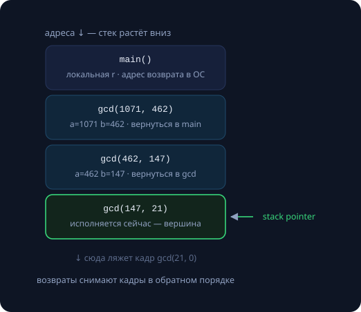
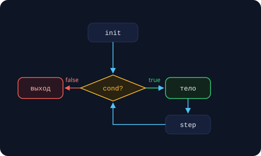

Программа — это не список действий, а граф решений и повторений. Сегодня разбираем инструменты управления этим графом: функции (и их скрытую механику — стек вызовов), ветвления и циклы — вместе с полным каталогом способов застрять в цикле навечно. Все числа в конспекте — реальные замеры (Apple M-серия, clang).

## Функции

### Единица смысла, а не экономии строк

Функция нужна не для того, чтобы «не повторять код» (это приятный бонус), а чтобы:

- **декомпозировать**: большая задача превращается в композицию маленьких, каждую можно понять отдельно;
- **зафиксировать контракт**: сигнатура обещает «что», скрывая «как» — вспомните разделение интерфейса и реализации через `.h/.cpp` из занятия 1;
- **тестировать в изоляции**: функцию можно прогнать на краевых случаях отдельно от всей программы.

Эмпирическое правило: функция делает **одну вещь** и умещается на экран. Если в имени просится союз «и» — `read_and_validate_and_save()` — это три функции. Имя — глагол или вопрос: `parse()`, `is_prime()`; если имя не придумывается, вы ещё не поняли, что делает функция.

### Анатомия

```cpp
//   тип      имя     параметры
long long power(long long base, int exp) {
    long long r = 1;
    while (exp-- > 0) r *= base;
    return r;
}
```

Терминология: **параметры** — имена внутри функции, **аргументы** — то, что передали при вызове. Параметр — новая переменная, живущая от вызова до возврата. `return` завершает функцию немедленно, из любого места. Функция не-`void` обязана вернуть значение на каждом пути исполнения — «дойти до конца без return» это UB (ловится `-Wall` через `-Wreturn-type`).

### Стек вызовов

Каждый вызов функции кладёт на стек **кадр** (stack frame): параметры, адрес возврата, локальные переменные. `return` снимает кадр и продолжает исполнение с адреса возврата. Рекурсия работает ровно поэтому: каждый уровень получает **независимый** кадр со своими значениями.



Стек конечен. По умолчанию — около 8 МБ (`ulimit -s` → 8176 КБ):

```cpp
long depth = 0;
void dive() { ++depth; dive(); }   // рекурсия без базы
int main() { dive(); }
```

```
$ clang++ -O0 stack_depth.cpp && ./a.out
261000
zsh: segmentation fault
```

8 МБ ÷ ~32 байта на кадр ≈ **260 тысяч вызовов** — арифметика сходится с экспериментом. Переполнение стека — мгновенный segfault, его нельзя поймать и обработать.

> [!tip] Правило
> Рекурсия хороша, когда глубина *логарифмическая* (двоичный поиск, быстрое возведение в степень) или заведомо мала. Линейная глубина порядка $10^5$ и больше — переписываем циклом или явным стеком.

### Хвостовая рекурсия

Если рекурсивный вызов — **последнее действие** функции, кадр можно не сохранять: компилятор заменяет вызов переходом (tail call optimization), и рекурсия превращается в цикл:

```cpp
long fact_acc(long n, long acc) {
    if (n <= 1) return acc;
    return fact_acc(n - 1, acc * n);   // хвостовой вызов
}
```

В листинге `clang++ -S -O2` этой функции нет **ни одной инструкции вызова** — только сравнения и переходы: стек не растёт. Но заметьте: `fib_rec` из занятия 2 — *не* хвостовая рекурсия (после вызовов ещё сложение), а стандарт C++ TCO **не гарантирует** — на `-O0` та же функция честно упадёт. Не стройте корректность программы на оптимизации.

### Параметры: передача и умолчания

Способы передачи — шпаргалка из занятия 3: мелкое копией (`int x`), крупное для чтения — `const T&`, для изменения — `T&`, «может отсутствовать» — `T*`. Новое — значения по умолчанию:

```cpp
double round_to(double x, int digits = 2);
round_to(3.14159);      // digits = 2
round_to(3.14159, 4);   // явно
```

Умолчания задаются **в объявлении** (в заголовке) — вызывающие видят только его; вычисляются заново при каждом вызове (запомните это до Python-интерлюдии). Много параметров — запах: связанные настройки собирайте в структуру.

### Перегрузка

```cpp
int    max(int a, int b);
double max(double a, double b);

max(3, 5);      // int-версия
max(3, 5.0);    // ошибка: неоднозначно
```

Перегрузки различаются **типами параметров** (возвращаемый тип не участвует). Компилятор выбирает лучшее соответствие: точное → продвижения (`char`→`int`, `float`→`double`) → преобразования (`int`→`double`); если лучших несколько — честная ошибка компиляции. Под капотом работает манглинг из занятия 1: `__Z3maxii` и `__Z3maxdd` — разные символы для линковщика.

> [!warning] Стиль
> Перегрузки должны делать одно и то же для разных типов. Если `print(int)` печатает, а `print(bool)` пишет в файл — вы готовите коллегам сюрприз.

### Возврат: одно значение, несколько, ни одного

```cpp
std::pair<int, bool> divide(int a, int b) {
    if (b == 0) return {0, false};
    return {a / b, true};
}
auto [q, ok] = divide(10, 3);   // structured bindings, C++17
```

Возврат больших объектов дёшев: copy elision / RVO строит объект сразу на месте результата (гарантировано стандартом с C++17). Несколько значений — `std::pair`/`std::tuple` со structured bindings, а для осмысленных наборов — маленькая `struct` с именованными полями. Атрибут `[[nodiscard]]` заставляет вызывающего использовать результат — вешайте его на функции, игнорирование результата которых почти наверняка баг:

```cpp
[[nodiscard]] bool save(const Data& d);
save(data);    // warning: ignoring return value
```

## Ветвления

### if/else — и init-statement из C++17

```cpp
if (auto it = m.find(key); it != m.end()) {
    use(it->second);
}   // it здесь уже не существует
```

Условие — любое выражение, приводимое к `bool` (отсюда идиомы `if (ptr)`, `if (!v.empty())`). `else if` — это просто `if` внутри `else`. Init-statement сужает область видимости: имя не «протекает» за пределы проверки.

Две привычки: скобки `{}` вокруг веток — всегда (история знает баг Apple `goto fail`, случившийся из-за «второй строки без скобок»); и помните про `if (x = 0)` — присваивание вместо сравнения компилируется, ловится `-Wall`.

### Тернарный оператор

```cpp
const char* sign = x >= 0 ? "+" : "-";
```

`усл ? a : b` — **выражение**: у него есть значение и тип. Главный кейс — инициализация `const`-переменных, где if бессилен. Вычисляется только выбранная ветка. Тернарный — для выбора *значения*; для выбора *действия* — обычный if. Вложенные тернарные не пишем: два уровня уже требуют расстановки скобок в уме.

### switch

```cpp
enum class Op { add, sub, mul, div };

switch (op) {
    case Op::add: r = a + b; break;
    case Op::sub: r = a - b; break;
    case Op::mul: r = a * b; break;
    case Op::div: r = a / b; break;
}   // без default: -Wall предупредит о забытом Op
```

`switch` сравнивает целочисленное выражение (включая `enum` и `char`) с константами времени компиляции. Без `break` исполнение **проваливается** в следующий `case` — источник классических багов; осознанное проваливание помечайте `[[fallthrough]];`. Приём: `switch` по `enum class` *без* `default` — тогда при добавлении нового значения enum компилятор укажет все места, где разбор неполон.

## Циклы

### for: три секции

```cpp
for (int i = 0; i < n; ++i) { use(i); }
//   ^init      ^cond   ^step
```



Порядок: init → cond → тело → step → cond → … Проверка условия — **до** первой итерации: тело может не выполниться ни разу. Счётчик живёт только внутри цикла. Любая секция опциональна: `for (;;)` — идиома осознанной бесконечности.

### while и do-while

```cpp
while (n > 1)                      // 0+ итераций
    n = n % 2 ? 3 * n + 1 : n / 2;

do {                               // 1+ итерация
    std::getline(std::cin, cmd);
} while (cmd != "quit");
```

Соглашение о читаемости: `for` — когда есть счётчик или диапазон; `while` — когда есть условие продолжения; `do-while` — когда тело обязано выполниться хотя бы раз (ввод, меню). Кстати, цикл в примере — гипотеза Коллатца: его завершимость для всех n — открытая математическая проблема.

### range-based for

```cpp
for (int x : v)         use(x);    // копия элемента
for (int& x : v)        x *= 2;    // меняем элементы
for (const auto& x : v) print(x);  // читаем без копий
```

Работает со всем, у чего есть `begin()/end()` — под капотом это в точности цикл по итераторам (тема занятия 16). Выбор формы — та же логика, что у параметров функций. Нет индекса — нет ошибок ±1; нужен индекс — берите классический for. Запрещено добавлять и удалять элементы контейнера внутри range-for: итераторы «протухают», это UB.

### break, continue и вложенные циклы

`break` покидает ближайший цикл или switch; `continue` перепрыгивает к следующей итерации (у for — через step). Ранние выходы упрощают условие цикла: вместо трёх флагов в cond — понятные точки выхода в теле.

Из вложенных циклов `break` не выведет. Лучший выход — функция:

```cpp
bool has_pair(const Grid& g, int sum) {
    for (int a : g.row1)
        for (int b : g.row2)
            if (a + b == sum) return true;
    return false;
}
```

А `goto`? Существует; его легитимная ниша в C — как раз выход из вложенных циклов. В C++ функция с `return` решает то же чище — в курсе goto не используем.

## Ловушки

### Бесконечные циклы: каталог

```cpp
for (size_t i = n - 1; i >= 0; --i)      // 1: unsigned не бывает < 0
for (float x = 0; x != 1.0f; x += 0.1f)  // 2: 0.1 не представим — x перепрыгнет 1.0
while (i < n) { process(j); ++j; }       // 3: меняется не та переменная
for (size_t i = 0; i < v.size(); ++i)
    if (bad(v[i])) v.push_back(...);     // 4: граница убегает от счётчика
```

Диагностика: программа «висит» — это почти всегда цикл; отладчик (пауза → где стоим?) или печать счётчика раз в миллион итераций находят виновника за минуту.

### Инвариант цикла

**Инвариант** — утверждение, истинное перед каждой проверкой условия цикла. Это главный инструмент рассуждения о корректности:

```cpp
int mx = a[0];
// инвариант: mx == max(a[0..i-1])
for (size_t i = 1; i < n; ++i) {
    if (a[i] > mx) mx = a[i];   // инвариант восстановлен для i+1
}
// после цикла: i == n → mx == max(a[0..n-1]), что и требовалось
```

Схема: инвариант истинен до цикла (база) → тело его сохраняет (шаг) → после выхода инвариант вместе с отрицанием условия дают требуемое. Это индукция, замаскированная под программирование. Навык понадобится немедленно: корректный двоичный поиск (занятие 12) без инварианта невозможно ни написать, ни отладить.

### Области видимости и затенение

```cpp
int x = 10;
void f() {
    int x = 20;                      // затеняет внешнюю
    for (int x = 0; x < 3; ++x) { }  // и ещё раз
}
```

Блок `{}` — граница видимости. **Затенение** (shadowing) легально и почти всегда случайно: включите `-Wshadow` в боевой набор флагов. Правило гигиены: объявляйте переменные в минимальной области и как можно ближе к использованию.

### Порядок вычислений

```cpp
int i = 0;
printf("%d %d\n", i++, i++);   // UB!
// warning: multiple unsequenced modifications to 'i' [-Wunsequenced]
```

Два изменения одной переменной без упорядочивания между ними — UB. C++17 навёл частичный порядок (в `a[i] = b[j]`, цепочках `<<`), но порядок вычисления аргументов функции по-прежнему не определён: в `f(read_next(), read_next())` неизвестно, какой вызов первый. Рабочее правило: **не более одного побочного эффекта на выражение**; сложное выражение — разбить на строки с именованными переменными.

### Стиль: ранний выход против лестницы

```cpp
int process(File* f) {
    if (f == nullptr)  return E_NULL;     // guard clauses:
    if (!f->is_open()) return E_CLOSED;   // ошибки обработаны
    if (f->empty())    return E_EMPTY;    // и забыты

    // основная работа — на первом уровне вложенности
}
```

Проверки-«вышибалы» в начале функции вместо четырёхэтажной лестницы if-ов: основной сценарий читается сверху вниз без скроллинга вправо.

## Взгляд со стороны: Python

```python
def f(x, items=[]):     # ловушка: список создаётся ОДИН раз — при def
    items.append(x)
    return items

f(1)   # [1]
f(2)   # [1, 2] — сюрприз!
```

Отличия от C++: умолчания вычисляются один раз при определении функции (в C++ — при каждом вызове), поэтому mutable-умолчание живёт между вызовами. Перегрузки по типам нет — функция это объект, имя указывает на последний `def`. Лимит рекурсии мягкий: ~1000 вызовов и ловимый `RecursionError` вместо segfault. А `for` в Python — всегда range-based; классического трёхсекционного нет.

## Самопроверка

1. Почему переполнение стека нельзя обработать, а `RecursionError` в Python — можно?
2. `f(3)` при перегрузках `f(int)` и `f(double)` — какая версия вызовется для аргумента `3.5f` (float)? Почему?
3. Чем `while (cond)` отличается от `do … while (cond)` по числу гарантированных итераций?
4. Сформулируйте инвариант цикла суммирования массива.

{}
1. Segfault приходит от ОС при обращении за пределы стека — процесс уже не в состоянии продолжать; Python сам считает глубину и бросает обычное исключение заранее.
2. `f(double)`: float→double — продвижение, оно «лучше», чем преобразование float→int.
3. `while` — ноль и больше; `do-while` — одна и больше.
4. Перед проверкой условия: `sum == a[0] + … + a[i-1]`.
{}

## Практика

1. Напишите `is_prime(n)`, `gcd(a, b)` циклом и `power(base, exp)` за $O(\log exp)$ — с обработкой краевых случаев.
2. Перепишите рекурсивный `gcd` итеративно; сравните ассемблер обеих версий на godbolt.org при `-O2`.
3. Измерьте глубину стека своей машины программой `dive()`; объясните полученное число через `ulimit -s`.
4. Сформулируйте инвариант цикла своей `power` и докажите её корректность.
