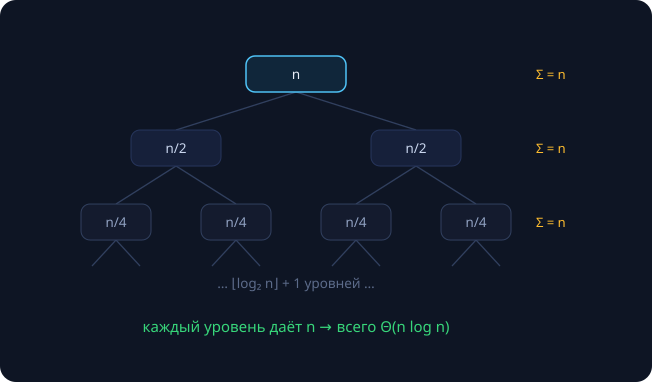

К шестому занятию у нас накопилось четыре рекуррентности, решённые «на глаз»: число вызовов наивного Фибоначчи, два разбиения из длинной арифметики и быстрое возведение в степень. Сегодня получаем строгий инструментарий: два ручных метода, основную теорему с доказательством — и характеристические уравнения, которые закроют обещание, данное ещё на занятии 2.

| откуда | соотношение | мы «угадали» |
|---|---|---|
| наивный fib (зан. 2) | $C(n) = C(n-1) + C(n-2) + 1$ | $\Theta(\varphi^n)$ — по замерам |
| разбиение пополам (зан. 4) | $T(n) = 4T(n/2) + \Theta(n)$ | $\Theta(n^2)$ — по дереву |
| Карацуба (зан. 4) | $T(n) = 3T(n/2) + \Theta(n)$ | $\Theta(n^{1.585})$ — по дереву |
| быстрое возведение (зан. 2) | $T(n) = T(n/2) + \Theta(1)$ | $\Theta(\log n)$ — интуиция |

**Рекуррентное соотношение** — определение функции через её значения на меньших аргументах плюс база (начальные значения). **Решить** — найти замкнутую форму или хотя бы асимптотику $\Theta$; для анализа алгоритмов асимптотики почти всегда достаточно.

## Метод 1: раскрутка

Подставляем определение в само себя, пока не дойдём до базы, и узнаём получившуюся сумму. Пример — $T(1) = 1$, $T(n) = T(n-1) + n$ (так ведут себя треугольные циклы и сортировка вставками):

$$T(n) = T(n-1) + n = T(n-2) + (n-1) + n = \dots = T(1) + 2 + \dots + n = \frac{n(n+1)}{2} = \Theta(n^2)$$

Раскрутка идеальна для «линейного спуска» ($n-1$, $n-2$), где дерево вырождается в цепочку. Если сумма не узнаётся сразу, раскрутка даёт гипотезу, которую можно закрепить индукцией.

## Метод 2: дерево рекурсии

Считаем суммарную работу **по уровням**. Классика: $T(n) = 2T(n/2) + n$ — «подели пополам, склей за линию» (так устроена сортировка слиянием, скоро увидим её вживую):

На уровне $i$ живёт $2^i$ узлов с работой $n/2^i$ каждый — уровень в сумме даёт ровно $n$. Уровней $\Theta(\log n)$, итого $\Theta(n \log n)$.

Дерево — универсальный метод: оно рисует картину даже там, где теоремы молчат. Обобщим его. Пусть

$$T(n) = a \cdot T(n/b) + \Theta(n^c).$$

Работа уровня $i$:

$$a^i \cdot \left(\frac{n}{b^i}\right)^{c} = n^c \cdot \left(\frac{a}{b^c}\right)^{i} = n^c \cdot q^i, \qquad q = \frac{a}{b^c}$$

— **геометрическая прогрессия** со знаменателем $q$. Число $q$ сравнивает рост количества задач (×$a$ за уровень) с падением работы на задачу (÷$b^c$). Листьев в дереве $a^{\log_b n} = n^{\log_b a}$ — это тождество стоит проверить логарифмированием и запомнить.

Три режима прогрессии — три исхода:

## Основная теорема

>[!theorem] Основная теорема о рекуррентных соотношениях
>Пусть $T(n) = a \cdot T(\lceil n/b \rceil) + \Theta(n^c)$, где $a > 0$, $b > 1$, $c \ge 0$. Тогда:
>$$T(n) = \begin{cases} \Theta(n^c), & \text{если } c > \log_b a \\ \Theta(n^c \log n), & \text{если } c = \log_b a \\ \Theta(n^{\log_b a}), & \text{если } c < \log_b a \end{cases}$$

Формулировка совпадает с [теорией весеннего семестра]({}) — это «экзаменационная» версия. Рецепт применения: выписать $a, b, c$ → посчитать $\log_b a$ → сравнить с $c$. В терминах дерева это в точности случаи $q < 1$, $q = 1$, $q > 1$.

Закрываем долги одним движением:

| алгоритм | $T(n)$ | $a, b, c$ | $\log_b a$ | ответ |
|---|---|---|---|---|
| Карацуба | $3T(n/2) + n$ | 3, 2, 1 | 1.585 | $\Theta(n^{1.585})$ |
| наивное разбиение | $4T(n/2) + n$ | 4, 2, 1 | 2 | $\Theta(n^2)$ |
| сортировка слиянием | $2T(n/2) + n$ | 2, 2, 1 | 1 | $\Theta(n \log n)$ |
| двоичный поиск | $T(n/2) + 1$ | 1, 2, 0 | 0 | $\Theta(\log n)$ |
| «тяжёлая склейка» | $2T(n/2) + n^2$ | 2, 2, 2 | 1 | $\Theta(n^2)$ |

Обратите внимание на последнюю строку: рекурсия есть, а платим только за корень — дети дешевле родителя, дерево «сходится» сверху.

### Доказательство

{}
**Шаг 1: $n = b^k$, раскрутка.** Подставляем определение в себя до базы:

$$T(n) = a T\!\left(\frac{n}{b}\right) + \Theta(n^c) = \dots = \Theta\!\left(n^c \left(1 + q + q^2 + \dots + q^k\right)\right), \qquad q = \frac{a}{b^c}.$$

Слагаемое уровня $i$ — это $a^i (n/b^i)^c = n^c q^i$: суммы уровней дерева, выписанные формулой. Последний член — листья: $a^k T(1) = \Theta(a^k) = \Theta(n^c q^k)$ при $n = b^k$, он вливается в ту же прогрессию.

**Шаг 2: три случая прогрессии.**

- $q < 1$ (то есть $c > \log_b a$): сумма ограничена константой $\frac{1}{1-q}$, не зависящей от $n$: $T(n) = \Theta(n^c)$.
- $q = 1$ (то есть $c = \log_b a$): все $k+1 = \Theta(\log n)$ слагаемых равны: $T(n) = \Theta(n^c \log n)$.
- $q > 1$ (то есть $c < \log_b a$): сумма есть $\Theta(q^k)$ — доминирует последний член: $T(n) = \Theta(n^c q^k) = \Theta(a^k) = \Theta(n^{\log_b a})$.

**Шаг 3: произвольное $n$.** Возьмём $k(n)$ с условием $b^{k(n)-1} < n \le b^{k(n)}$. Функция $T$ монотонна (при меньшем $n$ задач и работы не больше), поэтому $T(n) = O(T(b^{k(n)}))$, а $b^{k(n)} < b \cdot n = O(n)$: «округление до степени $b$» меняет аргумент лишь в константу раз. Так получается оценка $O$ для всех $n$; точная $\Theta$ с потолками $\lceil n/b \rceil$ требует технических выкладок — глава 4.6 Кормена.
{}

Вся теорема — это три режима геометрической прогрессии. Помните картинку «корень / равновесие / листья» — формулы восстанавливаются на месте.

## Когда теорема молчит

- **Спуск вычитанием:** $T(n) = T(n-1) + n$ — нет деления на $b > 1$. Метод: раскрутка → $\Theta(n^2)$.
- **«Нестепенная» склейка:** $T(n) = 2T(n/2) + n/\log n$ — $f(n)$ не имеет вид $n^c$. Метод: дерево и честное суммирование (получится $\Theta(n \log \log n)$).
- **Неравные части:** $T(n) = T(n/3) + T(2n/3) + n$. Дерево: каждый уровень даёт $\le n$, глубина $\log_{3/2} n$ → $\Theta(n \log n)$. Общий инструмент для таких случаев — теорема Акры–Бацци.
- **Экспоненциальный рост задач:** $C(n) = C(n-1) + C(n-2) + 1$ — Фибоначчи. Нужен другой аппарат — ниже.

## Замена переменной

$$T(n) = T(\sqrt{n}) + 1.$$

Пусть $m = \log_2 n$ (то есть $n = 2^m$, $\sqrt{n} = 2^{m/2}$). Для $S(m) = T(2^m)$ получаем знакомое $S(m) = S(m/2) + 1 = \Theta(\log m)$, откуда

$$T(n) = \Theta(\log \log n).$$

Приём общий: «странный» аргумент — переименуйте его так, чтобы соотношение стало знакомым. Величина $\log \log n$ — «почти константа»: для $n = 10^{18}$ это ≈ 6. Упражнение на месте: $T(n) = 2T(\sqrt{n}) + \log n$ — что получится? (Подсказка: после замены выйдет сортировка слиянием.)

## Линейные рекуррентности и формула Бине

Для соотношений вида $x_n = p \cdot x_{n-1} + q \cdot x_{n-2}$ ищем решения-«геометрии» $x_n = \lambda^n$. Подстановка даёт **характеристическое уравнение** $\lambda^2 = p\lambda + q$; при различных корнях $\lambda_1 \ne \lambda_2$ общее решение — $x_n = \alpha \lambda_1^n + \beta \lambda_2^n$, где $\alpha, \beta$ находятся из начальных условий. Асимптотику определяет наибольший по модулю корень.

Применим к Фибоначчи ($p = q = 1$): $\lambda^2 = \lambda + 1$, корни

$$\varphi = \frac{1+\sqrt{5}}{2} \approx 1.618, \qquad \psi = \frac{1-\sqrt{5}}{2} \approx -0.618.$$

Из $F_0 = 0$, $F_1 = 1$ получаем $\alpha = -\beta = 1/\sqrt{5}$:

$$F_n = \frac{\varphi^n - \psi^n}{\sqrt{5}}.$$

Так как $|\psi| < 1$, слагаемое $\psi^n/\sqrt 5$ стремится к нулю — $F_n$ есть ближайшее целое к $\varphi^n/\sqrt{5}$. Отсюда строго: $F_n = \Theta(\varphi^n)$, число вызовов наивного fib $C(n) = 2F_{n+1} - 1 = \Theta(\varphi^n)$, а «×11 за +5» из занятия 2 — это $\varphi^5 \approx 11.09$. Замер, интуиция и теорема сомкнулись.

> [!warning] Напоминание из занятия 3
> Формула Бине точна в $\mathbb{R}$, но в `double` ломается уже на $F_{72}$ — 52 бита мантиссы. Красивая математика ещё не значит хороший алгоритм.

## Шпаргалка: какой метод брать

| вид соотношения | метод | типичный ответ |
|---|---|---|
| подзадачи $T(n/b)$, склейка $n^c$ | основная теорема | по трём случаям |
| спуск вычитанием $T(n-1)$ | раскрутка до суммы | арифметика/геометрия ряда |
| неравные части, «странная» склейка | дерево + суммирование | индивидуально |
| $\sqrt{n}$, $\log n$ в аргументе | замена переменной | $\log \log n$ и похожие |
| линейная с постоянными коэффициентами | характеристическое уравнение | $\Theta(\lvert\lambda_{\max}\rvert^n)$ |

Сомневаетесь — рисуйте дерево: оно никогда не врёт, просто иногда требует терпения.

## Задачи семинара

Решите:

1. $T(n) = 9T(n/3) + n$
2. $T(n) = T(2n/3) + 1$
3. $T(n) = 3T(n/4) + n$
4. $T(n) = 7T(n/2) + n^2$ — умножение матриц Штрассена!
5. $T(n) = T(n-1) + \log n$
6. $T(n) = 2T(n/2) + n \log n$ — осторожно: подходит ли теорема?
7. $T(n) = T(\sqrt{n}) + \log n$
8. $x_n = 4x_{n-1} - 4x_{n-2}$ — кратный корень

{}
1 — $\Theta(n^2)$; 2 — $\Theta(\log n)$; 3 — $\Theta(n)$; 4 — $\Theta(n^{\log_2 7}) \approx \Theta(n^{2.807})$; 5 — $\Theta(n \log n)$; 6 — вне степенной формулировки, дерево даёт $\Theta(n \log^2 n)$; 7 — $\Theta(\log n)$; 8 — $x_n = (\alpha + \beta n) \cdot 2^n = \Theta(n \cdot 2^n)$.
{}

## См. также

- [Рекуррентные соотношения (теория, весенний семестр)]({}) — та же теорема с доказательством и девять упражнений «оцените алгоритм» для тренировки.
- [Анализ сложности алгоритмов]({}) — O-символика и иерархия роста, на которых всё здесь стоит.

## Домашнее задание (4 балла)

1. Решить восемь рекуррентностей из практики с полными выкладками (для 4 и 6 — нарисовать дерево).
2. Доказать тождество $a^{\log_b n} = n^{\log_b a}$.
3. Вывести формулу Бине из характеристического уравнения самостоятельно, со всеми $\alpha, \beta$.
4. \* Оценить $T(n) = 2T(n/2) + n/\log n$ деревом рекурсии.
