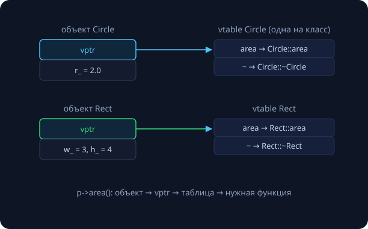

Двойная лекция о главном строительном материале C++. Сквозной пример — `BigInt` из занятия 4: там мы написали функции над `vector<int>`, сегодня соберём из них настоящий тип. Часть I — классы и жизненный цикл объекта; часть II — наследование и полиморфизм. Все замеры и выводы программ в тексте — реальные (Apple clang, эта машина).

## Часть I. Классы и жизненный цикл

### От мешка функций — к типу с поведением

В занятии 4 наша «длинная арифметика» выглядела так: `using Big = std::vector<int>` плюс свободные функции `add`, `mul`, `print`. Работает — но ничто не мешает создать `Big broken = {13, -7, 100}` и передать его в `add`: «цифры» вне 0..9, и никакой защиты.

Суть ООП в C++: **тип = данные + инварианты + операции**. Компилятор следит, чтобы к данным прикасались только операции, сохраняющие инварианты. Большая программа — это набор маленьких типов, каждому из которых можно доверять.

> [!def] Инвариант класса
> Утверждение о внутренних данных, истинное между вызовами методов. У `BigInt`: вектор непуст, каждая цифра в 0..9, нет ведущих нулей. Сравните с инвариантом цикла из занятия 5 — идея та же, масштаб другой.

### class и struct

```cpp
class BigInt {
public:                        // интерфейс — всем
    BigInt(const std::string& s);
    BigInt operator+(const BigInt& o) const;
private:                       // кухня — никому
    std::vector<int> digits_;  // little-endian, 0..9, без ведущих нулей
};
```

`class` и `struct` различаются **только** доступом по умолчанию (private против public). Соглашение курса: `struct` — для пассивных наборов данных без инвариантов (`Point`, `Options`), `class` — для всего, у чего есть что охранять. Суффикс `_` у полей — распространённый способ отличать члены от локальных переменных.

Методы объявляются в классе (в `.h`), определяются в `.cpp` через `Класс::метод` — это то же разделение интерфейса и реализации, что и в занятии 1. Методы, определённые прямо в теле класса, неявно `inline` (вспомните ODR).

### Инкапсуляция: private — это контроль, а не секретность

Любой код, который видит данные, может сломать инвариант; сузили доступ — сузили круг подозреваемых при отладке. Интерфейс — это **операции**, а не поля: `account.deposit(100)`, а не `set_balance(get_balance() + 100)`. Рефлекторные get/set на каждое поле — антипаттерн: это public-поля с лишними буквами.

> [!tip] Тест на хороший интерфейс
> Можно ли поменять внутреннее представление, не трогая вызывающий код? Наш `BigInt` сможет перейти с базы 10 на базу $10^9$ (занятие 4) — снаружи никто не заметит. С public-полем `digits_` эта дверь закрыта навсегда.

### Конструкторы

```cpp
class Rational {
public:
    Rational() : num_(0), den_(1) {}          // список инициализации
    Rational(int n, int d) : num_(n), den_(d) { normalize(); }
private:
    int num_, den_;
};
```

Конструктор устанавливает инвариант **с рождения** — не бывает «полусозданного» объекта. Список инициализации — не присваивание: поля создаются сразу с нужными значениями (для полей-классов это прямой вызов их конструкторов, без лишней работы). Подводный камень: инициализация идёт в порядке **объявления полей**, а не в порядке списка — `-Wreorder` из состава `-Wall` предупредит.

Если не написать ни одного конструктора, компилятор сгенерирует пустой default-конструктор; как только появится свой — default исчезает (вернуть: `Rational() = default;`).

**explicit.** Конструктор от одного аргумента — это неявное преобразование: с `BigInt(int)` вызов `process(42)` тихо создаст временный `BigInt`. Иногда это удобно, чаще — источник загадочных компиляций «не того» (вспомните ловушки преобразований из занятия 3 — теперь вы создаёте их сами). Правило курса: одноаргументные конструкторы помечаем `explicit` по умолчанию, снимаем пометку осознанно.

### Деструктор и RAII

```cpp
void f() {
    Logger log;          // конструктор: открыл файл
    if (error) return;   // деструктор: закрыл — и здесь тоже!
    work();
}                        // и здесь
```

`~Class()` вызывается **автоматически и детерминированно**: при выходе из области видимости любым путём — `return`, исключение, конец блока. Порядок разрушения обратен порядку создания. Сравните с Python/Java: там объект умирает «когда-нибудь» (сборщик мусора), и `__del__`/финализаторы ненадёжны; в C++ момент смерти — часть контракта.

Отсюда главная идиома языка:

> [!def] RAII — Resource Acquisition Is Initialization
> Захват ресурса — в конструкторе, освобождение — в деструкторе. Ресурс живёт ровно столько, сколько объект-владелец.

```cpp
class File {
public:
    explicit File(const char* path) : f_(std::fopen(path, "r")) {}
    ~File() { if (f_) std::fclose(f_); }
private:
    std::FILE* f_;
};
```

Ресурс — что угодно конечное: файл, память, мьютекс, сокет. В C++ нет `finally` — он не нужен: деструктор нельзя «забыть вызвать». Вся стандартная библиотека построена на RAII: `vector` владеет памятью, `lock_guard` — мьютексом, `unique_ptr` — объектом (занятие 14).

### Копирование и правило трёх

Компилятор бесплатно генерирует default-конструктор, копирующий конструктор, копирующее присваивание и деструктор (и move-пару — занятие 22). Сгенерированное копирование — **почленное**: поля-классы копируются своим копированием (глубоко), а указатели копируются… как указатели. Для `BigInt` с `vector` внутри этого достаточно. А вот для владельца сырого ресурса:

```cpp
struct Buffer {
    int* data;
    Buffer()  { data = new int[8]; }
    ~Buffer() { delete[] data; }
    // копирование не написали…
};
Buffer a;
Buffer b = a;    // скопировался УКАЗАТЕЛЬ: оба смотрят на один блок
```

```
$ clang++ -fsanitize=address rule3.cpp && ./a.out
==80685==ERROR: AddressSanitizer: attempting double-free … in Buffer::~Buffer()
```

Два деструктора освободили один буфер — реальный вывод ASan.

> [!theorem] Правило трёх
> Если классу нужен хотя бы один из: деструктор, копирующий конструктор, копирующее присваивание — почти наверняка нужны все три. (Написали деструктор → вы владеете ресурсом → сгенерированное копирование вас предаст.)

Варианты: написать честное глубокое копирование — или запретить его: `Buffer(const Buffer&) = delete;`. Заметьте: наш `File` выше тоже нарушает правило трёх — копия приведёт к двойному `fclose`; правильный ход — `= delete`.

**Правило пяти и правило нуля.** В C++11 к тройке добавились move-конструктор и move-присваивание («переезд» ресурса вместо копии — подробности на занятии 22): владеешь ресурсом — определи или явно запрети все пять. Но лучшее правило — **нуля**: не владейте сырыми ресурсами; храните поля-«владельцы» (`vector`, `string`, `unique_ptr`) и не пишите ничего из пяти — сгенерированное поведение корректно само. `BigInt` живёт по правилу нуля.

### Операторы, const, static

```cpp
class BigInt {
public:
    BigInt operator+(const BigInt& o) const;
    bool operator==(const BigInt& o) const { return digits_ == o.digits_; }
    size_t digit_count() const;              // const-метод: не меняет объект
    static BigInt zero() { return BigInt(0); }
private:
    std::vector<int> digits_;
    friend std::ostream& operator<<(std::ostream&, const BigInt&);
};
```

- `a + b` — это вызов `a.operator+(b)`; оператор — обычная функция, перегрузка по типам как в занятии 5. Этика: оператор должен значить то, что значит для чисел.
- `operator<<` — всегда свободная функция (левый операнд — поток); доступ к private ей даёт `friend`.
- **const-методы**: `const` после параметров — обещание не менять поля; через `const BigInt&` (наш способ передачи из занятия 3) можно звать только их. Помечайте const всё, что можно, — это документация, проверяемая компилятором.
- **static-члены** принадлежат классу, не объекту: константы (`static constexpr int kBase = 10;`), фабрики (`BigInt::zero()`), счётчики.

## Часть II. Наследование и полиморфизм

### Наследование — отношение «является»

```cpp
class Circle : public Shape { ... };   // каждый Circle ЯВЛЯЕТСЯ Shape
```

Наследник получает поля и методы базы и добавляет свои; `Circle*` неявно преобразуется в `Shape*` (и ссылки тоже). Уровень `protected` — виден наследникам, но не всем.

> [!warning] Тест is-a
> «X является Y» должно звучать естественно. «Круг является фигурой» — да. «Стек является вектором» — нет: стек *использует* вектор.

**Композиция прежде наследования.** `class Stack : public std::vector<int>` «бесплатно» даёт всё — включая `s[0] = 42` и `erase`, ломающие LIFO. Правильно — композиция: поле `std::vector<int> data_` и наружу только `push/pop/empty`. Наследование публикует всё; композиция — ровно то, что вы решили. Наследуйтесь ради **полиморфизма**, переиспользуйте код через композицию.

### Виртуальные функции

```cpp
class Shape {
public:
    virtual double area() const = 0;   // чисто виртуальная
    virtual ~Shape() = default;
};

double total(const std::vector<Shape*>& v) {
    double s = 0;
    for (const Shape* p : v) s += p->area();   // Circle? Rect? — решается в рантайме
    return s;
}
```

Без `virtual` вызов через `Shape*` выбрал бы `Shape::area` по типу указателя ещё на компиляции (статическая диспетчеризация). С `virtual` решает **реальный тип объекта** в момент вызова. Это полиморфизм: `total()` написан один раз и работает с фигурами, которых ещё не существует.

Как это устроено: у каждого класса с виртуальными функциями есть таблица указателей на функции (**vtable**), а у каждого объекта — скрытый указатель на неё (**vptr**).



Цена измерима: `sizeof` структуры с двумя long — 16 байт, добавили виртуальную функцию — 24 (vptr = 8 байт); плюс косвенный вызов. Поэтому в C++ виртуальность — по требованию, а не по умолчанию, в отличие от Java/Python, где виртуально всё.

### Виртуальный деструктор — обязателен для полиморфной базы

```cpp
struct Base    { ~Base() { puts("~Base"); } };        // НЕ virtual
struct Derived : Base { ~Derived() { puts("~Derived"); } };

Base* p = new Derived;
delete p;
```

Реальный вывод: печатается только `~Base` — деструктор наследника **не вызван**, его ресурсы утекли; формально это UB. С `virtual ~Base()` вывод правильный: `~Derived`, затем `~Base`.

> [!theorem] Правило
> Класс с виртуальными функциями обязан иметь виртуальный деструктор: `virtual ~Shape() = default;` — пишется не думая.

### Абстрактные классы, срезка, override

- `= 0` делает функцию **чисто виртуальной**, а класс — абстрактным: объекты не создаются, наследник обязан переопределить. Класс из одних чисто виртуальных функций — **интерфейс** (то, что в Java `interface`): контракт без реализации, главный инструмент развязки модулей и тестируемости.
- **Срезка (slicing):** `Shape s = circle;` копирует только Shape-часть — поля наследника и «виртуальность» отрезаны. Симптом «виртуальная функция зовёт базовую версию» — почти всегда полиморфный объект передали по значению. Мнемоника: **полиморфизм живёт за `&` и `*`**. Контейнер полиморфных объектов — контейнер (умных) указателей.
- **override** просит компилятор проверить, что вы действительно переопределяете: без него `double area()` вместо `double area() const` тихо создаёт *новую* функцию, и полиморфизм ломается. В курсе `override` обязателен. `final` запрещает дальнейшее наследование/переопределение — осознанная точка в иерархии.

### Сквозной пример

```cpp
class Shape {
public:
    virtual double area() const = 0;
    virtual ~Shape() = default;
};

class Circle final : public Shape {
    double r_;
public:
    explicit Circle(double r) : r_(r) {}
    double area() const override { return 3.14159 * r_ * r_; }
};

std::vector<std::unique_ptr<Shape>> shapes;
shapes.push_back(std::make_unique<Circle>(2));
shapes.push_back(std::make_unique<Rect>(3, 4));

double total = 0;
for (const auto& p : shapes)
    total += p->area();          // 12.57 + 12
```

Здесь всё занятие в одном месте: интерфейс, виртуальный деструктор, `explicit`/`override`/`final`, инкапсуляция и вектор указателей без срезки. `unique_ptr` — умный указатель (RAII для `new`): полный разбор на занятии 14, сегодня используйте как «указатель, который не течёт».

### Когда ООП не нужно

Не всё — класс: `gcd(a, b)` прекрасна свободной функцией. Не каждая иерархия оправдана: единственный наследник — сигнал «придумано на вырост». Для «разного поведения разных типов, известных на компиляции» есть статический полиморфизм — шаблоны (занятие 24), на них построена вся STL. C++ мультипарадигмен: ООП — инструмент, а не религия.

## Самопроверка

1. Почему список инициализации предпочтительнее присваивания в теле конструктора?
2. Класс с полем `std::string` и без ресурсов: что из «пятёрки» нужно написать?
3. `Base* p = new Derived; delete p;` — при каком условии это корректно и что происходит без него?
4. Почему `std::vector<Shape>` — почти всегда ошибка, а `std::vector<std::unique_ptr<Shape>>` — норма?

{}
1. Поля создаются сразу нужными значениями (для полей-классов — один вызов конструктора вместо default-конструктора + присваивания); для const-полей и ссылок список — единственный способ.
2. Ничего — правило нуля: `string` сам корректно копируется, перемещается и разрушается.
3. Корректно при виртуальном деструкторе базы; без него вызывается только `~Base` — UB, ресурсы наследника утекают (реальный вывод: печатается только «~Base»).
4. Вектор значений срезает каждый объект до Shape (и в абстрактном случае вообще не скомпилируется); указатели сохраняют реальный тип и виртуальную диспетчеризацию.
{}

## Домашнее задание (сдача через Git)

1. Доделать `BigInt`-класс: конструкторы, `+`, `−`, `*`, сравнения, `<<` — перенос кода занятия 4 внутрь класса; приватные поля и `strip_zeros()` во всех конструкторах.
2. Класс `Timer` (RAII: старт в конструкторе, печать прошедшего времени в деструкторе) — замерить своё умножение.
3. \* Иерархия `Shape` с `area`/`perimeter`: чтение фигур из файла в `vector<unique_ptr<Shape>>`, суммарная площадь.
