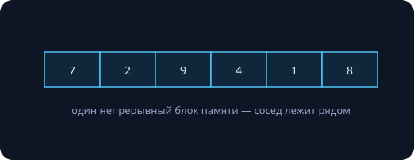
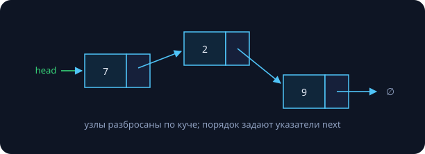
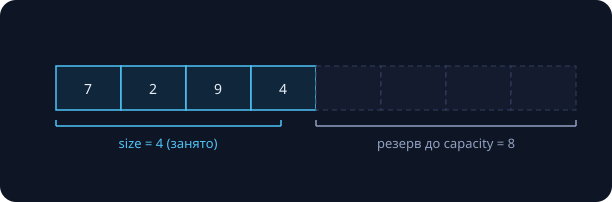
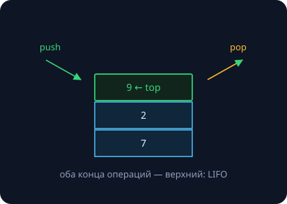
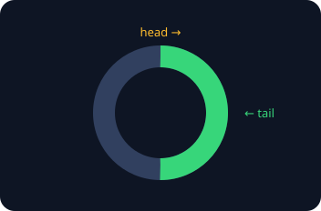

Структура данных — это **контракт операций и их цен**. Одни и те же данные можно хранить по-разному, и цена операций меняется на порядки; выбор структуры — это выбор, какие операции будут дешёвыми. Сегодня строим базовый набор руками — классами, по правилам занятия 7, — и сверяем со стандартной библиотекой. Все замеры в конспекте реальные: Apple M-серия, `clang++ -O2`, $10^7$ элементов.

## Массив и связный список

### Массив: всё подряд



Непрерывный блок памяти даёт доступ по индексу за $O(1)$ (адрес = база + i·sizeof, занятие 3) и максимальную дружбу с кэшем. Вставка и удаление в середине — сдвиг хвоста, $O(n)$; размер фиксирован на этапе компиляции.

### Связный список: узлы, сшитые указателями



```cpp
struct Node { int value; Node* next; };
```

Вставка и удаление **при известном узле** — $O(1)$: перешить два указателя. Доступ по индексу — $O(n)$, только пешком от головы. Каждый узел — отдельная аллокация: плюс указатель на элемент и разброс по памяти.

Список как класс — концентрат вчерашнего занятия: инкапсуляция (Node — приватная деталь), RAII (деструктор освобождает узлы), правило пяти (владеем `new`/`delete` — копирование либо глубокое, либо `= delete`):

```cpp
class IntList {
public:
    IntList() = default;
    ~IntList() {
        while (head_) { Node* n = head_; head_ = head_->next; delete n; }
    }
    IntList(const IntList&) = delete;             // правило пяти:
    IntList& operator=(const IntList&) = delete;  // пока запретили
    void push_front(int x) { head_ = new Node{x, head_}; }
private:
    struct Node { int value; Node* next; };
    Node* head_ = nullptr;
};
```

### Сравнение и кэш-реальность

| операция | массив | связный список |
|---|---|---|
| доступ по индексу | $O(1)$ | $O(n)$ |
| вставка/удаление в начале | $O(n)$ — сдвиг | $O(1)$ |
| вставка/удаление в середине | $O(n)$ — сдвиг | $O(1)$*, найти узел — $O(n)$ |
| добавление в конец | $O(1)$ аморт. | $O(1)$ с указателем на хвост |
| память на элемент | sizeof(T) | sizeof(T) + указатель + накладные кучи |

\* Ловушка собеседований: $O(1)$ вставка — *при уже найденном месте*.

Теперь главный опыт занятия. Сумма $10^7$ int:

```
обход vector:    0.8 мс
обход list:     29.2 мс      # ×36!
```

Обе операции — $\Theta(n)$, но процессор читает память **кэш-линиями** по 64–128 байт: у вектора следующая порция уже подъехала, а каждый переход по `next` в списке — потенциальный промах кэша и сотни тактов ожидания.

> [!warning] Скрытые константы — во плоти
> Занятие 2 предупреждало: O-символика не видит констант. Вот они: «одинаковые» $\Theta(n)$ отличаются в 36 раз. Асимптотика выбирает алгоритм, кэш выбирает структуру. Практический вывод: связный список сегодня — нишевый инструмент; по умолчанию — непрерывная память.

## Динамический массив

### size + capacity и стратегия роста



Храним **size** (занято) и **capacity** (выделено). `push_back` в резерв — $O(1)$. Резерв кончился — выделяем блок побольше, переезжаем (копируем все элементы), освобождаем старый: $O(n)$. Весь вопрос — *насколько* побольше:

- **Расти на +1:** каждый push — переезд; суммарно $1 + 2 + \dots + n = \Theta(n^2)$ копирований. Миллион добавлений — полтриллиона копий.
- **Расти в ×2:** переезды только на степенях двойки; суммарно $1 + 2 + 4 + \dots + n \le 2n = \Theta(n)$ — геометрическая прогрессия из занятия 6. Вся история переездов стоит меньше двух проходов.

В среднем на один `push_back` приходится $O(1)$ работы — это **амортизированная сложность**. Строгий разбор (метод усреднения, банковский метод) — занятие 10.

Реальный `std::vector` (libc++, эта машина): capacity растёт 1, 2, 4, 8, …, 1048576 — чистое удвоение, **21 реаллокация на миллион** `push_back`. Знаете размер заранее — `reserve(n)`: ноль переездов.

> [!warning] Инвалидация — плата за переезды
> Рост инвалидирует **все** указатели, ссылки и итераторы на элементы: они смотрят в старый, уже освобождённый блок (UB). Та же причина запрещала менять контейнер внутри range-for (занятие 5).

### Свой DynArray — правило пяти в бою

```cpp
class DynArray {
public:
    DynArray() = default;
    ~DynArray() { delete[] data_; }
    DynArray(const DynArray& o)                    // глубокая копия
        : size_(o.size_), cap_(o.cap_), data_(new int[o.cap_]) {
        std::copy(o.data_, o.data_ + size_, data_);
    }
    DynArray& operator=(const DynArray&) = delete; // дописать — ДЗ

    void push_back(int x) {
        if (size_ == cap_) grow();
        data_[size_++] = x;
    }
    int& operator[](size_t i) { return data_[i]; }
    size_t size() const { return size_; }
private:
    void grow() {
        size_t nc = cap_ ? cap_ * 2 : 1;
        int* nd = new int[nc];
        std::copy(data_, data_ + size_, nd);
        delete[] data_;
        data_ = nd; cap_ = nc;
    }
    size_t size_ = 0, cap_ = 0;
    int*   data_ = nullptr;
};
```

`operator[]` возвращает **ссылку** (занятие 3) — поэтому работает `a[i] = 5`. Это ядро настоящего `std::vector` минус шаблоны (занятие 24), move (22) и исключения (24).

## Стек, очередь, дек

### Стек — LIFO



`push`, `pop`, `top` — все $O(1)$, работаем только с вершиной. Где живёт: стек вызовов (кадры из занятия 5!), скобочные последовательности, undo, обход в глубину, разбор выражений. Реализация — адаптер над вектором (та самая композиция из занятия 7): `push_back`/`pop_back` и есть стек.

Классика применения — проверка скобочной последовательности:

```cpp
bool balanced(const std::string& s) {
    std::stack<char> st;
    for (char c : s) {
        if (c == '(' || c == '[' || c == '{') st.push(c);
        else {
            if (st.empty()) return false;
            char open = st.top();
            if ((c == ')' && open != '(') || (c == ']' && open != '[') ||
                (c == '}' && open != '{')) return false;
            st.pop();
        }
    }
    return st.empty();
}
```

Инвариант (в духе занятия 5): в стеке — все открытые и ещё не закрытые скобки в порядке вложенности; закрывающая обязана подойти к вершине.

### Очередь — FIFO и кольцевой буфер

Очереди нужны `push` в хвост и `pop` из головы за $O(1)$: обработка задач по порядку, буферы ввода, обход в ширину (второй семестр). Наивная реализация на векторе проваливается: `erase(v.begin())` сдвигает весь хвост — $O(n)$, миллион операций — $\Theta(n^2)$.



Решение — **кольцевой буфер**: массив и два индекса, движущиеся по модулю ёмкости (`(i + 1) % cap`). Оба конца — $O(1)$, память непрерывная, рост — как у вектора.

### Дек

**D**ouble-**e**nded **que**ue: push/pop с обоих концов за $O(1)$ плюс доступ по индексу. Покрывает и стек, и очередь — `std::stack` и `std::queue` по умолчанию как раз адаптеры над `std::deque`. Устройство: каталог указателей на блоки-страницы — непрерывность кусочная, зато рост без переезда всех элементов. Киллер-фича — «скользящее окно»: добавляем справа, выбрасываем слева.

## Шпаргалка по std::

| нужно | берите | почему |
|---|---|---|
| «просто набор элементов» | `std::vector` | непрерывная память, кэш — **дефолт всегда** |
| LIFO | `std::stack` или vector | `push_back`/`pop_back` — то же самое |
| FIFO | `std::queue` | адаптер над deque; для скорости — свой кольцевой буфер |
| оба конца + индексы | `std::deque` | блочная структура, $O(1)$ на концах |
| вставки в середину при известной позиции | `std::list` | редко! помните ×36 на обходе |

> [!tip] Правило курса
> Начинайте с `vector`. Меняйте структуру только по результату профилирования или явного требования операций — теперь вы знаете цену каждой.

## Задачи семинара

1. **Скобки:** реализовать `balanced()`; расширение — вернуть позицию первой ошибки.
2. **Разворот списка** за $O(n)$ времени и $O(1)$ памяти — только перешивая указатели. Подсказка: три указателя prev/cur/next и письменный инвариант «всё до cur развёрнуто».
3. **Кольцевой буфер:** класс `Queue` с ростом ×2; стресс-тест против `std::queue` (методика — занятие 4).

## Домашнее задание (сдача через Git)

1. Дописать `DynArray`: копирующее присваивание, `reserve`, `pop_back`; стресс-тест против `std::vector`.
2. Задачи семинара (все три).
3. Замерить у себя обход vector против list на $10^7$; числа и вывод — в README репозитория.
4. \* Глубокое копирование `IntList` — правило пяти целиком.
