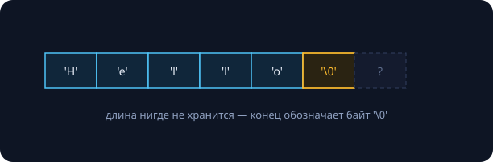

Строки — самый используемый и самый недопонятый тип данных: под словом «строка» в C++ живут три разных зверя (`const char*`, `std::string`, `std::string_view`), а под словом «символ» — целых четыре понятия. Разбираем всё по слоям, с реальными замерами (Apple M-серия, `clang++ -O2`).

## Наследие C

### Массив байтов с секретом в конце



```cpp
const char* s = "Hello";
std::strlen(s);   // 5 — но как он узнал?
```

Тип литерала `"Hello"` — `const char[6]`: пять букв плюс невидимый `'\0'`. Длина нигде не хранится — конец обозначает терминатор, поэтому **каждый** `strlen` — проход по строке за $O(n)$ (занятие 2 передаёт привет). Переход массив → указатель — это decay из занятия 3.

Три классические ловушки:

```cpp
a == b;                  // 1: сравнили АДРЕСА, не содержимое (нужен strcmp)
strcpy(buf, user_input); // 2: переполнение буфера — главная дыра XX века
char s[5] = {'H','e','l','l','o'};
strlen(s);               // 3: '\0' не влез — strlen гуляет по чужой памяти, UB
```

### Литералы живут в .rodata

Строковые литералы лежат в секции `.rodata` исполняемого файла (занятие 1) — память только для чтения, время жизни — вся программа. Возвращать `const char*` на литерал безопасно (в отличие от локального массива — привет, висячие указатели из занятия 5); менять литерал — честный мгновенный крэш. Компилятор *может* склеивать одинаковые литералы — поэтому сравнение их адресов иногда «работает», а потом внезапно нет.

> [!tip] Зачем это знать, если есть std::string
> `main(int argc, char* argv[])`, системные вызовы и все C-библиотеки говорят на `const char*`. C-строки — язык границы; внутри программы — современные типы.

## std::string

### Это DynArray для символов

`std::string` — владеющая строка: внутри указатель, size и capacity — вчерашний `DynArray` (занятие 8) для `char`, плюс полторы сотни методов. Следствия: `size()` за $O(1)$ (длина хранится), глубокое копирование, RAII, рост с запасом ×2, автоматический терминатор в конце — для совместимости с C через `c_str()`.

### SSO: короткие строки не трогают кучу

```
sizeof(std::string) = 24
capacity() пустой строки: 22    # SSO-буфер
len=22 -> capacity=22           # без аллокации
len=23 -> capacity=24           # куча!
```

**Small String Optimization:** в 24 байтах объекта прячется буфер — строки до 22 символов (libc++) живут прямо в объекте, копия — это memcpy 24 байт. Байты объекта переиспользуются: либо (ptr, size, capacity), либо сам текст. Вот чем строка отличается от «вектора символов» — инженерия победила чистоту абстракции.

### += против +: квадрат в невинной строчке

```cpp
for (...) s += 'x';      // дописали в буфер: O(1) амортизированно
for (...) t = t + 'x';   // построили НОВУЮ строку: копия всех i символов
```

```
s += 'x'  (200 000 раз):    0.54 мс
t = t + 'x' (200 000 раз): 354.05 мс     # ×650
```

`t + 'x'` создаёт новую строку с копированием накопленного: $1 + 2 + \dots + n = \Theta(n^2)$ — «расти на +1» из занятия 8, вид сбоку. Тот же капкан есть в Python и Java (там ради него придумали StringBuilder). Правило: наращиваете — `+=`/`append`; знаете итоговый размер — `reserve`.

## std::string_view

### Окно в чужие символы


`string_view` — невладеющее «окно»: указатель + длина, всего 16 байт. Смотрит на что угодно — `string`, литерал, кусок буфера; `substr` у view — $O(1)$ без копии (у `string` — копия!).

Идеальный **тип параметра для чтения**:

```cpp
void log(std::string_view msg);
log("literal");   // 0 копий (const std::string& здесь построил бы string!)
log(name);        // 0 копий из string
```

И его тёмная сторона — **висячие view**:

```cpp
std::string_view bad() {
    std::string s = compute();
    return s;                      // view на труп
}
std::string_view v = get_name() + "!";  // временная строка умерла — v висит
```

> [!warning] Правило времени жизни
> View живёт, пока жив владелец символов. Это ссылка из занятия 3 со всеми болезнями висячих указателей: параметры и локальный разбор — да; поля классов и возвраты — почти всегда нет.

### Таблица выбора

| задача | тип |
|---|---|
| хранить строку (поле, контейнер) | `std::string` |
| читать в функции | `std::string_view` |
| менять в функции | `std::string&` |
| граница с C API | `const char*` через `c_str()` |

У `string_view` нет `c_str()` — терминатор не гарантирован. Дефолт курса: хранение — `string`, чтение — `string_view`.

### Повседневные операции

`find`/`rfind` (не найдено — `npos`; сравнивайте с ним, не с −1 — привет, беззнаковый `size_t`), `substr`, C++20-шные `starts_with`/`ends_with`. Числа ↔ строки: `to_string`, `stoi` (бросает исключения), быстрый `from_chars` — без локалей и исключений.

## Unicode и UTF-8

### Краткая история хаоса

ASCII (1963) — 7 бит, 128 символов; коды `'0'..'9'` подряд — отсюда `c - '0'`. Потом восьмибитные кодовые страницы (КОИ-8, CP1251…) и «кракозябры». С 1991 — Unicode: единый реестр на ~155 тысяч символов. Термины: **код-поинт** — номер символа (`U+041F` = «П»); **кодировка** — как номера становятся байтами; **графема** — то, что человек видит как один символ.

### UTF-8

| код-поинты | байтов | раскладка | примеры |
|---|---|---|---|
| U+0000…U+007F | 1 | `0xxxxxxx` | весь ASCII |
| U+0080…U+07FF | 2 | `110xxxxx 10xxxxxx` | кириллица |
| U+0800…U+FFFF | 3 | `1110xxxx 10xxxxxx ×2` | иероглифы, ₽ |
| U+10000…U+10FFFF | 4 | `11110xxx 10xxxxxx ×3` | эмодзи |

Два гениальных свойства: ASCII-текст — уже валидный UTF-8, а байты-продолжения всегда `10xxxxxx` — с любого места можно найти границу символа (самосинхронизация).

### «Привет» под микроскопом

```
"Привет": size() = 12
D0 9F  D1 80  D0 B8  D0 B2  D0 B5  D1 82
 П      р      и      в      е      т
```

Каждая кириллическая буква — 2 байта; `size()` честно считает **байты**. `p[0]` — это байт `0xD0`, не буква «П». Следствие: обрезка по произвольному индексу разрезает символ пополам и даёт невалидный UTF-8 (тот самый «�») — резать можно только по границам символов.

> [!tip] Практический рецепт курса
> Храните текст в `std::string` с UTF-8. Работайте с целыми подстроками (поиск/сравнение безопасны). Не индексируйте «буквы». Длина в код-поинтах — счёт байтов, не равных продолжениям: `(c & 0xC0) != 0x80`. Для серьёзной обработки текста (регистры, нормализация) — библиотека ICU: стандартная библиотека C++ этого не умеет.

## Самопроверка

1. Почему `strlen` — $O(n)$, а `s.size()` — $O(1)$?
2. `if (cmd == "quit")` для `const char* cmd` — что сравнивается на самом деле?
3. Когда `string_view`-параметр лучше `const std::string&` — и когда view опасен?
4. Сколько байтов займёт строка `"π = Пи"` в UTF-8?

{}
1. У C-строки длина не хранится (ищем `'\0'`); у `std::string` — хранится в поле.
2. Адрес буфера с адресом литерала — почти всегда false; нужен `strcmp` или `std::string_view(cmd) == "quit"`.
3. Лучше как параметр чтения: принимает литералы/подстроки без копий. Опасен при хранении и возврате — когда переживает владельца символов.
4. π — 2 байта (U+03C0), пробел/=/пробел — 3, «Пи» — 4: итого 9.
{}

## Домашнее задание (сдача через Git)

1. `split(std::string_view s, char sep)` → вектор view — без единой копии символов; тесты на пустые части.
2. `utf8_length(std::string_view)` — длина в код-поинтах; проверить на «Привет», «héllo», эмодзи.
3. Повторить бенчмарк `+=` против `+`; объяснить числа через занятие 8.
4. \* `utf8_valid()` — проверка корректности байтов по таблице шаблонов.
