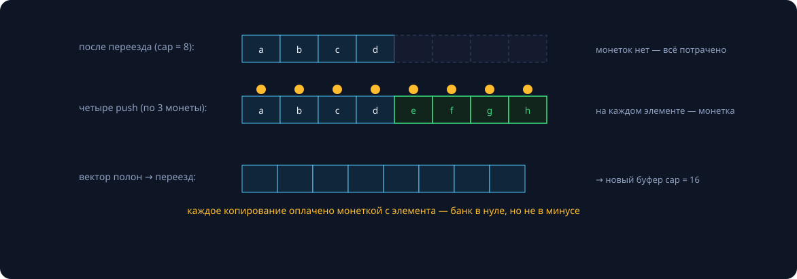
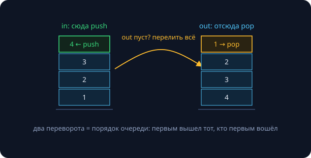

Семинар закрывает два долга: занятие 8 обещало строго доказать «O(1) амортизированно» для `push_back`, а занятие 2 — объяснить, что вообще значит «дорогая операция, оплаченная дешёвыми». Плюс две классические структуры, где амортизация — суть, а не оптимизация. Замеры реальные (Apple M-серия, `clang++ -O2`).

## Проблема и определение

Худший случай одной операции `push_back` — $O(n)$: переезд всего массива. Значит ли это, что $n$ операций стоят $O(n^2)$? Нет: дорогие операции редки. Амортизационный анализ узаконивает это рассуждение.

> [!def] Амортизированная стоимость
> Операция имеет амортизированную стоимость $t(n)$, если **любая** последовательность из $m$ таких операций (из начального состояния) выполняется за время $T(m) \le m \cdot t(n)$.

Ключевое отличие от среднего случая: average case усредняет по *случайным входам*, амортизация — по операциям **худшей серии**. Никаких вероятностей: гарантия «$n$ операций ≤ $n \cdot t$» держится для любого злого сценария.

Три метода доказательства: усреднение, банковский, потенциалы.

## Метод усреднения

**Разминка — двоичный счётчик.** Инкремент перещёлкивает хвост единиц: в худшем случае все $k$ бит. Но бит $i$ меняется лишь каждые $2^i$ инкрементов, поэтому $n$ инкрементов стоят

$$T(n) = \sum_{i \ge 0} \frac{n}{2^i} \le 2n \;\Rightarrow\; O(1) \text{ амортизированно.}$$

**Вектор.** Переезды случаются на размерах $1, 2, 4, \dots$: суммарных копирований $\sum 2^j \le 2n$, плюс $n$ вставок — итого $T(n) \le 3n$. Интуиция занятия 8 стала теоремой; экспериментальная сверка — 21 реаллокация на миллион `push_back`. Та же геометрическая прогрессия, что в мастер-теореме (занятие 6).

## Банковский метод

Назначаем операциям **тариф в монетках**; реальная работа списывает монетки, переплата копится на элементах структуры. Правило корректности: **баланс никогда не уходит в минус** — тогда тарифы и есть честные амортизированные оценки.

Тариф `push_back` — 3 монеты: одна за собственную вставку, одна на свой будущий переезд, одна — за «старый» элемент, чьи монетки сгорели в прошлом переезде. К моменту переполнения на каждом элементе лежит монетка — реаллокация оплачена заранее:



**Почему геометрический рост обязателен.** Стратегии `+1` и `+k` дают $O(n)$ и $O(n/k)$ на операцию — фиксированного тарифа не хватает. Любой множитель $> 1$ (×1.5, ×2) даёт $O(1)$. Стандарт C++, кстати, требует от `vector::push_back` именно амортизированное $O(1)$ — теория прописана в тексте стандарта. Обратное сжатие делают при заполнении в четверть (не в половину — иначе «пила» push/pop на границе устраивает переезд каждый раз).

## Метод потенциалов (для подготовленных)

Вводим функцию состояния $\Phi \ge 0$ и считаем амортизированную стоимость как $\hat{t} = t_{\text{real}} + \Phi_{\text{после}} - \Phi_{\text{до}}$. Сумма телескопируется: $\sum \hat{t} = T + \Phi_{\text{кон}} - \Phi_{\text{нач}} \ge T$ — оценка честная. Для вектора берём $\Phi = 2 \cdot \text{size} - \text{capacity}$: обычный push — $\hat{t} = 3$; push с переездом при $\text{size} = \text{cap} = k$ — реально $k+1$, но $\Delta\Phi = 2 - k$, и снова $\hat{t} = 3$. Монетки стали алгеброй.

## Стек с минимумом за O(1)

Задача: обычный стек плюс `min()` за $O(1)$. Одна переменная-минимум ломается на `pop`. Решение — **параллельный стек минимумов**: рядом с каждым элементом храним минимум «его эпохи».

```cpp
class MinStack {
public:
    void push(int x) {
        data_.push_back(x);
        mins_.push_back(mins_.empty() ? x : std::min(x, mins_.back()));
    }
    void pop()  { data_.pop_back(); mins_.pop_back(); }
    int top() const { return data_.back(); }
    int min() const { return mins_.back(); }
private:
    std::vector<int> data_, mins_;
};
```

Инвариант: `mins_[i] = min(data_[0..i])`. Push его сохраняет (новый минимум = min(старый, x)), pop снимает обе вершины — соответствие 1:1 не рвётся, значит `mins_.back()` — всегда минимум стека. Цена — ×2 памяти; оптимизация со стеком «рекордов» — задача со звёздочкой.

## Очередь на двух стеках



`push` — всегда в стек **in**; `pop` — из стека **out**, а если он пуст — перелить всё из in (порядок переворачивается, два переворота дают порядок очереди):

```cpp
class Queue {
public:
    void push(int x) { in_.push_back(x); }
    int pop() {
        if (out_.empty())
            while (!in_.empty()) { out_.push_back(in_.back()); in_.pop_back(); }
        int v = out_.back(); out_.pop_back(); return v;
    }
private:
    std::vector<int> in_, out_;
};
```

> [!theorem] Амортизированное O(1)
> Тариф 3 монеты на push: положить в in, перелететь в out, выйти при pop. Каждый элемент проходит этот путь ровно один раз — всё оплачено при рождении, банк неотрицателен. Отдельный `pop` бывает за $O(n)$, но любая серия из $n$ операций стоит ≤ $3n$.

## Амортизация ≠ равномерность

Замер одного `push_back` из серии в $10^7$:

```
медиана:            0 нс
99-й процентиль:   42 нс
среднее:           14 нс
максимум:   4 722 958 нс   # 4.7 мс — переезд 8 млн элементов
```

Средняя цена — копейки, но один push из десяти миллионов стоил в ~300 000 раз дороже типичного. Для систем реального времени (игры, аудио, торговля) такой пик — дёрганый кадр или сорванный дедлайн: там нужны честные worst-case гарантии, а не амортизированные. Лекарства: `reserve` заранее, инкрементальные структуры, аллокации вне горячего пути. И помните: амортизация размазывает стоимость по операциям *одной* структуры — усреднять между разными объектами нельзя.

Где амортизация живёт: `vector`/`string` (занятия 8–9), rehash хеш-таблиц и union-find (второй семестр), компакция логов и LSM-деревья в базах, сборка мусора поколениями, `git gc`.

## Задачи семинара

1. **Счётчик монетками:** докажите $O(1)$ инкремента банковским методом — монетка кладётся на каждую единицу. Кто платит за обнуление хвоста?
2. **MinQueue:** очередь с минимумом за $O(1)$ аморт. — два `MinStack` по схеме in/out; минимум очереди = min двух минимумов. (Это стандартный приём для «минимума в скользящем окне» — встретится на рубежном контроле.)
3. **Ленивая очередь:** один вектор + индекс головы; физическая чистка — когда голова дошла до половины. Докажите $O(1)$ аморт.

## Домашнее задание (сдача через Git)

1. `MinStack` и `MinQueue` + стресс-тест против наивного $O(n)$-минимума.
2. Письменное доказательство $O(1)$ для очереди на двух стеках банковским методом.
3. Ленивая очередь: код + анализ.
4. \* MinStack с $O(1)$ дополнительной памяти на неубывающих участках (стек «рекордов» со счётчиками).
