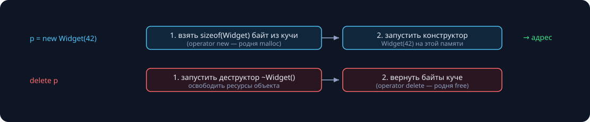

В C++20 — 81 ключевое слово, а смыслов заметно больше: новое слово ломает чей-то старый код (у кого-то это было имя переменной), поэтому комитет предпочитает переиспользовать старые слова в новых позициях. `static` тянется из C 1972 года и накопил три смысла; `auto` сорок лет пылился без дела и в C++11 получил новую работу. Правило лекции: **смысл определяет место в объявлении**, а не слово само по себе. Хорошая новость — большинство смыслов нам уже встречались, сегодня раскладываем всё по полкам. Замеры в тексте реальные (Apple M-серия, `clang++ -O2`).

## const и его семья

### const в объявлениях: читаем справа налево

Приём из занятия 3 — объявление читается справа налево:

```cpp
int x = 1;

const int* p = &x;       // указатель на const int: *p менять нельзя, p — можно
int* const q = &x;       // const-указатель на int:  q менять нельзя, *q — можно
const int* const r = &x; // нельзя ни то, ни другое
```

`const` слева от `*` защищает **данные**, справа — сам **указатель**. Параметры-ссылки из занятия 5 — тот же механизм: `const BigInt&` означает «смотреть можно, трогать нельзя, копии нет».

Главное: const — это **контракт, который проверяет компилятор**. Нарушение — ошибка компиляции, а не сюрприз в рантайме. Поэтому правило курса: всё, что не должно меняться, помечаем const — компилятор работает бесплатным ревьюером.

### const-методы и перегрузка по константности

`const` после скобок метода (занятие 7) обещает: «метод не меняет объект». Через `const Account&` можно позвать **только** const-методы — константность заразительна, и это хорошо: она распространяет гарантию по всей цепочке вызовов.

```cpp
class Account {
public:
    long balance() const { return balance_; }
    void deposit(long v) { balance_ += v; }

    // перегрузка ПО КОНСТАНТНОСТИ — так живёт std::string:
    char& front();               // для обычного объекта
    const char& front() const;   // для const-объекта
private:
    long balance_;
};

void audit(const Account& a) {
    a.balance();   // ок
    a.deposit(1);  // ошибка компиляции
}
```

Перегрузка по const — обычное дело в стандартной библиотеке: у `std::string::front()` (занятие 9) две версии, изменяемая и читающая.

Но «не меняет» — в каком смысле? Не меняется **ни один байт** (физическая константность) или **снаружи изменений не видно** (логическая)? C++ по умолчанию требует физическую — и для честных исключений из правила существует `mutable`.

### mutable: лазейка для логической константности

```cpp
class Polygon {
public:
    double area() const {              // логически — чтение
        if (!cached_) {
            area_   = heavyCompute();  // физически — запись!
            cached_ = true;            // mutable разрешает
        }
        return area_;
    }
private:
    std::vector<Point> pts_;
    mutable double area_;
    mutable bool   cached_ = false;
};
```

`mutable`-поле можно менять даже в const-методе. Снаружи `area()` ведёт себя как чистое чтение — результат тот же, объект «не изменился»: логическая константность соблюдена, а тяжёлое вычисление выполняется один раз.

> [!tip] Тест на честность mutable
> Два подряд вызова const-метода обязаны дать одинаковый ответ. Легитимные применения — кэши, счётчики обращений, mutex (встретится в теме параллельности). Если mutable меняет наблюдаемое состояние — это ложь в интерфейсе.

### constexpr: вычислено до запуска

`const` обещает «не изменится», `constexpr` — сильнее: «значение известно на этапе компиляции».

|  | `const` | `constexpr` |
|---|---|---|
| обещание | «не изменится» | «известно до запуска» |
| инициализация | хоть в рантайме | только компилятайм |
| пример | `const int x = rand();` | `constexpr int x = 60;` |

```cpp
constexpr long fact(int n) {
    return n <= 1 ? 1 : n * fact(n - 1);
}

static_assert(fact(10) == 3'628'800);  // проверил КОМПИЛЯТОР: в бинарнике вычисления нет
int table[fact(5)];                    // размер массива: 120, известен на компиляции

int runtime_n; std::cin >> runtime_n;
fact(runtime_n);                       // и в рантайме тоже работает
```

`constexpr`-функция вычисляется на компиляции, когда аргументы известны, — и остаётся обычной функцией в рантайме. `static_assert` — юнит-тест, работающий при каждой сборке: ошибка не доживает до запуска. Идея «сдвинуть работу на компиляцию» уже встречалась в занятии 1 — препроцессор; constexpr — её честная, типизированная версия.

## static: одно слово, три смысла

### Смысл 1. Локальная static-переменная: жизнь между вызовами

```cpp
int next_id() {
    static int counter = 0;   // инициализация — ОДИН раз, при первом вызове
    return ++counter;
}

int main() {
    std::cout << next_id() << next_id() << next_id();   // 123
}
```

Обычная локальная переменная умирает вместе с кадром стека (занятие 5). `static`-локальная живёт в сегменте данных программы — как глобальная, но имя видно только внутри функции. Инициализация **ленивая** (при первом проходе через объявление) и с C++11 потокобезопасная — это гарантирует стандарт («magic statics»).

Честные применения: счётчики, единственный тяжёлый ресурс, мемоизация. Обратная сторона: это **скрытое глобальное состояние** — функция перестаёт быть «чистой», результат зависит от истории вызовов, тесты начинают зависеть от порядка запуска.

### Смысл 2. static в файле: внутренняя линковка

```cpp
// linkage.cpp
static int hidden = 1;      // виден только этому файлу
int visible = 2;            // виден всей программе

static int helper() { return hidden; }
int api()           { return helper(); }
```

Занятие 1: линкер сшивает объектные файлы по таблицам символов. `static` у имени уровня файла **прячет символ от линкера** — в `nm` буква типа становится строчной:

```
$ nm linkage.o | c++filt
0000000000000000 T api()      # T — внешний символ
0000000000000014 t helper()   # t — внутренний
0000000000000024 d hidden
0000000000000020 D _visible
```

Два разных .cpp со `static int counter` — две **разные** переменные: конфликта имён при линковке нет, каждая единица трансляции живёт со своей.

> [!warning] static в заголовке
> `static`-переменная, объявленная в .h, — это своя копия в **каждом** .cpp, который его включил. Классическая ошибка: «общий» счётчик, который у каждого файла свой.

Современный синоним внутренней линковки — анонимное пространство имён `namespace { ... }`: работает не только для переменных и функций, но и для типов.

### Смысл 3. static-члены класса: один на класс

```cpp
class Widget {
public:
    Widget()  { ++alive_; }
    ~Widget() { --alive_; }

    static int alive() { return alive_; }   // зовётся БЕЗ объекта, this не существует
private:
    inline static int alive_ = 0;           // C++17: определение прямо в классе
};

Widget a, b;
std::cout << Widget::alive();   // 2 — обращаемся через имя класса
```

Обычное поле — у каждого объекта своё (занятие 7). static-поле — **одно на весь класс**, живёт вне объектов; `sizeof(Widget)` его не включает. По сути это глобальная переменная с фамилией класса. static-метод — функция в пространстве имён класса: объекта нет, `this` внутри не существует.

Применения: счётчик живых объектов (конструкторы увеличивают, деструктор уменьшает — RAII из занятия 7 ведёт учёт сам), фабричные функции `Widget::create()`, общие константы класса.

### Сводная таблица static

| где стоит | что означает | зачем |
|---|---|---|
| `static int x;` в функции | живёт между вызовами, инициализация один раз | счётчики, кэш, единственный ресурс |
| `static int x;` в файле | внутренняя линковка: имя не видно другим .cpp | детали реализации; сегодня — анонимный namespace |
| `static int x_;` в классе | одно поле на класс; static-метод — без this | общие данные класса, фабрики, счётчики |

Общий знаменатель: **время жизни — вся программа**, память в сегменте данных, а не на стеке и не в куче (карта памяти — занятие 3). Различается только видимость имени.

## this: скрытый параметр каждого метода

Вызов `v.push(5)` компилятор превращает примерно в `push(&v, 5)`: адрес объекта передаётся скрытым параметром `this`. Его тип в методах класса `Vec` — `Vec* const`, а в const-методах — `const Vec* const`: вот куда физически «прикрепляется» const после скобок.

```cpp
class Vec {
public:
    void set(int size) {
        this->size = size;   // 1) снять неоднозначность: поле vs параметр
    }
    Vec& add(int v) {
        push(v);
        return *this;        // 2) вернуть себя — цепочка вызовов
    }
    // ...
    int size;
};

v.add(1).add(2).add(3);
```

Явный `this` нужен редко, и почти всегда это одна из двух ситуаций: параметр затенил поле (`this->x = x`) или метод возвращает `*this` для цепочки. Цепочки нам уже встречались дважды: `operator+=` у BigInt возвращал `BigInt&` (занятие 7) — это был `*this`; и `std::cout << a << b` работает (занятие 5), потому что `operator<<` возвращает ссылку на поток — тот же приём.

## new и delete: ручное управление памятью

### Механика

Куча — из занятия 3: память, которую программа просит и возвращает **сама**. `new`/`delete` — типизированная надстройка над этим механизмом:



- `p = new Widget(42)` — два шага: **взять** `sizeof(Widget)` байт из кучи (`operator new` — родня `malloc`), затем **запустить конструктор** `Widget(42)` на этой памяти. Результат — адрес.
- `delete p` — зеркально: **запустить деструктор** `~Widget()`, затем **вернуть байты куче** (`operator delete` — родня `free`).
- Для массивов формы парные: `new Widget[n]` ↔ `delete[] p` — n деструкторов; размер блока реализация хранит рядом с ним.

Контракт прост: **каждому new — ровно один delete, той же формы**. Всё дальнейшее — о том, как легко этот контракт нарушить.

### Четыре классические катастрофы

**1. Утечка — delete не случился.**

```cpp
int* p = new int[1000];
if (oops) return;        // забыли delete[] на этом пути
```

Наша демка: цикл на 1000 итераций, где `delete[]` пропущен на одном-единственном пути. Инструмент `leaks` находит: `1 leak for 4096 total leaked bytes`.

**2. Висячий указатель — использование после освобождения.**

```cpp
int* p = new int(42);
delete p;
std::cout << *p;         // память уже чужая
```

AddressSanitizer ловит с точными стеками: `heap-use-after-free ... READ of size 4`, «freed by thread T0 here...», «previously allocated here...».

**3. Двойное удаление.** Видели в занятии 7: копия класса без правила трёх — два деструктора удаляют один буфер, ASan печатает `double-free`, куча повреждена.

**4. Перепутанные формы.**

```cpp
int* p = new int[8];
delete p;                // надо delete[] — неопределённое поведение
```

Форма без скобок «не знает», что перед ней массив: скольким элементам звать деструкторы? UB.

### Почему «просто не забывай delete» не работает

```cpp
std::string* load(const char* path) {
    auto* s = new std::string;
    if (!readInto(*s, path))
        return nullptr;      // утечка на пути ошибки!
    if (s->empty())
        return nullptr;      // и здесь утечка!
    return s;                // а кто и когда удалит потом?
}
```

Освободить нужно на **каждом** пути выхода: ранние return, будущие исключения, чужие правки через полгода. Компилятор при этом молчит — контракт new/delete не проверяется; в нашей демке утечку нашёл только внешний инструмент.

> [!tip] Правило курса
> Голые `new`/`delete` в коде не пишем. Ответ курса — RAII из занятия 7: ресурсом владеет объект, деструктор срабатывает на любом пути выхода автоматически. Массив — `std::vector`, строка — `std::string`. Для остального впереди умные указатели: `unique_ptr` сделает «delete на всех путях» за нас.

## auto: вывод типа

### auto молча копирует

`auto` выводит тип из инициализатора — и при этом **отбрасывает ссылку и const**: по умолчанию получается копия. На больших объектах это дорого — замер на векторе из миллиона строк по 100 символов:

```cpp
for (auto s : v)        n += s.size();  // копия строки на каждом шаге
for (const auto& s : v) n += s.size();  // просто взгляд
```

```
for (auto s : v)          24.2 мс
for (const auto& s : v)    0.4 мс      # ×60
```

Тот же цикл, та же работа — разница ×60 из-за одного амперсанда. Ссылочность указываем сами, и это осознанный выбор из занятия 5:

| форма | смысл |
|---|---|
| `auto x = ...` | своя копия |
| `auto& x = ...` | менять оригинал |
| `const auto& x = ...` | читать без копии |

### Где auto уместен — и где подводит

Уместен там, где тип очевиден из правой части или невыразим:

```cpp
auto it = m.begin();     // вместо std::map<std::string, std::vector<int>>::iterator
auto cmp = [](int a, int b) { return a > b; };   // тип лямбды не выписать вообще
```

Подводит — когда прячет важное:

```cpp
auto v = {1, 2};      // не vector и не массив: std::initializer_list<int>!
auto n = vec.size();  // unsigned: n - 1 при пустом векторе — ~10^19 (занятие 3)
auto s = obj.name();  // копия? ссылка? по коду не видно
```

> [!tip] Правило курса
> `auto` — для итераторов, лямбд и мест, где тип очевиден из правой части. `const auto&` — по умолчанию в range-for. На границах API и в коротких объявлениях — явный тип: читатель важнее пишущего.

## enum и enum class

### Старый enum: два врождённых дефекта

```cpp
enum Color  { RED, GREEN, BLUE };
enum Fruit  { APPLE, ORANGE };
// enum Signal { RED };   // ошибка: имя RED уже занято!

int x  = RED + 10;    // 10: enum молча стал int
bool b = RED < 11;    // true: сравнили яблоко с числом
Color c = RED;
if (c == APPLE) {}    // компилируется (с warning)!
```

Дефект 1 — **имена наружу**: константы высыпаются в объемлющую область, два enum'а с общим именем не уживаются. Дефект 2 — **неявная конверсия в int**: компилятор разрешает арифметику и сравнения, не имеющие смысла. Под капотом обычный `int`: `sizeof(Color) == 4`, тип подложки до C++11 выбрать было нельзя. Это наследие C 1989 года: честный набор именованных int-констант, небезопасный по нынешним меркам.

### enum class: перечисление с манерами

```cpp
enum class Level : std::uint8_t { Low, Mid, High };

Level lv = Level::Low;           // имя — только через Level::
// int x = Level::Low + 10;      // не скомпилируется:
//   error: invalid operands to binary expression ('Level' and 'int')

int code = static_cast<int>(lv); // конверсия — только явная
sizeof(Level);                   // 1 байт: подложку выбрали сами
```

Оба дефекта закрыты: имена живут в своей области, конверсий нет — намерение всегда явное. Подложка на выбор (`: uint8_t` — и sizeof падает с 4 до 1; наш замер это подтверждает).

Со `switch` из занятия 5 — идеальная пара: флаг `-Wswitch` предупреждает о **непокрытом** варианте. Добавили `Level::Critical` — компилятор сам найдёт все switch'и, которые забыли обновить. В C++20 есть `using enum Level;` — локально снимает многословность внутри switch.

> [!tip] Правило курса
> Новые перечисления — только `enum class`.

## Проверьте себя

1. **Что напечатает?**

   ```cpp
   int f() {
       static int n = 0;
       return ++n;
   }
   int main() { std::cout << f() + f(); }
   ```

   {}**3.** Порядок вычисления операндов `+` не определён, но сумма коммутативна: static-счётчик выдаст 1 и 2 в каком-то порядке, 1 + 2 = 2 + 1 = 3.{}

2. **Что не так?**

   ```cpp
   struct P {
       int x = 0;
       void set(int x) { x = x; }
   };
   ```

   {}`x = x` присваивает **параметр самому себе** — поле не тронуто. Лечение: `this->x = x` или другое имя параметра. Clang подскажет флагом `-Wself-assign`.{}

3. **Скомпилируется ли каждая строка?**

   ```cpp
   enum class E { A };
   int a = E::A;          // ①

   const int c = 1;
   auto d = c;            // ②
   d = 5;                 // ③
   ```

   {}① — нет: неявных конверсий у enum class не бывает, нужен `static_cast<int>(E::A)`. ② и ③ — да: auto **отбросил const**, поэтому `d` — обычная изменяемая int-копия.{}

## Итоги: инвентаризация

| слово | смысл | правило курса |
|---|---|---|
| `const` | «не меняется»: данные, указатель или метод | ставим везде, где можно; читаем справа налево |
| `constexpr` | известно на этапе компиляции | константы, размеры, static_assert |
| `mutable` | изменяемо даже в const-объекте | только кэши и служебные поля |
| `static` | между вызовами · внутри файла · один на класс | смысл определяется местом |
| `this` | адрес текущего объекта, скрытый параметр | `*this` для цепочек, `this->` от теней |
| `new`/`delete` | куча вручную: память + конструктор | в коде курса не пишем — контейнеры и RAII |
| `auto` | вывод типа (ссылки и const отброшены!) | `const auto&` в циклах; явный тип на границах |
| `enum class` | перечисление со своей областью имён | всегда вместо старого enum |

Сквозная мысль лекции: почти каждое из этих слов — **контракт, который проверяет компилятор**. Чем больше обещаний записано в коде, тем меньше сюрпризов в рантайме.

## Домашнее задание (сдача через Git)

1. **const-аудит BigInt** из занятия 7: пометьте `const` все методы и параметры, где это возможно; код должен работать с `const BigInt`.
2. **Счётчик живых объектов:** добавьте в свой класс `inline static` счётчик (плюс в конструкторах — всех! — минус в деструкторе); в конце `main` убедитесь, что он равен нулю.
3. **Охота на утечки:** напишите три функции с разными ошибками new/delete из «четырёх катастроф», поймайте каждую через ASan или `leaks`, приложите отчёты — и почините.
4. **enum → enum class:** отрефакторите выданный фрагмент; switch должен покрывать все варианты без `default` (проверьте с `-Wswitch`).
5. \* **constexpr-простота:** напишите `constexpr bool isPrime(int)` и добейтесь `static_assert(isPrime(1'000'003))`. Засеките, как изменилось время компиляции.

Следующее занятие — **двоичный поиск**: занятие 2 обещало объяснить, почему отсортированность стоит дорого, а окупается мгновенно. Поищем в миллиарде за 30 шагов и разберём метод двух указателей.
