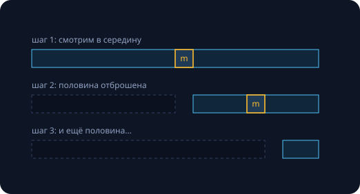
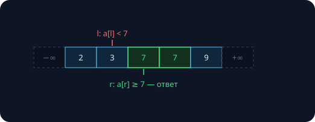

Семинар закрывает обещание занятия 2: объяснить, за что мы платим сортировкой. Ответ — за структуру, которая превращает поиск из $\Theta(n)$ в $O(\log n)$: один взгляд в середину отбрасывает половину кандидатов. Половина от половины от половины — знакомая геометрическая прогрессия: шагов $\lceil \log_2 n \rceil$. Тот же ответ даёт мастер-теорема занятия 6: $T(n) = T(n/2) + \Theta(1)$ — случай $c = \log_b a$, итого $\Theta(\log n)$.

| $n$ | шагов |
|---|---|
| $10^3$ | 10 |
| $10^6$ | 20 |
| $10^9$ | 30 |
| $10^{18}$ | 60 |

Удвоение *показателя степени* лишь удваивает число шагов. Игра «угадай число до миллиарда за 30 вопросов „больше или меньше?"» — это и есть двоичный поиск. Замеры в тексте реальные (Apple M-серия, `clang++ -O2`).

## Классический двоичный поиск

Ищем $x$ в отсортированном массиве; возвращаем индекс или −1:

```cpp
int binarySearch(const std::vector<int>& a, int x) {
    int l = 0, r = (int)a.size() - 1;
    while (l <= r) {              // пока отрезок непуст
        int m = l + (r - l) / 2;
        if (a[m] == x) return m;
        if (a[m] < x)  l = m + 1; // x правее середины
        else           r = m - 1; // x левее середины
    }
    return -1;
}
```



Выглядит на пять минут — но именно здесь ошибаются чаще всего.

### Три способа сломать пять строчек

1. **Переполнение середины.** `int m = (l + r) / 2` при $l, r \sim 2$ млрд переполняет int (занятие 3 предупреждало). Этот баг девять лет жил в `java.util.Arrays` и в учебнике «Programming Pearls». Лечение: `m = l + (r - l) / 2`.
2. **Зацикливание.** При `r == l + 1` середина `m == l`; если сдвиг границы нестрогий (`l = m` в замкнутом отрезке), отрезок не сжался — цикл вечный. Каждый шаг обязан **строго** уменьшать отрезок.
3. **Ошибка на единицу.** Замкнутый отрезок $[l, r]$, полуинтервал $[l, r)$ и «границы снаружи» — три разные системы координат. Смешать две — получить выход за массив или пропущенный элемент.

Дональд Кнут отмечает: первый двоичный поиск опубликован в 1946 году, а первый корректный во всех случаях — только в 1962-м. Шестнадцать лет на пять строчек. Значит, нужен инструмент надёжнее интуиции.

### Инструмент: инвариант цикла

> [!def] Инвариант бинпоиска
> Если $x$ есть в массиве, то он — внутри текущего отрезка $[l, r]$. Снаружи отрезка $x$ нет.

Доказательство корректности по схеме занятия 5:

- **Инициализация:** $[0, n-1]$ — весь массив, инвариант верен тривиально.
- **Сохранение:** отбрасываем половину, только если там $x$ заведомо нет — сравнение с $a[m]$ гарантирует это именно потому, что массив отсортирован.
- **Завершаемость:** каждый шаг строго сжимает отрезок — дойдём либо до $x$, либо до пустого отрезка.
- **Вывод:** пустой отрезок + инвариант ⇒ $x$ в массиве нет.

Все три классических бага — это **нарушения инварианта**: переполненная середина выпрыгивает из отрезка, нестрогий сдвиг не сжимает, путаница границ ломает «снаружи $x$ нет». Рецепт семинара: сначала выписать инвариант, потом писать цикл под него — а не наоборот.

### Замер: логарифм против прохода

Массив $10^8$ отсортированных int, $10^6$ случайных запросов:

```
10^6 бинпоисков:      455.7 мс   # 456 нс на запрос
1 линейный проход:      5.6 мс
```

Один запрос — 456 нс против 5.6 мс сканом: в ~12 000 раз быстрее. Но откуда 456 нс, если 27 сравнений должны стоить наносекунды? Это скрытая цена памяти: 27 прыжков бинпоиска — 27 **случайных** обращений к 400 МБ данных, почти каждое — кэш-промах по ~17 нс (занятие 8: считаем не только сравнения, но и обращения к памяти). Линейный проход дружит с кэшем и предвыборкой — потому весь массив за 5.6 мс. Мораль: бинпоиск выигрывает на запросах; если нужно тронуть всё — честный проход быстрее.

## Левое и правое вхождение

Если $x$ встречается несколько раз, вхождения образуют блок (массив отсортирован). Ищем левый край блока — минимальное $i$ с $a[i] \ge x$. Меняем стиль границ: теперь $l$ и $r$ живут **снаружи** отрезка поиска, с фиктивными элементами $a[-1] = -\infty$ и $a[n] = +\infty$.

> [!def] Инвариант границ
> $a[l] < x \le a[r]$: слева от $l$ (включительно) все элементы меньше $x$, справа от $r$ (включительно) — не меньше.

```cpp
// минимальное i такое, что a[i] >= x
int lowerBound(const std::vector<int>& a, int x) {
    int l = -1, r = (int)a.size();
    while (r - l > 1) {
        int m = l + (r - l) / 2;
        if (a[m] < x) l = m;   // a[l] < x  — инвариант цел
        else          r = m;   // a[r] >= x — инвариант цел
    }
    return r;   // первый элемент >= x
}
```



Здесь сдвиги `l = m` и `r = m` **не** зацикливаются: условие `r - l > 1` гарантирует, что середина строго между границами. Фиктивные бесконечности убирают крайние случаи — в коде нет ни одного if про «не нашли»: если $x$ отсутствует, `r` укажет на первый больший элемент (или на $n$).

**Правое вхождение** — зеркально: инвариант $a[l] \le x < a[r]$, в коде меняется одно сравнение (`<` → `<=`), а ответом становится `l` — последний элемент $\le x$. Число вхождений: `upperEntry − lowerBound + 1`, если $x$ есть (без $x$ разность даёт −1 — удобная проверка); а у std-пары ниже — «первый $> x$» минус «первый $\ge x$» — ровно `upper − lower`.

Проверка на семинаре: массив из одних $x$ — обе границы должны «обнять» весь массив.

### Стандартная библиотека уже умеет

```cpp
std::vector<int> a = {2, 3, 7, 7, 9};

auto lo = std::lower_bound(a.begin(), a.end(), 7);  // первый элемент >= 7
auto hi = std::upper_bound(a.begin(), a.end(), 7);  // первый элемент  > 7

lo - a.begin();   // 2 — индекс левого вхождения
hi - lo;          // 2 — сколько раз встретилась семёрка
std::binary_search(a.begin(), a.end(), 7);  // true — только «есть/нет»
```

Требование — отсортированность: на неотсортированном массиве ответ бессмысленный, и никаких проверок нет. $O(\log n)$ — только на random-access контейнерах: у списка «середины» нет (занятие 8). На семинаре пишем свои версии, дальше в курсе — можно std.

## Двоичный поиск по функции

Массив не нужен вообще. Достаточно монотонного предиката: $f(i) = 0$ для всех $i$ ниже порога и $f(i) = 1$ начиная с порога.


```cpp
// f: 000...0111...1; ищем первый i с f(i) = 1
// инвариант: f(l) = 0, f(r) = 1
while (r - l > 1) {
    long long m = l + (r - l) / 2;
    if (f(m) == 0) l = m;
    else           r = m;
}
return r;
```

Левое вхождение — частный случай с $f(i) = [a[i] \ge x]$. Цена — $O(\log(R - L))$ **вызовов** $f$: шаблон выгоден, даже когда каждый вызов дорог.

### Бинпоиск по ответу

Переворот мышления: спрашиваем не «где ответ?», а «**подходит ли кандидат?**». Если проверка монотонна («раз $k$ подошло — подойдёт и всё меньшее»), граница ищется бинпоиском. Пример — целочисленный корень без float:

```cpp
// наибольшее k такое, что k*k <= n
long long isqrt(long long n) {
    long long l = 0, r = n + 1;
    // инвариант: l*l <= n < r*r
    while (r - l > 1) {
        long long m = l + (r - l) / 2;
        if (m <= n / m) l = m;  // это m*m <= n, но без переполнения
        else            r = m;
    }
    return l;
}
```

`isqrt(10^18)` — за 60 итераций, и никакой сетки double (занятие 3). Сравнение делением вместо `m * m <= n` не случайно: при $n \sim 10^{18}$ квадрат середины достигал бы $10^{35}$ — переполнение long long и UB. Типовые задачи «по ответу»: минимальная скорость, чтобы успеть; максимальная длина, чтобы влезло; минимальное время, за которое $k$ станков сделают $n$ деталей. Рецепт: придумать проверку дешевле полного решения → доказать монотонность → приложить шаблон.

### Вещественный аргумент

Монотонная непрерывная $f$, $f(L) < 0 \le f(R)$: ищем корень с точностью $\varepsilon$. Инвариант тот же ($f(l) < 0 \le f(r)$), по непрерывности корень внутри $[l, r]$, каждая итерация делит отрезок пополам.

```cpp
double findRoot(double L, double R, double eps) {
    double l = L, r = R;
    int k = (int)std::log2((r - l) / eps) + 1;
    for (int i = 0; i < k; i++) {   // не while!
        double m = (l + r) / 2;
        if (f(m) < 0) l = m;
        else          r = m;
    }
    return r;
}
```

> [!warning] Почему не `while (r - l > eps)`
> Сетка double неравномерна (занятие 3): у больших чисел соседние представимые значения отстоят дальше, чем $\varepsilon$, — условие может не выполниться никогда, и цикл зависнет. Фиксированное число итераций гарантирует завершение; «100 итераций» покрывают любой разумный запрос — это $2^{-100}$ от исходного отрезка.

Если границы $L, R$ не даны — экспоненциальный поиск: удваивать $R$, пока $f(R) < 0$ (и симметрично для $L$).

### Чек-лист любого бинпоиска

1. **Инвариант выписан?** Что верно про $l$ и что про $r$ — до написания цикла.
2. **Монотонность есть?** Предикат обязан переключиться с 0 на 1 один раз и не дёргаться. Нет монотонности — нет бинпоиска (частая ошибка на контрольных).
3. **Каждый шаг сжимает?** Сдвиги `l = m` / `r = m` корректны только при `while (r - l > 1)`, где середина строго внутри.
4. **Края и переполнение?** Середина — только `l + (r - l) / 2`; фиктивные ±∞ вместо специальных случаев; в «по ответу» ответом может оказаться граница диапазона.

Проверка на честность: мысленно прогоните массив из двух элементов и массив из одинаковых значений — на них ломается большинство неверных бинпоисков.

## Метод двух указателей

Задача: дан массив из **неотрицательных** чисел и лимит $M$; найти максимальный по длине подотрезок с суммой $\le M$. Работаем с полуинтервалами $[l, r)$ — меньше ±1 в индексах (занятие 8).

Наивный перебор пар границ — $\Theta(n^2)$. Шаг умнее: при фиксированном $l$ сумма растёт по $r$ (числа неотрицательны!), значит «подходит» — монотонный предикат, и максимальное $r$ ищется бинпоиском по префиксным суммам: $\Theta(n \log n)$. Но можно вообще без логарифма:

```cpp
long long sum = 0;
int best = 0, l = 0;
for (int r = 0; r < n; r++) {
    sum += a[r];              // расширили окно вправо
    while (sum > M) {         // чиним инвариант:
        sum -= a[l];          // сжимаем слева,
        l++;                  // пока сумма велика
    }
    best = std::max(best, r - l + 1);
}
```


**Инвариант окна:** после ремонта сумма на $[l, r]$ не превосходит $M$, и $l$ — минимально возможный для данного $r$.

> [!theorem] Почему O(n), хотя внутри for сидит while
> Амортизация из занятия 10: указатель $l$ только растёт, поэтому суммарно за всю программу внутренний while сделает не больше $n$ шагов. Банковский метод: монетка кладётся на элемент при входе в окно и тратится при выходе.

Требование то же, что и в варианте с бинпоиском: **неотрицательность** элементов даёт монотонность суммы. С отрицательными числами окно ломается — сжатие слева может и уменьшить, и «починить» сумму непредсказуемо; там нужны другие методы.

## Задачи семинара

1. **Границы руками:** реализуйте `lowerBound` и `upperEntry`, прогоните стресс-тест против `std::lower_bound` / `upper_bound` на $10^5$ случайных массивов — включая пустой и массив из одинаковых элементов.
2. **Корень по ответу:** целочисленный кубический корень — наибольшее $k$ с $k^3 \le n$ для $n \le 10^{18}$. Аккуратно с переполнением в проверке: $m^3$ может не влезть в long long.
3. **Окно наоборот:** кратчайший подотрезок с суммой $\ge S$ (числа положительные). Каркас тот же — но какой теперь инвариант окна? Выпишите его до кода.

Каждую задачу начинаем с инварианта на доске — код после. Стресс-тест ловит то, что глаз пропустил: генератор + наивное решение + сравнение в цикле.

## Домашнее задание (сдача через Git)

1. **Границы + стресс** — задача A семинара, с крайними случаями в тестах.
2. **Кубический корень** для $n \le 10^{18}$ — бинпоиск по ответу без переполнений.
3. **Вещественный поиск:** решите $x^3 + x = C$ с точностью $10^{-9}$; в комментарии объясните, почему итераций фиксированное число.
4. **Два указателя:** кратчайший подотрезок с суммой $\ge S$; инвариант окна — в комментарии перед циклом.
5. \* **Число подотрезков** с суммой $\le M$ за $O(n)$: что добавить в окно, чтобы посчитать их все?

В решениях с бинпоиском инвариант в комментарии — обязательная часть задания.

> [!warning] Следующее занятие — рубежный контроль № 1
> Занятие 13 — РК1 по материалу занятий 1–12. Ядро: сложность и O-символика, рекурренты и мастер-теорема, структуры данных, амортизация, двоичный поиск — плюс базовый C++ (типы, функции, классы, ключевые слова). Инварианты выписывать: их спросят.
