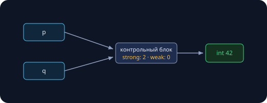
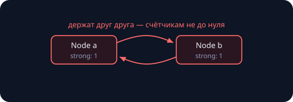

Занятие 11 закончилось обещанием: «голые new/delete в коде не пишем — delete на всех путях сделают за нас». Сегодня смотрим, кто и как. Заодно закрываем второй сюжет — «поведение как параметр»: от указателей на функции из C до лямбд. Замеры в тексте реальные (Apple M-серия, `clang++ -O2`).

## Проблема: кто зовёт delete?

Голый `new` вешает на программиста обязанность «delete на каждом пути» — и компилятор не проверяет ни одного (четыре катастрофы занятия 11). RAII из занятия 7 закрывает простые случаи: `vector` и `string` владеют своей памятью сами. Но если объект в куче **передают между функциями** — кто ответственный? По сигнатуре `Widget* f();` это не видно.

**Владение** — это ответственность за удаление. Идея занятия: записать её прямо **в тип**.

| Сколько владельцев | Тип |
|---|---|
| ровно один | `std::unique_ptr<T>` |
| несколько равноправных | `std::shared_ptr<T>` |
| ноль — только смотрю | `std::weak_ptr<T>` или `T*` |

Все три живут в `<memory>` с C++11. Сырой указатель никуда не исчез — он остался в роли «смотреть, но не владеть».

## unique_ptr: единственный владелец

### Утечка из занятия 11 — и её лекарство

```cpp
std::unique_ptr<std::string> load(bool ok) {
    auto s = std::make_unique<std::string>(1000, 'x');
    if (!ok) return nullptr;  // деструктор s сам освободит память
    return s;                 // владение уехало наружу
}
int main() {
    for (int i = 0; i < 1000; i++) load(i != 500);
}
```

```
$ leaks --atExit -- ./unique_fix
Process 4190: 0 leaks for 0 total leaked bytes.
```

Та же функция, что текла в занятии 11, — но теперь строкой владеет `unique_ptr`: **деструктор указателя зовёт delete** на раннем return, при исключении — на любом пути. Это RAII, упакованный в шаблон.

Правила пользования: создавать `std::make_unique<T>(аргументы)` (слова `new` в коде нет), дальше как с обычным указателем — `*p`, `p->size()`, проверка `if (p)`; сырой адрес «посмотреть» — `p.get()`.

### Сколько это стоит? Нисколько

```cpp
sizeof(int*)                  // 8
sizeof(std::unique_ptr<int>)  // 8  — ни байта сверху
sizeof(std::shared_ptr<int>)  // 16 — два указателя
sizeof(std::weak_ptr<int>)    // 16
```

`unique_ptr` — абстракция за ноль рублей: в памяти это ровно тот же адрес, что у сырого указателя, а «ум» — деструктор — существует только на этапе компиляции. Вызовы `->` и `*` компилируются в те же инструкции. Безопасность не куплена скоростью.

### Копировать нельзя. Передать — можно

```cpp
auto p = std::make_unique<int>(1);
auto q = p;              // error: call to implicitly-deleted
                         //        copy constructor of 'unique_ptr<int>'
auto r = std::move(p);   // передача владения: теперь владеет r,
                         // а p == nullptr
```

Два `unique_ptr` на один объект — это два delete (пожар из занятия 7). Поэтому копия **запрещена на компиляции** — ошибка, а не UB в рантайме. `std::move` — «передать ключи»: владельцем становится приёмник, источник обнуляется. Так объект уезжает из функции-фабрики наружу, в вектор, в поле другого объекта — владелец всегда ровно один. (Полная механика move-семантики — отдельное занятие впереди; сегодня достаточно смысла «передача владения».)

### Наконец-то честный полиморфный контейнер

```cpp
struct Shape {
    virtual double area() const = 0;
    virtual ~Shape() = default;   // занятие 7!
};

std::vector<std::unique_ptr<Shape>> scene;
scene.push_back(std::make_unique<Circle>(2.0));
scene.push_back(std::make_unique<Rect>(3.0, 4.0));

for (const auto& s : scene)
    total += s->area();           // виртуальный вызов
```

Полиморфизм работает только через указатель или ссылку (занятие 7), и раньше это означало «вектор сырых указателей + ручная чистка». Теперь вектор **владеет** фигурами: очистка вектора удалит каждую. `virtual ~Shape` обязателен — удаление идёт через указатель на базу.

## shared_ptr: совместное владение

### Счётчик ссылок: последний гасит свет

```cpp
auto p = std::make_shared<int>(42);
p.use_count();   // 1
auto q = p;      // копия РАЗРЕШЕНА
p.use_count();   // 2 — владельцев двое

q.reset();       // счётчик 1
p.reset();       // счётчик 0 -> delete. Свет погашен
```



Каждая копия увеличивает **счётчик** в общем контрольном блоке, деструктор — уменьшает; дошли до нуля — последний владелец удаляет объект. Никто не «главный»: владение действительно общее. `make_shared` кладёт объект и контрольный блок **одной аллокацией** — и быстрее, и дружелюбнее к кэшу (занятие 8).

### Цена общего владения

- **Память:** `sizeof` = 16 байт (указатель на объект + указатель на контрольный блок), плюс сам блок в куче.
- **Время:** счётчик **атомарный** (владельцы могут жить в разных потоках) — каждая копия и каждый деструктор дороже обычного инкремента.
- **Семантика:** «владелец кто-то, когда-нибудь удалится» — по коду больше не видно, когда объект умрёт.

> [!tip] Правило курса
> По умолчанию — `unique_ptr`. `shared_ptr` — только когда несколько владельцев с независимыми временами жизни действительно нужны по задаче, а не «на всякий случай».

### Ахиллесова пята: цикл

```cpp
struct Node { std::shared_ptr<Node> other; };

auto a = std::make_shared<Node>();
auto b = std::make_shared<Node>();
a->other = b;
b->other = a;   // a держит b, b держит a
```

```
$ leaks --atExit -- ./cycle
Process 1216: 2 leaks for 96 total leaked bytes.
```



`main()` закончился, но счётчики застряли на единице навсегда: подсчёт ссылок видит только «на меня кто-то смотрит» — **цикл из владельцев для него невидим** (сборщики мусора в других языках циклы находят, подсчёт ссылок — принципиально нет). Типовые сюжеты: дерево с указателем на родителя, двусвязный список, «наблюдатель, который держит наблюдаемого».

### weak_ptr: смотрит, но не держит

```cpp
struct Node {
    std::shared_ptr<Node> next;   // владеет
    std::weak_ptr<Node>   prev;   // наблюдает
};
a->next = b;
b->prev = a;    // цикла владения больше нет
```

```
$ leaks --atExit -- ./cycle_fixed
Process 1241: 0 leaks for 0 total leaked bytes.
```

`weak_ptr` ссылается на объект, **не увеличивая strong-счётчик**: жизнь не продлевает. Пользоваться напрямую нельзя — сначала `lock()`:

```cpp
if (auto p = b->prev.lock())   // shared_ptr или пустой
    use(*p);                   // объект жив — работаем
```

Наш замер: после `reset()` обоих владельцев `w.expired()` честно вернул 1. Рецепт для пар «родитель–ребёнок»: вниз — владение (`unique`/`shared`), вверх — наблюдение (`weak`).

### Сводка: кто есть кто

| Тип | Владеет? | Копируется? | Цена | Когда |
|---|---|---|---|---|
| `T*` | нет (в нашем курсе) | да | 0 | посмотреть на объект, который точно вас переживёт |
| `unique_ptr<T>` | да, единолично | нет — только move | 0 | **по умолчанию** для кучи |
| `shared_ptr<T>` | да, совместно | да, счётчик++ | 16 Б + блок + атомики | настоящее совместное владение |
| `weak_ptr<T>` | нет | да | 16 Б | наблюдение; разрыв циклов |

Смысл таблицы — не «какой указатель лучше», а то, что **сигнатура теперь говорит правду**: `unique_ptr<T> f()` — «забирай и владей», `T* f()` — «посмотри, но владелец не ты». Компилятор проверяет эту правду на каждом присваивании.

## Указатели на функции: код — тоже данные

Машинный код функций лежит в сегменте кода (карта памяти — занятие 3), и у каждой функции есть адрес:

```cpp
int add(int a, int b) { return a + b; }
int mul(int a, int b) { return a * b; }

int (*op)(int, int);   // указатель на функцию «int(int, int)»
op = add;
op(2, 3);              // 5
op = mul;
op(2, 3);              // 6 — то же место кода, другое поведение

using BinOp = int (*)(int, int);   // читаемый синоним
```

Зачем: **поведение как параметр**. Классика — `qsort` из C:

```cpp
static int cmp(const void* x, const void* y) {
    int a = *(const int*)x, b = *(const int*)y;
    return (a > b) - (a < b);
}
std::qsort(v.data(), v.size(), sizeof(int), cmp);
```

Цена дизайна: `void*` стирает типы, а каждый вызов `cmp` — прыжок по указателю, содержимое которого компилятор не видит насквозь. Значит, компаратор **не инлайнится** — а вызовов при сортировке $10^7$ элементов наберётся порядка $10^8$. И второе ограничение: указатель хранит только адрес — никакого **состояния** при функции нет.

## Лямбда-выражения

### Функция на месте использования

```cpp
std::sort(v.begin(), v.end(),
          [](int a, int b) { return a > b; });          // по убыванию

std::sort(v.begin(), v.end(),
          [](int a, int b) { return std::abs(a) < std::abs(b); });

auto isEven = [](int x) { return x % 2 == 0; };
isEven(10);   // true
```

Синтаксис: `[захват](параметры) { тело }`. Под капотом компилятор пишет за вас **класс с operator()** (функтор) и создаёт его объект: лямбда — это объект с невыразимым типом, потому `auto` (занятие 11). Лямбда без захватов (`[]`) конвертируется в обычный указатель на функцию.

### Захваты: состояние при функции

```cpp
int limit = 10, hits = 0;

auto pred  = [limit](int x) { return x < limit; };  // копия внутри лямбды
auto count = [&hits](int)   { ++hits; };            // ссылка на оригинал
```

`[x]` — копия в момент создания; `[&x]` — ссылка; `[=]` / `[&]` — «всё, что использую», копией или ссылкой. Замер размеров показывает, что захваты физически лежат внутри объекта-лямбды:

```cpp
sizeof([]{})            // 1 — состояния нет
sizeof([a]{...})        // 4 — int внутри
sizeof([a, b]{...})     // 8 — два int
sizeof([&a, &b]{...})   // 16 — две ссылки
```

> [!warning] Ловушка захвата по ссылке
> Лямбда с `[&]`, пережившая свои переменные, — висячая ссылка (сюжет `string_view` из занятия 9). Правило: `[&]` — только если лямбда умирает раньше захваченного. Передали в `std::sort` и забыли — можно; сохранили «на потом» — только по значению.

### Бенчмарк: лямбда против указателя на функцию

Сортировка $10^7$ случайных int:

```
qsort с указателем на функцию:   789 мс
std::sort с лямбдой:             477 мс   # ×1.65
```

Один алгоритм-идея, одни данные — 65 % разницы. Дело не в «C медленный»: `std::sort` — шаблон, тип лямбды известен на компиляции, её тело **инлайнится** прямо в цикл сортировки, сравнение стоит пару инструкций. `qsort` зовёт компаратор через непрозрачный указатель: ~$10^8$ настоящих вызовов с передачей аргументов через `void*`.

Знакомый мотив: `constexpr` (занятие 11) двигал в компиляцию вычисления — шаблон + лямбда двигают туда **диспетчеризацию**. Чем больше компилятор знает заранее, тем меньше платит рантайм.

## Проверьте себя

1. **Что напечатает?**

   ```cpp
   auto p = std::make_unique<int>(7);
   auto q = std::move(p);
   std::cout << (p ? "p" : "-") << (q ? "q" : "-");
   ```

   {}`-q`: после move владелец — q, а p пуст (nullptr). Проверка умного указателя в условии — это проверка «не пуст ли».{}

2. **Где утечка и как чинить?**

   ```cpp
   struct User { std::shared_ptr<User> friend_; };
   auto x = std::make_shared<User>();
   auto y = std::make_shared<User>();
   x->friend_ = y;
   y->friend_ = x;
   ```

   {}Цикл владения: strong-счётчики застряли на 1, объекты не удалятся никогда. Лечение — одна из ссылок становится `weak_ptr` (+ `lock()` при использовании): владение в одну сторону, наблюдение — в обратную.{}

3. **Напишите компаратор:** отсортируйте `vector<pair<string, int>>` по убыванию числа, при равенстве — по алфавиту.

   {}
   ```cpp
   std::sort(v.begin(), v.end(),
       [](const auto& a, const auto& b) {
           if (a.second != b.second) return a.second > b.second;
           return a.first < b.first;
       });
   ```
   {}

## Итоги

| Инструмент | Суть | Правило курса |
|---|---|---|
| `unique_ptr` | единственный владелец, delete в деструкторе, 0 байт сверху | тип по умолчанию для кучи; создавать make_unique |
| `std::move` | передача владения: источник пустеет | отдавать unique_ptr из фабрик и в контейнеры |
| `shared_ptr` | счётчик ссылок, последний удаляет | только при настоящем совместном владении |
| `weak_ptr` | наблюдает, не продлевает жизнь; `lock()` | обратные ссылки и разрыв циклов |
| указатель на функцию | адрес кода, поведение как параметр, без состояния | читать; в новом коде — лямбды |
| лямбда | функтор на месте использования, захваты = состояние | компараторы и предикаты; `[&]` — только вниз по стеку |

Сквозная мысль — продолжение занятия 11: **намерение записываем в тип**. Владение — в тип указателя, поведение — в объект-лямбду; проверяет и оптимизирует всё это компилятор.

## Домашнее задание (сдача через Git)

1. **Санация утечек:** возьмите свои три «катастрофы» из ДЗ занятия 11 и перепишите на `unique_ptr`/контейнеры; приложите отчёты leaks до и после (до: N утечек, после: 0).
2. **Дерево с родителем:** `Node` с `vector<unique_ptr<Node>>` детей и weak-родителем (после перевода узлов на shared — объясните в комментарии, почему родитель именно weak); докажите leaks-ом отсутствие утечек.
3. **Калькулятор-диспетчер:** таблица операций `+ − * /` сначала на указателях на функции, потом на лямбдах; сравните код в комментарии.
4. **Компараторы:** топ-k строк файла по длине (при равенстве — лексикографически) через `std::sort` с лямбдой.
5. \* **SimpleUnique:** свой мини-unique_ptr — конструктор от `T*`, деструктор, запрет копий (`= delete`), move-конструктор; тест с leaks. Правило пяти из занятия 7 в действии.

Следующее занятие — семинар **«Префиксные суммы и RMQ»**: сумма любого отрезка за $O(1)$ после $O(n)$ подготовки, двумерный вариант и разреженная таблица для минимума. В начале пары — разбор рубежного контроля.
