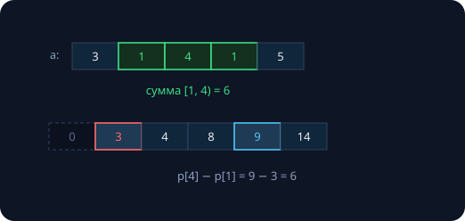
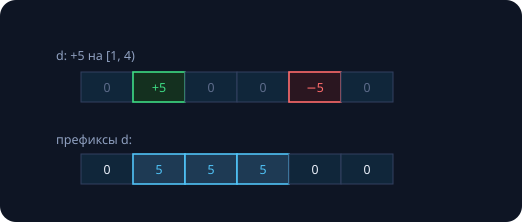
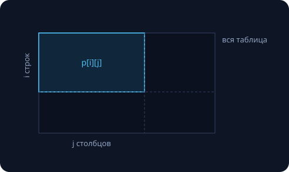
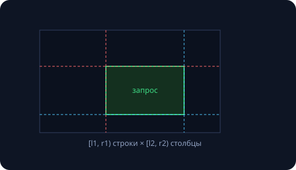
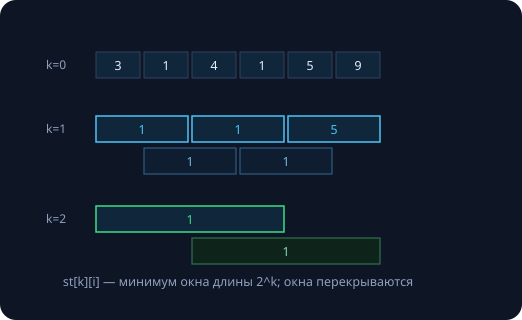
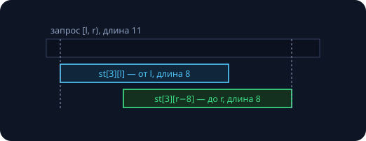

Семинар открывает новый класс задач: массив **неизменен**, а вопросов к нему — миллионы. Наивный ответ на каждый вопрос — честный проход, $O(n)$ на запрос и $O(nq)$ всего. Идея занятия: **инвестиция** — один раз потратиться на подготовку, дальше отвечать почти бесплатно. Занятие 12 уже так делало: сортировка — инвестиция, бинпоиски — дивиденды. Сегодня строим четыре структуры предпосчёта. Замеры реальные (Apple M-серия, `clang++ -O2`).

Перед темой — первые 20 минут пары: разбор РК1 по обоим вариантам. Классические места потери баллов: невыписанный инвариант (минус половина задачи), «два цикла ⇒ n log n» вместо суммы прогрессии, амортизация «в среднем» без «по худшей серии», `(l + r) / 2` без мысли о переполнении.

## Префиксные суммы

$p[i]$ — сумма первых $i$ элементов: $p[0] = 0$, $p[i] = a[0] + \dots + a[i-1]$. Считается одним проходом, а сумма на **полуинтервале** $[l, r)$ — двумя операциями:

```cpp
std::vector<long long> p(n + 1, 0);
for (int i = 0; i < n; i++)
    p[i + 1] = p[i] + a[i];       // один проход

long long sum(int l, int r) {     // сумма на [l, r)
    return p[r] - p[l];
}
```



Почему работает: каждый элемент с индексом из $[l, r)$ входит в $p[r]$, но не в $p[l]$ — разность отменяет общий «хвост». Полуинтервалы — те же, что в занятии 12: длина равна $r - l$, и никаких ±1.

### Замер: инвестиция и дивиденды

Массив $10^8$ чисел, $10^6$ запросов случайных отрезков:

```
build префиксов:          85.0 мс   # один раз
10^6 запросов по p[]:      8.8 мс   # 8.8 нс/запрос

300 наивных запросов:      522 мс   # -> 10^6 наивных: ~полчаса
```

Запрос стоит дешевле кэш-промаха: два чтения и вычитание. Средний наивный запрос — треть массива, ~33 млн сложений. Итог: **полчаса против 94 миллисекунд**; асимптотика $O(n + q)$ вместо $O(nq)$.

### Три ловушки на ровном месте

1. **Переполнение.** Массив int, но $p$ — уже *суммы*: $10^8$ элементов по 100 — это $10^{10}$, int лопнул (занятие 3). Префиксы храним в `long long` всегда.
2. **Смешение конвенций.** «$p[i]$ — сумма до $i$ включительно или нет?» У нас полуинтервалы: $p[i]$ — сумма строго до $i$, запрос $p[r] - p[l]$ для $[l, r)$. Выберите конвенцию один раз.
3. **$p[0] = 0$ — сентинель**, как ±∞ в бинпоиске: запрос с $l = 0$ не требует отдельного if. Массив $p$ на единицу длиннее — цена отсутствия крайних случаев.

Проверка: `sum(0, n)` обязан равняться сумме всего массива, `sum(i, i)` — нулю. Две строчки теста ловят ошибки конвенций сразу.

### Индикаторный приём

Вопрос «сколько на отрезке элементов со свойством X» — это сумма **индикаторов**, 0/1-массива:

```cpp
// сколько нулей на [l, r)?
std::vector<long long> pz(n + 1, 0);
for (int i = 0; i < n; i++)
    pz[i + 1] = pz[i] + (a[i] == 0);

long long zeros(int l, int r) { return pz[r] - pz[l]; }
```

Работает для чего угодно: чётные, отрицательные, «спуски» $a[i] > a[i+1]$… Один исходный массив — сколько угодно индикаторных префиксов рядом.

## Разностный массив

Зеркальная задача: $k$ раз «прибавить $x$ на $[l, r)$», ответ нужен один раз в конце. Обновление отрезка — **две точечные записи**:

```cpp
std::vector<long long> d(n + 1, 0);

void add(int l, int r, long long x) {
    d[l] += x;                    // включили с l
    d[r] -= x;                    // выключили с r
}

// восстановление: префиксные суммы самого d
long long cur = 0;
for (int i = 0; i < n; i++) {
    cur += d[i];
    a[i] += cur;
}
```



Итого $O(n + k)$ вместо $O(nk)$. Префиксы и разности — пара взаимно обратных операций, дискретные «интеграл» и «производная»:

|  | префиксные суммы | разностный массив |
|---|---|---|
| быстрый **запрос** суммы | O(1) | — |
| быстрое **обновление** отрезка | — | O(1) |
| подготовка / финал | один проход | один проход |
| аналогия | интеграл | производная |

Выбор — по тому, чего *много*: запросов или обновлений. Много и того и другого вперемешку — сегодняшние структуры не тянут: нужны дерево Фенвика или дерево отрезков (второй семестр).

## Двумерные префиксы

$p[i][j]$ — сумма прямоугольника $[0, i) \times [0, j)$. Строится **включением-исключением**: складываем «верх» и «лево», их общий угол вошёл дважды — вычитаем:

```cpp
for (int i = 1; i <= n; i++)
    for (int j = 1; j <= m; j++)
        p[i][j] = a[i-1][j-1]
                + p[i-1][j] + p[i][j-1]
                - p[i-1][j-1];
```



Запрос суммы в произвольном прямоугольнике $[l_1, r_1) \times [l_2, r_2)$ — четыре слагаемых, тем же принципом:

```cpp
long long sum2d(int l1, int r1, int l2, int r2) {
    return p[r1][r2] - p[l1][r2]
         - p[r1][l2] + p[l1][l2];
}
```



Построение $O(nm)$, запрос $O(1)$ при любом размере прямоугольника. Нулевая строка и столбец — сентинели; в формуле только границы $l$ и $r$, без −1: полуинтервалы спасают и в 2D. Проверка себя: `sum2d(0, n, 0, m)` — сумма всей таблицы.

## RMQ: почему префиксы бессильны

**Range Minimum Query** — тот же формат: массив неизменен, миллион вопросов «каков *минимум* на $[l, r)$?». Попытка по аналогии — $pm[i] = \min$ первых $i$ элементов и ответ «$pm[r] \ominus pm[l]$» — разбивается о простой факт: **вычитания для минимума не существует**. Зная min первых 10 и min первых 7 элементов, минимум $a[7..10)$ не восстановить; узнав $\min(x, 5) = 5$, не вернуть $x$.

Разность $p[r] - p[l]$ работала, потому что у сложения есть обратная операция:

| операция | обратная | префиксы работают? |
|---|---|---|
| сложение | вычитание | да |
| XOR | сам XOR | да |
| умножение | деление* | да, но мешают нули |
| min / max | нет | **нет** |

Урок: инструмент определяется **алгеброй операции**. Для min нужен другой предпосчёт.

## Sparse Table

Идея: заранее посчитать минимумы **всех отрезков длины — степени двойки**. $st[k][i]$ — минимум на $[i, i + 2^k)$:

```cpp
st[0] = a;                       // окна длины 1
for (int k = 1; (1 << k) <= n; k++)
    for (int i = 0; i + (1 << k) <= n; i++)
        st[k][i] = std::min(
            st[k-1][i],                  // левая половина
            st[k-1][i + (1 << (k-1))]);  // правая
```



Динамика: отрезок длины $2^k$ — это две половины длины $2^{k-1}$, уже посчитанные. Уровней $\log_2 n$, память и построение $O(n \log n)$.

### Запрос за O(1): перекрытие безвредно

Для запроса $[l, r)$ берём $k = \lfloor \log_2(r - l) \rfloor$ и **два перекрывающихся** окна длины $2^k$ — от начала и до конца:

```cpp
int rmq(int l, int r) {           // [l, r), r > l
    int k = std::bit_width((unsigned)(r - l)) - 1;
    return std::min(st[k][l], st[k][r - (1 << k)]);
}
```



Перекрытие законно из-за **идемпотентности**: $\min(x, x) = x$ — элемент, учтённый дважды, минимума не меняет. Той же схемой живут max, gcd, побитовые and/or. А вот сумма перекрытия не прощает — для неё Sparse Table в один запрос не работает.

### Замер

Массив $10^6$, $10^6$ запросов минимума:

```
уровней: 20, память: 80 МБ     # n log n
build Sparse Table:   11.2 мс
10^6 запросов min:     3.5 мс  # 4 нс/запрос

300 наивных min:         29 мс # -> 10^6 наивных: ~2 минуты
```

Запрос — два чтения и один min: **4 нс**, в сто раз быстрее бинпоиска из занятия 12 (там мешали кэш-промахи по 400 МБ данных). Цена — память ×20 от исходного массива: классический размен «память ↔ время».

## Сводка инструментов

| инструмент | подготовка | операция | когда брать |
|---|---|---|---|
| префиксные суммы | $O(n)$ | сумма на отрезке за $O(1)$ | много запросов сумм / количеств |
| разностный массив | $O(n)$ | $+x$ на отрезке за $O(1)$ | много обновлений, ответ в конце |
| 2D префиксы | $O(nm)$ | сумма прямоугольника за $O(1)$ | таблицы, картинки, поля |
| Sparse Table | $O(n \log n)$ | min/max/gcd на отрезке за $O(1)$ | идемпотентные операции |

Общий каркас: **инвестиция в подготовку → дешёвые запросы**. Выбор определяет алгебра: есть обратная операция — префиксы; идемпотентность — Sparse Table. Все четыре — для неизменяемых данных; запросы вперемешку с обновлениями — тема второго семестра.

## Задачи семинара

1. **Нули на отрезке:** массив и $q$ запросов «сколько нулей на $[l, r)$?» — индикаторный префикс, ответ за $O(1)$. Проверьте на запросах $(0, n)$ и $(i, i)$.

   {}Индикатор $z[i] = [a[i] = 0]$, его префиксы $pz$; ответ $pz[r] - pz[l]$. Код — в разделе «Индикаторный приём» выше.{}

2. **Полив газона:** газон из $n$ клеток, $k$ поливов «отрезок $[l, r)$ получает +1». Найдите самую политую клетку за $O(n + k)$.

   {}Разностный массив: каждый полив — `d[l] += 1; d[r] -= 1`. В конце один проход префиксных сумм восстанавливает высоты, попутно ищем максимум. Обновлений много, вопрос один — по сводной таблице это ровно случай разностного массива.{}

3. **Отсортирован ли отрезок?** $q$ запросов «верно ли, что $a[l..r)$ не убывает?» за $O(1)$ каждый.

   {}Индикатор «спусков»: $d[i] = [a[i] > a[i+1]]$ для $i < n-1$. Отрезок $[l, r)$ отсортирован ⟺ на $[l, r-1)$ нет ни одного спуска ⟺ $pd[r-1] - pd[l] = 0$ (при $r - l \le 1$ отрезок отсортирован тривиально). Считать «сколько» умеем — значит, умеем и «есть ли хоть один».{}

## Домашнее задание (сдача через Git)

1. **Суммы и количества:** задача 1 семинара + запросы «сколько чётных на отрезке» — оба через префиксы, с тестами `sum(0, n)` и `sum(i, i)`.
2. **Полив газона:** задача 2 — разностный массив, $k$ обновлений и один проход.
3. **Прямоугольники:** таблица $n \times m$ и $q$ запросов суммы в прямоугольнике; сверьте `sum2d(0, n, 0, m)` с полной суммой.
4. **Sparse Table:** RMQ-минимум + стресс-тест против наивного скана на $10^5$ случайных запросов.
5. \* **Отсортированность за O(1):** задача 3 семинара; бонус — вторым запросом «максимум на отрезке» через тот же Sparse Table проверяйте, что отрезок не превышает порог.

В каждой задаче — комментарий: какой инструмент выбран и почему (по алгебре операции).

Следующее занятие — **стандартная библиотека на практике**: `std::vector` изнутри, `std::chrono` (наконец узаконим наши замеры), первый взгляд на `std::thread`, пространства имён и перегрузка операторов.
