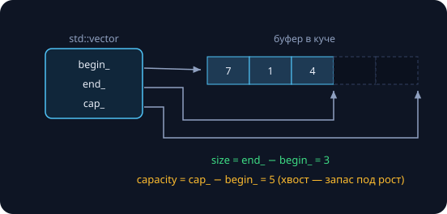

Эта лекция — легализация подполья. `std::vector` мы «писали сами» в занятии 8, все замеры курса пятнадцать занятий делались через `std::chrono`, операторы перегружал ещё BigInt из занятия 7, а `std::` стоит в каждой программе с первого дня. Сегодня раскладываем всё это по полкам — и добавляем действительно новое: `std::thread`. Замеры реальные (Apple M-серия, 12 ядер, `clang++ -O2`; демо гонки — `-O0`, иначе оптимизатор схлопывает цикл).

## std::vector под микроскопом

### Три указателя

`std::vector` — это наш `DynArray` из занятия 8, доведённый до ума: непрерывный буфер в куче и три указателя.



- `size()` — сколько элементов живёт; `capacity()` — на сколько выкуплено место; хвост между ними — оплаченный запас под рост.
- Рост при переполнении — ×2; «`push_back` за $O(1)$ амортизированно» — требование стандарта, а доказательство мы сдавали на РК1 (занятие 10).
- `reserve(n)` выкупает ёмкость заранее; `shrink_to_fit()` просит вернуть излишки (совет компилятору, не приказ).
- Непрерывность буфера — то самое преимущество из занятия 8: кэш и предвыборка работают на полную.

### Цена переездов: замер

$10^8$ вызовов `push_back`:

```
без reserve:  233 мс, реаллокаций: 28, итоговая capacity: 134 217 728
с reserve:     47 мс, реаллокаций: 1
```

28 переездов на сто миллионов вставок — логарифм в действии (занятие 8 насчитало 21 на миллион). Итоговая ёмкость $134\,217\,728 = 2^{27}$ — рост ×2 виден невооружённым глазом. Одна строчка `reserve` убирает все переезды: **×5 быстрее**. Заодно она лечит пики латентности из занятия 10 — тот самый push_back за 4.7 мс на фоне медианы 0 нс.

> [!tip] Правило курса
> Знаешь итоговый размер — пиши `reserve` сразу.

### Инвалидация: контракт, который нарушают молча

```cpp
std::vector<int> v = {1, 2, 3};
int* p = &v[0];        // указатель внутрь вектора

for (int i = 0; i < 100; i++)
    v.push_back(i);    // рост => переезд буфера

std::cout << *p;       // p смотрит в СТАРЫЙ буфер
```

```
==88877==ERROR: AddressSanitizer: heap-use-after-free ...
READ of size 4 at 0x6020000000b0 thread T0
```

Переезд — это `new` + копирование + освобождение старого буфера: все указатели, ссылки и итераторы внутрь становятся **висячими**. Катастрофа № 2 из занятия 11 — только устраивает её сам контейнер, и никакого «golden rule» компилятор здесь не проверит. Это не баг, а задокументированный контракт: `push_back` с переездом инвалидирует всё; без переезда — ничего. Той же болезнью болел `string_view`, глядящий в растущую строку (занятие 9).

> [!warning] Правило
> Не храните указатели и итераторы внутрь растущего вектора. Нужны стабильные адреса — `reserve` до заполнения или индексы вместо указателей.

### Четыре факта, экономящие часы отладки

- **`emplace_back("42")`** — конструирует объект прямо в буфере, без промежуточного временного (сравните с `push_back(BigInt("42"))`).
- **`data()`** — указатель на непрерывный буфер: vector дружит с любым C-интерфейсом, как `c_str()` у строк (занятие 9).
- **`vector<bool>`** — упакован по битам, `b[0]` возвращает *прокси-объект*, а не `bool` — ловушка для `auto` из занятия 11. Нужны честные байты — берите `vector<char>`.
- **`at(i)`** — доступ с проверкой границ: пара наносекунд против часа с санитайзером; `v[i]` мимо массива — молчаливое UB.

## std::chrono: время в типах

### Которые часы?

| | `system_clock` | `steady_clock` |
|---|---|---|
| что это | настенные часы | секундомер |
| привязка | календарь, UTC | только «вперёд» |
| может прыгнуть | да: NTP, перевод времени | никогда |
| годится для | меток «когда случилось» | замеров «сколько заняло» |

Замер на `system_clock` — мина: NTP подвёл часы на секунду назад, и бенчмарк «занял −0.3 с». Поэтому все замеры курса сделаны на `steady_clock` — его монотонность гарантирует стандарт. Обратно: метка времени в логе или дата файла — только `system_clock`, секундомер не знает, который час. `high_resolution_clock` — псевдоним одного из этих двух (какого — зависит от реализации), в новом коде его не используют.

Мнемоника: **интервалы — steady, календарь — system**.

### duration: единица измерения живёт в типе

```cpp
using namespace std::chrono_literals;

auto a = 5ms;             // milliseconds
auto b = 2s;              // seconds
auto c = a + b;           // 2005ms — конвертацию сделал компилятор

auto d = std::chrono::duration_cast<std::chrono::seconds>(c);
                          // 2s: терять точность — только явно
```

Классический баг индустрии: `void connect(int timeout)` — секунды? миллисекунды? Ответа нет в типе — значит, он появится в багтрекере. `duration` хранит число **плюс единицу в типе**: складывать разные единицы можно (компилятор приведёт без потерь), а сужающая конвертация мс → с требует явного `duration_cast`. Это та же идея, что `enum class` в занятии 11 и сильные типы вообще: смысл — в тип, проверку — компилятору.

Сигнатура в духе курса: `void connect(std::chrono::milliseconds timeout)` — неправильно вызвать не получится.

### Методика замеров курса — официально

```cpp
auto t0 = std::chrono::steady_clock::now();

long long checksum = 0;
for (/* работа */) checksum += ...;   // результат НАБЛЮДАЕМ

auto t1 = std::chrono::steady_clock::now();
double ms = std::chrono::duration<double, std::milli>(t1 - t0).count();
printf("%lld за %.1f мс\n", checksum, ms);
```

Три врага честного бенчмарка:

1. **Оптимизатор.** Результат, который никто не читает, `-O2` выкидывает вместе с циклом — на подготовке занятия 12 первый замер бинпоиска показал «0.0 мс». Лекарство: checksum, выведенный наружу.
2. **Холодный старт.** Первый прогон греет кэши (занятие 8) — перед замером нужен прогрев.
3. **Разброс.** Система живёт своей жизнью — повторы и медиана вместо единственного запуска (занятие 10 объясняло разницу медианы и пика).

Каждая цифра на слайдах курса прошла через этот шаблон.

## std::thread: первый взгляд

### Поток — ещё один исполнитель в той же памяти

```cpp
void work(int id) { /* ... */ }

int main() {
    std::cout << std::thread::hardware_concurrency();   // на этой машине: 12

    std::thread t(work, 7);   // исполнитель запущен
    // ... main работает параллельно с t ...
    t.join();                 // дождаться. ОБЯЗАТЕЛЬНО
}
```

Карта памяти из занятия 3 дополняется: у каждого потока — **свой стек** (занятие 5), а куча, глобальные данные и код — **общие**. Общая память — одновременно суперсила (ничего не нужно пересылать) и главный источник бед. Потоку можно отдать функцию, указатель на функцию или лямбду — занятие 14 здесь расцветает. Забытый `join` — аварийное завершение всей программы.

### Параллельная сумма: ускорение и его потолок

Массив $10^8$ int режем на $T$ кусков; каждый поток суммирует свой кусок и пишет результат **только в свою ячейку** `part[t]`:

```cpp
std::vector<long long> part(T, 0);
std::vector<std::thread> ts;
for (int t = 0; t < T; t++)
    ts.emplace_back([&, t] {
        long long s = 0;
        for (int i = lo(t); i < hi(t); i++) s += a[i];
        part[t] = s;                  // у каждого — своя ячейка
    });
for (auto& th : ts) th.join();
```

```
потоков 1:   5.7 мс
потоков 2:   3.3 мс
потоков 4:   2.4 мс
потоков 8:   1.8 мс    # ×3.2, не ×8
```

Почему потолок ×3.2 на 12 ядрах? Ядер много, а **шина памяти одна**: сумма упирается в подачу данных, не в арифметику. Занятия 8 и 12 предупреждали: память — такой же ресурс, как процессор, и здесь он кончается первым.

### Гонка данных: куда пропала половина

```cpp
int counter = 0;
void inc() {
    for (int i = 0; i < 10'000'000; i++)
        counter++;        // два потока, ОДНА ячейка
}
std::thread t1(inc), t2(inc);
t1.join(); t2.join();
```

```
$ ./race16     # три запуска подряд
ожидали 20 000 000, получили: 10074087
ожидали 20 000 000, получили:  9996053
ожидали 20 000 000, получили: 10004715
```

`counter++` — не один шаг, а три: **прочитать → прибавить → записать** (машинные шаги из занятия 5). Когда два потока читают одно и то же старое значение, две единицы схлопываются в одну — потеряна почти половина, и каждый запуск даёт новое число. По стандарту одновременная запись без синхронизации — **data race, неопределённое поведение**: не «иногда неточно», а «программа некорректна». Ловится инструментом: `-fsanitize=thread` покажет оба стека, наступившие на одну ячейку, — как ASan ловил утечки.

Заметьте: в параллельной сумме гонки не было — `part[t]` у каждого свой. Это не везение, это дизайн.

> [!tip] Правило курса — сегодня
> Потоки не делят изменяемые данные: каждый пишет только в своё, читать общее можно, пока никто не пишет, итоги складывает главный поток после `join`. Замки (`std::mutex`), неделимые операции (`std::atomic`) и цена синхронизации — во втором семестре.

И мораль замеров: сначала алгоритм (занятия 2–15), потом ядра. Плохой алгоритм на 12 ядрах — всё ещё плохой алгоритм.

## Правила дома

### Пространства имён: фамилии для кода

```cpp
namespace geometry {
    struct Point { double x, y; };
    double distance(Point a, Point b);
}
namespace audio {
    double distance(double db1, double db2);
}   // конфликта нет: фамилии разные

geometry::distance(p, q);        // полное имя
using geometry::Point;           // точечный импорт — ок
```

Болезнь та же, что у старого `enum` из занятия 11: без фамилий имена сыплются в общую кучу и сталкиваются. `std::` — просто фамилия стандартной библиотеки.

- `using geometry::Point;` — точечный импорт одного имени: нормальная практика в .cpp.
- `using namespace std;` — высыпать в свой код **тысячи** имён (`count`, `size`, `distance`, `sort`…): коллизии гарантированы. В заголовочном файле — преступление против всех, кто его включит; в этом курсе не пишем нигде.
- Анонимный `namespace { ... }` — современная внутренняя линковка: static № 2 из занятия 11.

### Перегрузка операторов: правила игры

```cpp
class Money {
public:
    friend Money operator+(Money a, Money b);          // симметрия — свободной функцией

    bool operator==(const Money&) const = default;     // C++20:
    auto operator<=>(const Money&) const = default;    // сравнения пишет компилятор
private:
    long long cents_;
};

Money total = price + tax;     // читается как формула
```

Занятие 7 уже перегружало `+=` у BigInt — теперь свод правил:

- Перегружается почти всё; **нельзя**: `::`, `.`, `?:`, `sizeof`. Новых операторов не изобрести, приоритеты не изменить.
- Симметричные операторы — **свободными функциями**: метод не позволит `2 + x` (слева литерал, у него методов нет), свободная функция — позволит.
- C++20: `operator<=>` («spaceship») со `= default` — одна строка, и все шесть сравнений корректны, лексикографически по полям в порядке объявления.
- **Принцип наименьшего удивления:** `+` складывает, `==` сравнивает. Перегрузка — про читаемость, не про остроумие.

### Два оператора, которые вы уже используете

```cpp
// 1. operator() — «объект, притворяющийся функцией»
struct ByLength {
    bool operator()(const std::string& a, const std::string& b) const {
        return a.size() < b.size();
    }
};
std::sort(v.begin(), v.end(), ByLength{});

// 2. operator<< — научить cout своему типу
std::ostream& operator<<(std::ostream& os, Point p) {
    return os << '(' << p.x << ", " << p.y << ')';
}
```

**Функтор** — класс с `operator()`. Лямбда из занятия 14 — ровно это: компилятор сам генерирует такой класс, а захваты становятся полями (мы даже мерили их `sizeof`). Круг замкнулся.

`operator<<` возвращает `ostream&` — потому и работают цепочки `cout << a << b`: тот же `*this`-приём, что в занятиях 5 и 11. И он обязан быть свободной функцией: слева стоит чужой класс `ostream`, метод в него не добавить.

## Проверьте себя

1. **Что напечатает?**

   ```cpp
   std::vector<int> v;
   v.reserve(4);
   for (int i = 0; i < 5; i++) v.push_back(i);
   std::cout << v.size() << ' ' << v.capacity();
   ```

   {}**5 8.** `reserve(4)` дал ёмкость 4; пятый `push_back` вызвал переезд ×2 — capacity стала 8. Все указатели и итераторы внутрь вектора после пятой вставки — висячие.{}

2. **Про гонку.** Запуски дают 10 074 087, 9 996 053, 10 004 715… Почему все результаты ≈ $10^7$, а не $2 \cdot 10^7$ и не случайные числа около нуля? И почему это UB, даже если «числа похожи на правду»?

   {}Потоки исполняются на разных ядрах одновременно и почти каждую итерацию читают одно и то же старое значение: пара одновременных инкрементов схлопывается в один — теряется примерно каждый второй, отсюда ≈ половина. Точное число зависит от планировщика и кэшей — потому каждый запуск новый. А UB это потому, что стандарт объявляет несинхронизированную одновременную запись data race'ом: компилятор и процессор вправе предполагать её отсутствие, и «похожие на правду» числа ничем не гарантированы — с другим компилятором/флагами результат может быть любым.{}

3. **Оператор.** Отсортировать `Student {name, height}` по имени, при равенстве — по росту. Два решения?

   {}Если такой порядок — «естественный» для типа: `auto operator<=>(const Student&) const = default;` — поля уже объявлены в нужном порядке, и `std::sort(v.begin(), v.end())` работает без компаратора. Если порядок ситуативный (в другом месте сортируем по росту) — лямбда-компаратор из занятия 14 прямо в вызове sort. Правило: default-spaceship для канонического порядка, лямбда — для локального.{}

## Домашнее задание (сдача через Git)

1. **Бенчмарк-обвязка:** функция `measure(f)` по методике курса (steady_clock, checksum, прогрев, медиана из 5 запусков). Перемерьте ею свой `lowerBound` из ДЗ-12 против `std::lower_bound`.
2. **Параллельный минимум:** минимум массива в T потоков без общих изменяемых данных; таблица времени для T = 1, 2, 4, 8 со своей машины и объяснение потолка.
3. **Свой тип — полноправный:** класс `Fraction` (дробь) с `operator+`, `operator==`, `operator<=>`, `operator<<`; вектор дробей сортируется без компаратора.
4. **Охота на инвалидацию:** в выданном фрагменте три обращения к элементам vector после модификаций — какие валидны, какие UB и почему.
5. \* **Гонка под микроскопом:** цикл инкрементов — один поток vs два с гонкой vs `std::atomic<int>` в два. Три числа и объяснение каждого.

Следующее занятие — **STL целиком**: контейнеры от `deque` до `unordered_map`, итераторы и их категории, алгоритмы и компараторы. Весь зоопарк на одной карте — с ценами операций.
