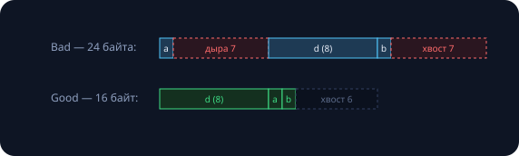

Семнадцать занятий мы строили дисциплину: типы, const, RAII, инварианты. Эта лекция — экскурсия за стену, которую та дисциплина возводит: что происходит, когда программа обращается с памятью «как с байтами», и почему компилятор вправе удалить ваш код целиком. Правила курса не отменяются — в домашних работах этим инструментам делать нечего; но их нужно узнавать в чужом коде (драйверы, протоколы, движки) и понимать контракт с компилятором. Половина сегодняшнего кода — специально сломанная. Все выводы и ассемблер настоящие (Apple M-серия, clang, `-O2` там, где не сказано иное).

## Биты под типами

### Четыре каста — четыре степени риска

| каст | что делает | риск |
|---|---|---|
| `static_cast<double>(i)` | честное преобразование **значения**: биты меняются по правилам | проверен компилятором |
| `const_cast<T&>(x)` | снимает const (занятие 11) | менять настоящую константу — UB |
| `dynamic_cast<D*>(b)` | спуск по иерархии с проверкой в рантайме (vtable, занятие 7) | `nullptr` при неудаче |
| `reinterpret_cast<T*>(p)` | **переинтерпретация**: биты не трогает, меняет только «очки» | почти всегда на грани UB |

Сравните: `static_cast<double>(1)` строит новые биты 0x3FF0…, а `reinterpret_cast` оставил бы битовый узор единицы-int и назвал его double — вышло бы 4.94·10⁻³²⁴. C-каст `(T)x` перебирает эти касты и молча берёт первый подошедший — поэтому в курсе пишем именованные: намерение видно и ревью, и компилятору.

### Легальный мост: std::bit_cast

```cpp
#include <bit>
std::bit_cast<std::uint32_t>(1.0f);   // скопировать 4 байта float в uint32
```

```
1.0f  = 0x3F800000
2.0f  = 0x40000000    # экспонента +1
-1.0f = 0xBF800000    # старший бит — знак
0.1f  = 0x3DCCCCCD    # ...CCCD: 0.1 не точен!
```

Занятие 3 рисовало IEEE 754 на доске — теперь видны живые биты: знак · 8 бит экспоненты · 23 бита мантиссы. Удвоение числа — это +1 к экспоненте; минус — один старший бит; хвост 0.1f — та самая бесконечная двоичная дробь, обрезанная до …CCCD. `bit_cast` (C++20) — единственный прямой легальный способ переложить биты между типами (до него — `std::memcpy`). А классика интернета `*(uint32_t*)&f` — UB, и ниже станет ясно почему.

### 0x5f3759df: легенда 1999 года

```cpp
float q_rsqrt(float x) {                       // Quake III Arena
    float half = 0.5f * x;
    auto i = std::bit_cast<std::uint32_t>(x);
    i = 0x5f3759df - (i >> 1);                 // магия: логарифм в битах
    float y = std::bit_cast<float>(i);
    y = y * (1.5f - half * y * y);             // шаг Ньютона
    return y;                                  // ≈ 1 / sqrt(x)
}
```

Идея: биты float — почти масштабированный **логарифм** числа (экспонента и есть log₂). Сдвиг вправо делит логарифм на два, вычитание из подобранной константы даёт минус — получается грубое $x^{-1/2}$, а шаг Ньютона дошлифовывает. Замеры:

```
максимальная относительная ошибка: 0.175%
q_rsqrt 10^7:    8.3 мс
1/sqrtf 10^7:    5.7 мс   # аппаратный корень быстрее!
```

Точности 0.175% хватало освещению в игре 1999 года. Сегодня аппаратный корень быстрее: легенда устарела — а мост «биты ↔ число» вечен. (В оригинале вместо bit_cast — каст указателей и комментарий, который мы не процитируем.)

## union: память по совместительству

```cpp
union Pun {
    float         f;
    std::uint32_t u;   // те же 4 байта!
};

Pun p;
p.f = 1.0f;                        // активный член — f
std::cout << std::hex << p.u;      // печатает 3f800000...
```

Все члены union делят **один адрес**; sizeof равен максимуму из членов; «активен» тот, куда писали последним. Честные применения: варианты «или-или» в протоколах и форматах, экономия памяти в узлах структур данных.

Но есть два подвоха. Первый: читать не тот член (type punning) легально в C и **формально UB в C++** — компиляторы поддерживают это как расширение, однако контракт нарушен, и мост всё тот же: `bit_cast`. Второй: union не помнит, кто активен, — это ваша ручная бухгалтерия с тегом рядом, и она регулярно ломается.

> [!tip] Наследник
> Типобезопасный union — `std::variant`: хранит тег сам и не даст прочитать не тот член. Встретим через занятие.

## UB и оптимизатор

### Неопределённое поведение — это контракт

Стандарт делит мир на определённое поведение (гарантии) и UB: «стандарт **не накладывает никаких требований**». Никаких — значит не «упадёт», а «что угодно». Компилятор оптимизирует, предполагая, что UB не случается: это сделка — вы обещаете играть по правилам, он генерирует быстрый код без страховочных проверок. Поэтому «у меня же работает» ничего не доказывает: с другим флагом, компилятором или в другой день результат другой.

Знакомые UB, вдоль которых мы шли весь семестр: переполнение signed int (занятия 3, 12), выход за границы массива (3, 16), висячий указатель и double free (11, 16), `delete` вместо `delete[]` (11), гонка данных (16), компаратор с «≤» (17).

### Компилятор вам верит. Буквально

```cpp
bool wraps(int x) { return x + 1 > x; }

int deref(int* p) {
    int v = *p;          // разыменовали...
    if (!p) return -1;   // ...потом проверили
    return v;
}
```

```
$ clang++ -O2 -S             # ассемблер:
wraps:  mov  w0, #1          # «всегда true»
        ret
deref:  ldr  w0, [x0]        # if исчез целиком
        ret
```

`wraps`: переполнение signed — UB, значит его «не бывает», значит работает алгебра идеальных чисел: $x + 1 > x$ истинно всегда — одна инструкция. `deref`: раз `*p` выполнилось, p не мог быть null — проверка мертва, компилятор её убрал. Ровно такой паттерн (разыменование до проверки) стал знаменитой уязвимостью в ядре Linux в 2009 году: удалённый оптимизатором if открыл дорогу эксплойту. Мораль: UB отменяет не строку — он отменяет **рассуждения** о соседнем коде.

### Одна программа — два ответа

```cpp
int foo(int* i, float* f) {
    *i = 1;
    *f = 0.f;     // компилятор уверен: float* не задевает int*
    return *i;    // ...значит, можно вернуть 1 не перечитывая
}
int main() {
    int x = 0;
    printf("%d\n", foo(&x, reinterpret_cast<float*>(&x)));
}
```

```
$ clang++ -O0 ... && ./a.out
0
$ clang++ -O2 ... && ./a.out
1
```

Нарушено правило **strict aliasing**: к памяти можно обращаться только через её настоящий тип (исключение — `char*`/`std::byte*`, законные «обходчики байтов»). `-O0` честно перечитал память и напечатал 0; `-O2` применил разрешённую сделкой оптимизацию и вернул 1. **Оба ответа «правильны»** — некорректна программа. Вот почему `*(uint32_t*)&f` — мина замедленного действия, а легальные мосты (`bit_cast`, `memcpy`) компилятор превращает в те же быстрые инструкции без всякого UB.

### Как жить: санитайзер и на это есть

```cpp
int big = 2'000'000'000;
printf("%d\n", big + big);   // signed overflow
```

```
$ clang++ -fsanitize=undefined ... && ./a.out
ubsan18.cpp:4:24: runtime error: signed integer overflow:
  2000000000 + 2000000000 cannot be represented in type 'int'
-294967296
```

**UBSan** (`-fsanitize=undefined`) вставляет проверки в местах потенциального UB и печатает точную строку с объяснением. Инструментальная триада курса собрана: **ASan** — память (занятия 7, 11, 16), **TSan** — гонки (16), **UBSan** — арифметика и касты. Цена — замедление в разы, поэтому это отладочные флаги, не боевые.

Диагностический симптом на всю жизнь: программа меняет поведение между `-O0` и `-O2` — почти всегда это UB, а не «глюк компилятора». Компилятор почти всегда прав.

## Выравнивание

### У каждого типа есть любимые адреса

```
alignof(char)         = 1
alignof(int)          = 4
alignof(double)       = 8
alignof(max_align_t)  = 8   # на этой машине
```

**Выравнивание** типа — адреса, кратные его `alignof`: int живёт по адресам, делящимся на 4, double — на 8. Компилятор гарантирует это для переменных, полей и результата new. Зачем: шина читает память выровненными словами — невыровненный доступ превращается в два чтения со склейкой, на части архитектур это аппаратная ошибка, а для атомарных операций (занятие 16) выравнивание — условие корректности.

### 24 байта против 16: цена порядка полей

```cpp
struct Bad  { char a; double d; char b; };
struct Good { double d; char a; char b; };
```

```
Bad  {char,double,char}: sizeof 24   (a@0, d@8, b@16)
Good {double,char,char}: sizeof 16   (d@0, a@8, b@9)
```



double требует адрес ÷ 8 — после одинокого char компилятор вставляет 7 байт дыры; хвост добивается до кратности 8, чтобы **массив** таких структур сохранял выравнивание каждого элемента. Отсюда правило укладки:

> [!tip] Поля — от больших к малым
> Дыры схлопываются: 24 → 16, минус треть памяти всего массива структур. Проверяется за минуту печатью `sizeof` и `offsetof`.

`#pragma pack(1)` убирает дыры принудительно — легально и нужно для бинарных форматов файлов и сети, но поля теряют выравнивание: читать их напрямую нельзя, только `memcpy` в выровненную переменную (который компилятор сведёт к оптимальным инструкциям).

## Проверьте себя

1. **Прочитайте биты.** Почему `bit_cast<uint32_t>(2.0f) == 0x40000000`? Что даст 4.0f? 0.5f?

   {}2.0 = +1 · 2¹ · 1.0: знак 0, экспонента 127 + 1 = 128 = 0b1000'0000, мантисса нулевая → `0100 0000 0…` = 0x40000000. Каждое удвоение — +1 к экспоненте: 4.0f = 0x40800000, 0.5f (экспонента 126) = 0x3F000000.{}

2. **Найдите UB** в трёх фрагментах: `int m = (l + r) / 2;` · запись `p.f = 1;` и чтение `p.i` из union · `int* q = new int[4]; delete q;`

   {}(1) переполнение `l + r` при больших границах — баг из `java.util.Arrays`, занятие 12; лечение `l + (r - l) / 2`. (2) чтение неактивного члена union — UB в C++; мост — `bit_cast`. (3) несовпадение форм `new[]`/`delete` — катастрофа № 4 из занятия 11.{}

3. **Уложите поля:** `struct S { char tag; long id; short port; char flag; };` — sizeof? как сжать?

   {}Как есть: tag@0 + 7 байт дыры + id@8 (8) + port@16 (2) + flag@18 (1) + 5 байт хвоста = **24**. Порядок {long, short, char, char}: 8 + 2 + 1 + 1 = 12, хвост до кратности 8 → **16**. Минус треть.{}

## Домашнее задание (сдача через Git)

1. **Инспектор битов:** `dumpFloat(float)` печатает знак, экспоненту и мантиссу отдельными полями (bit_cast + маски); проверьте на 1.0f, 0.1f, 1e38f и на 0.1f + 0.2f — занятие 3 передаёт привет.
2. **Суд над хаком:** реализуйте q_rsqrt, измерьте по методике занятия 16 точность и скорость против `1/sqrtf` на своей машине; вердикт с числами.
3. **Охота на UB:** в выданном файле шесть фрагментов — найдите UB в каждом, назовите термином, почините; сверьтесь запуском под UBSan.
4. **Диета для структуры:** дана структура на 48 байт — переставьте поля до минимума; приложите offsetof-карту до и после.
5. \* **«Глюк компилятора»:** соберите собственный пример (не из лекции), где -O0 и -O2 дают разные ответы; объясните, какое обещание нарушено.

Следующее занятие — **квадратичные сортировки**: выбором и вставками. Первые честные сортировки курса: инварианты, число сравнений и обменов — и почему «квадратичная» не значит «бесполезная».
