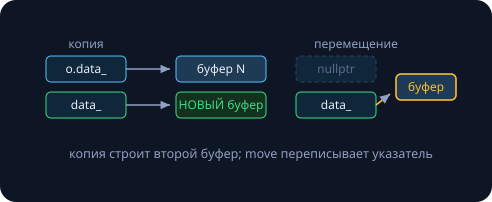

Копии дороги, а временные объекты умирают богатыми: в конце выражения их ресурсы всё равно пропадут — значит, у умирающего можно честно **забрать**, а не копировать. Мы этим уже пользовались вслепую, передавая `unique_ptr` через `std::move` (занятие 14). Эта лекция — механика: как язык отличает умирающих от живых, что происходит при «краже» и где выигрыш возникает сам собой. Все счётчики и замеры реальные (Apple M-серия, `clang++ -O2`).

Заглавный замер:

```
# 10^6 строк по 100 символов
копия вектора:   25.96 мс    # миллион аллокаций + мегабайты memcpy
move вектора:   0.0000 мс    # переписали три указателя (занятие 16)
```

## lvalue и rvalue

**lvalue** — «жилец»: есть имя или адрес, переживёт текущую строку, к нему можно вернуться (`x`, `s[0]`, `*ptr`; можно взять `&x`). **rvalue** — «временный»: безымянный, умирает в конце полного выражения (`42`, `x + 1`, `makeString()`; `&(x + 1)` не скомпилируется).

Этимология «слева/справа от `=`» — историческая и давно врёт: `const int c` — lvalue, которому нельзя присваивать. Рабочий критерий — **время жизни и адрес**.

### Три ссылки — три клиента

| ссылка | lvalue | rvalue |
|---|---|---|
| `T&` | да | нет |
| `const T&` | да | да (и продлевает жизнь временному) |
| `T&&` | нет | **да** |

```cpp
std::string s = "hi";
std::string& a = s;             // ок: жилец
// std::string& b = s + "!";    // нельзя: временный
const std::string& c = s + "!"; // ок — вот почему параметры занятия 5 берут всё
std::string&& d = s + "!";      // rvalue-ссылка: ловит ТОЛЬКО умирающих
// std::string&& e = s;         // нельзя: s жив
```

Зачем языку различать клиентов? Чтобы перегрузка ответила по-разному: живого — копировать, умирающего — **обокрасть**.

## Move-конструктор: кража ресурсов

Наш `DynArray` из занятия 7 учится перемещаться:

```cpp
class DynArray {
public:
    // копия: новый буфер + перенос (занятие 7)
    DynArray(const DynArray& o)
        : size_(o.size_), data_(new int[o.size_]) {
        std::copy(o.data_, o.data_ + size_, data_);
    }
    // перемещение: украсть и обнулить
    DynArray(DynArray&& o) noexcept
        : size_(o.size_), data_(o.data_) {
        o.data_ = nullptr;    // источник обезврежен: его деструктор
        o.size_ = 0;          // удалит nullptr — это безопасно
    }
private:
    int* data_;
    size_t size_;
};
```



Move-конструктор ловит rvalue сигнатурой `T&&` — перегрузка выбирается **по категории аргумента**. Обнуление источника обязательно: иначе два деструктора удалят один буфер — та самая катастрофа занятия 7.

### Контракт: что остаётся от обворованного

```
после move: v1.size() = 0   (валиден, но пуст)
            v3.size() = 1000000
```

> [!warning] Контракт стандарта
> Объект после move — «валидное, но неопределённое состояние». Деструктор отработает; присвоить новое значение можно; **полагаться на содержимое нельзя**. Интуиция: осталась пустая коробка — целая, но без вещей.

Использование после move — новый пункт в списке «висячих» ошибок курса (занятия 9, 11, 16). Санитайзеры его почти не ловят — здесь работает только дисциплина: после `std::move(s)` объект `s` не читаем.

## std::move ничего не двигает

```cpp
std::string s = "большая строка ...";

sink(s);              // lvalue → выбрана копирующая перегрузка
sink(std::move(s));   // каст к rvalue → выбран move
// дальше s не читаем!
s = "новая";          // а присвоить заново — можно
```

`std::move` — это **каст** lvalue → rvalue-ссылка. Он не переносит ни байта, а лишь меняет категорию выражения, чтобы перегрузка выбрала move-версию. Честное имя было бы `std::allow_steal`: вы подписываете согласие — кражу совершает конструктор.

> [!warning] move от const
> `std::move` от const-объекта молча выберет… копирующую перегрузку: красть у const нельзя. Ошибки компиляции не будет — будет тихая потеря выигрыша. Проверяйте const-ность того, что «мувается».

### Правило трёх дозрело до пяти

| операция | сигнатура |
|---|---|
| деструктор | `~T()` |
| копирующий конструктор | `T(const T&)` |
| копирующее присваивание | `T& operator=(const T&)` |
| **move-конструктор** | `T(T&&) noexcept` |
| **move-присваивание** | `T& operator=(T&&) noexcept` |

Занятие 7 обещало «правило пяти» — вот недостающая пара. Важно: написали свои копирующие операции — компилятор **не сгенерирует** move, и тип будет молча копироваться. А **правило нуля** теперь раскрывается полностью: храните ресурсы в `vector`/`string`/`unique_ptr` — все пять операций, включая правильный move, приедут бесплатно.

## Где выигрыш: шпион считает

Шпион-класс инкрементирует статические счётчики в копирующих и перемещающих операциях — и показывает, что происходит на самом деле.

### Сюрприз № 1: return бесплатен (RVO)

```cpp
Spy makeSpy() {
    Spy s(std::string(50, 'a'));
    return s;
}
Spy r = makeSpy();
```

```
return из функции:  копий 0, мувов 0    # RVO
```

**RVO** (return value optimization): компилятор строит локальный объект сразу в памяти получателя — переносить нечего. Иерархия стоимости: **RVO (0) < move (указатели) < copy (буферы)**, и компилятор сам выбирает лучшее.

> [!warning] Антипаттерн
> `return std::move(local);` — «помощь», которая **ломает RVO**: вместо нуля операций получаете move. Локальные объекты возвращайте по имени. Возвращать тяжёлые объекты по значению — нормальный современный стиль.

### Сюрприз № 2: слово noexcept ценой в 131 071 копию

```
# 100 000 push_back с реаллокациями
move с noexcept:      копий      0,  мувов 231 071
move БЕЗ noexcept:    копий 131 071, мувов 100 000
```

231 071 = 100 000 вставок + 131 071 переезд, а 131 071 = $2^{17} - 1$ — реаллокации по степеням двойки, амортизация занятия 10 прямо в счётчиках.

Почему так: при переезде буфера vector обязан пережить исключение посреди переноса. Копирование безопасно (старый буфер цел), а «половина мувов» невосстановима — поэтому vector перемещает **только если** move-конструктор обещал `noexcept`, иначе молча копирует каждый переезд.

> [!tip] Правило курса
> Move-операции — всегда `noexcept`: кража указателей и не может бросить. Одно слово — и 131 071 копия превращается в дешёвые мувы.

### Кто живёт перемещениями

```
sort 100k строк-шпионов:  копий 0, мувов 346 799
```

`std::sort` занятия 21 весь построен на перемещениях — вот почему сортировка векторов строк не разоряет. Всё это работает само: контейнеры и алгоритмы STL написаны в терминах move, ваша задача — не мешать (и не забывать noexcept в своих типах).

Отрезвление: move «ускоряет» только владельцев ресурсов. Для `int`, POD-структур и массивов на стеке перемещение — та же копия: красть нечего.

## Проверьте себя

1. **Считаем операции.** Сколько копий и мувов?

   ```cpp
   Spy a(...);
   Spy b = a;
   Spy c = std::move(a);
   b = makeSpy();
   ```

   {}`b = a` — копия (a — lvalue). `c = std::move(a)` — мув (каст сработал; после этого a не читаем). `b = makeSpy()` — временный строится через RVO без операций, затем **move-присваивание** в b. Итого: 1 копия, 2 мува. Проверяется шпионом за минуту.{}

2. **Найдите три ошибки:**

   ```cpp
   std::string s = load();
   use(std::move(s));
   log(s);                    // (1)

   const Big cfg = ...;
   send(std::move(cfg));      // (2)

   Big make() { Big b; ...; return std::move(b); }   // (3)
   ```

   {}(1) чтение после move — содержимое s не специфицировано; (2) move от const — тихо выберется копия, выигрыша нет; (3) `return std::move(local)` ломает RVO: вместо нуля операций — мув. Ни одна из трёх не является ошибкой компиляции — все три ловятся только глазами и ревью.{}

3. **Допишите move-конструктор** классу `Buffer { char* data_; size_t n_; }`. Почему noexcept честен? Что случится без обнуления источника?

   {}

```cpp
Buffer(Buffer&& o) noexcept
    : data_(o.data_), n_(o.n_) {
    o.data_ = nullptr;
    o.n_ = 0;
}
```

noexcept честен: тело — присваивания указателей и целых, бросить некому. Без обнуления деструкторы источника и приёмника оба вызовут `delete[]` на одном адресе — double free, катастрофа № 3 занятия 11.{}

## Домашнее задание (сдача через Git)

1. **BigInt переезжает:** допишите move-пару (noexcept!) классу из занятия 7; шпион-счётчики должны показать исчезновение копий в `vector<BigInt>` с реаллокациями.
2. **Свой шпион:** воспроизведите все три таблицы лекции (RVO, push_back с/без noexcept, sort) на своей машине.
3. **Аудит старого кода:** найдите в прошлых ДЗ три места лишних копий (возврат больших объектов, вставка в контейнеры), почините через move/RVO; замеры до/после по методике занятия 16.
4. **Ловушки:** оформите три ошибки из задачи 2 в компилируемые мини-примеры с комментариями.
5. \* **swap за три мува:** реализуйте обмен через move-операции, сравните со `std::swap`; объясните, почему до C++11 swap был дорогим.

Следующее занятие — семинар **«жизнь без сравнений»**: k-я порядковая статистика и quickselect, строгая нижняя оценка Ω(n log n) для сортировок сравнениями — и counting с radix, которые её обходят, не сравнивая вовсе.
