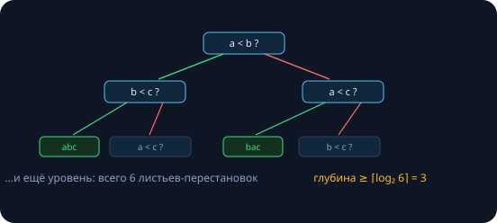

Финальный семинар сортировочной линии — про пределы и их обходы. Занятие 19 ограничило «соседние» алгоритмы, сегодня — строгая нижняя оценка для **всех**, кто сравнивает: $\Omega(n \log n)$. И два обходных пути из мелкого шрифта теоремы: спросить меньше (k-я статистика за O(n)) или узнать о ключах больше (counting и radix — вообще без сравнений). Замеры реальные (Apple M-серия, `clang++ -O2`).

| класс алгоритмов | предел | занятие |
|---|---|---|
| обмены только соседей | Ω(Inv) ⇒ в среднем n² | 19 |
| **любые сравнения** | **Ω(n log n) — сегодня** | 23 |
| без сравнений | O(n) при условиях | 23 |

## k-я порядковая статистика

**k-я статистика** — элемент, который стоял бы на позиции $k$ в отсортированном массиве. $k = n/2$ — медиана (занятие 10 не зря мерило медиану латентности: выбросы её не сдвигают); $k = 0.99n$ — 99-й перцентиль, язык SLA. Решение «в лоб» — отсортировать и взять `a[k]` — покупает **весь порядок**, а нужен один элемент.

```
# 10^7 элементов, ищем медиану
std::sort, затем a[n/2]:   162.0 мс
std::nth_element:           60.4 мс     # ответ одинаковый
```

### Quickselect: партиция занятия 21, рекурсия в одну сторону

```cpp
// k-й (0-индексация) на полуинтервале [l, r)
int quickselect(std::vector<int>& a, int l, int r, int k) {
    while (true) {
        int i = partition(a, l, r);   // случайный пивот, занятие 21
        if (i == k) return a[i];      // пивот встал ровно на k — готово
        if (k < i)  r = i;            // ответ слева
        else        l = i + 1;        // ответ справа
    }
}
```

После партиции пивот стоит на окончательном месте — если это k, сортировать остальное незачем; иначе k-й прячется ровно в одной из частей, вторую выбрасываем целиком. Родство с бинпоиском (занятие 12) прямое: каждый раунд сужает зону поиска, только границу ставит пивот, а не середина.

**Средний случай:** случайный пивот отрезает в среднем константную долю, работа падает геометрически — знакомая сумма занятий 6, 10 и 15:

$$n + \frac{n}{2} + \frac{n}{4} + \dots \le 2n = O(n).$$

Худший случай — те же killer-входы занятия 21, $n^2$; случайный пивот делает его астрономически редким. Гарантированный O(n) существует — «медиана медиан» (BFPRT, 1973): красивая теория с большой константой, звёздочка в ДЗ.

> [!tip] Контракт std::nth_element
> После вызова `a[k]` — правильный k-й; всё левее — не больше него, всё правее — не меньше; **внутри частей порядка нет** — за то и скидка. Топ-10 из миллиона: `nth_element` на k = 10, затем сортировка первых десяти — O(n).

## Нижняя оценка Ω(n log n)

### Дерево решений

Что бы ни делал алгоритм, сортирующий сравнениями, вся информация о порядке приходит из ответов «да/нет» на вопросы `a[i] < a[j]` — его работа описывается **двоичным деревом решений**.



Каждой входной перестановке обязан достаться свой лист: если два разных входа приводят в один лист, алгоритм выполнил для них одинаковые действия — и хотя бы один отсортирован неверно. Листьев минимум $n!$, значит глубина дерева — худшее число сравнений — не меньше $\log_2(n!)$: более мелкое дерево столько листьев физически не вмещает.

### Считаем предел — и меряем зазор

$$\log_2(n!) = n \log_2 n - 1.44\,n + O(\log n) \quad \text{(Стирлинг)}$$

```
# n = 10^6
нижняя граница log2(n!):   18 488 885 сравнений
наш merge sort (зан. 21):  18 674 359 сравнений
зазор:                     1.00%
```

Для миллиона элементов меньше 18 488 885 сравнений не обойдётся **никто и никогда** — а наш скромный merge из занятия 21 работает в одном проценте от вечного предела. «Изобрести сортировку сравнениями сильно лучше merge» — невозможно: Ω(n log n) отныне теорема, а не наблюдение.

Мелкий шрифт теоремы: «худший случай» и «сравнениями». Первое обходит адаптивность (занятие 19: Θ(n + Inv)), второе — сегодняшняя вторая половина.

## Counting sort: гистограмма вместо сравнений

```cpp
// ключи 0..255 (байты)
int cnt[256] = {};
for (unsigned char x : a) cnt[x]++;      // гистограмма

size_t pos = 0;                           // развёртка
for (int v = 0; v < 256; v++)
    for (int k = 0; k < cnt[v]; k++)
        a[pos++] = (unsigned char)v;
```

```
# 10^7 байтов
counting:    2.7 мс
std::sort:  58.3 мс     # ×21
```

Ни одного сравнения: ключ сам говорит, куда встать — **O(n + K)** для K возможных значений. Теорема не нарушена: мы вышли из класса сравнивающих, прочитав ключ как число. Ограничение честное: K мал (байты, оценки, месяцы); для $K = 2^{32}$ таблица счётчиков заняла бы 16 ГБ.

### Стабильная версия: префиксные суммы занятия 15

Простая версия теряет исходные объекты — для записей с полезной нагрузкой нужна стабильная раскладка:

```cpp
size_t cnt[K + 1] = {};
for (auto& rec : a) cnt[key(rec) + 1]++;
for (int v = 0; v < K; v++) cnt[v + 1] += cnt[v];   // старт группы v

for (auto& rec : a)                  // проход по входу слева направо
    out[cnt[key(rec)]++] = rec;      // каждый — на своё место
```

Префиксные суммы гистограммы говорят, **где начинается группа** каждого ключа; проход слева направо раскладывает записи в группы в порядке появления — сортировка **стабильна** (занятия 19, 21). Стабильность здесь — несущая конструкция: на ней собирается radix.

## Radix sort: четыре стабильных прохода

```cpp
for (int shift = 0; shift < 32; shift += 8) {
    // стабильный counting по байту (x >> shift) & 255:
    size_t cnt[257] = {};
    for (unsigned x : a) cnt[((x >> shift) & 255) + 1]++;
    for (int i = 0; i < 256; i++) cnt[i + 1] += cnt[i];
    for (unsigned x : a) buf[cnt[(x >> shift) & 255]++] = x;
    std::swap(a, buf);               // 4 прохода для uint32
}
```

```
# 10^7 uint32
radix (4 прохода):   32.7 мс
std::sort:          162.1 мс    # ×5
```

> [!theorem] Инвариант radix (LSD)
> После $i$ проходов массив отсортирован по младшим $i$ байтам. Индукция держится на **стабильности**: элементы, равные по текущему байту, сохраняют порядок, установленный проходами по младшим.

Порядок «от младшего к старшему» не случаен: последний проход — по старшему байту — главный, а стабильность сохраняет всё, что решили предыдущие. Итого $4 \cdot O(n + 256) = O(n)$.

**Цена и ниша.** Уместен: целые ключи фиксированной ширины (id, ip, таймстампы), большие n, «цифруемые» составные ключи (даты, строки фиксированной длины). Цена: буфер O(n), несколько полных проходов по памяти, и произвольный компаратор из занятия 17 не подключить. При малых n или «почти отсортировано» проигрывает introsort и вставкам (занятие 19). Правило то же, что весь курс: чем больше структуры данных использовано, тем ниже предел.

## Задачи семинара

1. **Quickselect на бумаге.** Найдите медиану {7, 2, 9, 4, 1} трассировкой (пивот — последний элемент). Сколько элементов встало на свои места, а сколько осталось хаосом?

   {}Раунд 1: пивот 1 → партиция ставит его на позицию 0, массив {1 | 2, 9, 4, 7} (порядок правой части зависит от реализации партиции; с Ломуто из занятия 21: {1, 2, 9, 4, 7}). Ищем k = 2 — правее. Раунд 2 на {2, 9, 4, 7}: пивот 7 → {2, 4, 7, 9}, 7 на позиции 3 &gt; 2 — левее. Раунд 3 на {2, 4}: пивот 4 → позиция 2 == k — ответ **4**. На местах гарантированно стоят только пивоты (1, 7, 4); элементы 9 и 2 могли не занять свои финальные позиции — полный порядок мы и не покупали.{}

2. **Дерево для n = 3.** Достройте дерево со слайда: 6 листьев, глубина 3; докажите, что двух сравнений мало.

   {}Два сравнения дают дерево максимум с $2^2 = 4$ листьями, а перестановок $3! = 6$ — по принципу Дирихле два входа делят лист, и один отсортируется неверно: $\lceil \log_2 6 \rceil = 3$. Достроить: в ветке «a&lt;b, b≥c» спросить «a &lt; c?» → листья acb и cab; в ветке «a≥b, a&lt;c» — bac уже определён? Нет: там нужен вопрос «b &lt; c?» → bca/что осталось. Полное дерево — в ДЗ; проверка корректности — прогнать все 6 перестановок входа {1,2,3}.{}

3. **Radix для дат** (год, месяц, день): какие проходы и в каком порядке?

   {}От младшего разряда к старшему: стабильная сортировка по **дню**, затем стабильная по **месяцу**, затем стабильная по **году** (counting с K = 31/12/диапазон лет). Проверка на {2024-05-01, 2023-05-02, 2024-01-02}: после дня — (…-01, …-02, …-02); после месяца — (01 раньше 05, равные месяцы сохранили порядок дней); после года — 2023-05-02, 2024-01-02, 2024-05-01 ✓. Нарушьте стабильность любого прохода — и равные по старшему ключу даты перемешаются по младшему.{}

## Домашнее задание (сдача через Git)

1. **Quickselect** со случайным пивотом + стресс-тест против `std::nth_element` на $10^5$ случайных пар (n, k).
2. **Стабильный counting** для записей (ключ 0..255 + полезная нагрузка): проверка стабильности на парах, как в занятии 19.
3. **Radix для uint32** + таблица замеров против std::sort на своей машине для $n = 10^5, 10^6, 10^7$: где точка перелома?
4. **Дерево решений:** полное дерево для n = 3 на бумаге; вычислите $\lceil \log_2(5!) \rceil$ и выясните, достижимо ли это число сравнений для n = 5.
5. \* **Медиана медиан** (BFPRT): реализуйте и сравните с quickselect по времени и числу сравнений на killer-входах занятия 21.

Следующее занятие — **шаблоны и исключения**: функции- и классы-шаблоны, typename против class, концепты C++20 и обработка ошибок через try/catch.
