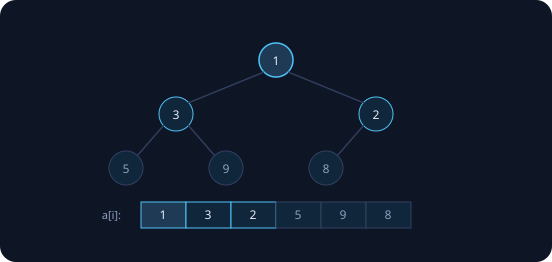

Финальный семинар и последняя структура данных семестра. Задача, ради которой она существует: **многократно доставать самый срочный элемент из меняющегося набора** — планировщики, таймеры, Дейкстра второго семестра. Несортированный вектор дёшев на вставке и дорог на минимуме, отсортированный — наоборот, `set` платит узлами и кэш-промахами (занятие 17: ×11). Куча — золотая середина: логарифм на всё, и притом в **непрерывном массиве**. Замеры реальные (Apple M-серия, `clang++ -O2`).

## Куча и её инвариант

> [!def] Двоичная куча (min-heap)
> Массив, читаемый как полное двоичное дерево по уровням: родитель элемента $i$ — элемент $(i-1)/2$, дети — $2i+1$ и $2i+2$. Инвариант: значение каждого элемента **не меньше** значения родителя ⇒ в корне `a[0]` — минимум.



Никаких указателей — сплошная память (занятие 8). Дерево всегда полное (заполняется по уровням слева направо), поэтому высота $\lfloor \log_2 n \rfloor$: у $10^7$ элементов — всего 23. Весенний конспект нумерует с 1 (родитель $\lfloor i/2 \rfloor$, дети $2i$, $2i+1$) — формулы чуть красивее, суть та же.

### insert: новичок всплывает

```cpp
void siftUp(std::vector<int>& a, size_t i) {
    // инвариант нарушен разве что в i: a[i] мал для своего места
    while (i > 0 && a[i] < a[(i - 1) / 2]) {
        std::swap(a[i], a[(i - 1) / 2]);
        i = (i - 1) / 2;                  // всплыли на уровень
    }
}
void insert(std::vector<int>& a, int x) {
    a.push_back(x);                       // в единственное место,
    siftUp(a, a.size() - 1);              // не ломающее форму дерева
}
```

Новый элемент кладём в конец массива — форма дерева цела, сломаться могло только свойство кучи на пути вверх. `siftUp` чинит: каждый обмен поднимает на уровень, шагов не больше высоты — **O(log n)**. Доказательство корректности — индукция по пути, как в весеннем конспекте.

### extractMin: последний тонет

```cpp
void siftDown(std::vector<int>& a, size_t i, size_t n) {
    while (true) {
        size_t l = 2*i + 1, r = 2*i + 2, m = i;
        if (l < n && a[l] < a[m]) m = l;
        if (r < n && a[r] < a[m]) m = r;
        if (m == i) return;               // оба ребёнка не меньше — куча
        std::swap(a[i], a[m]);            // тонем в сторону МЕНЬШЕГО
        i = m;
    }
}
int extractMin(std::vector<int>& a) {
    int mn = a[0];
    a[0] = a.back(); a.pop_back();        // последний — в корень
    siftDown(a, 0, a.size());
    return mn;
}
```

Минимум в корне; дырку затыкаем последним элементом (форма цела) и топим его, меняя с **меньшим** из детей — новый родитель обязан быть не больше обоих. Путь вниз ≤ высоты ⇒ O(log n).

## Построение за O(n)

```cpp
void buildHeap(std::vector<int>& a) {
    // листья — уже кучи из одного элемента;
    // идём от последнего РОДИТЕЛЯ к корню:
    for (size_t i = a.size() / 2; i-- > 0; )
        siftDown(a, i, a.size());
    // инвариант цикла: поддеревья всех j > i — корректные кучи
}
```

Половина вершин — листья с высотой 0: им ремонт не нужен. Дорогое просеивание достаётся единицам вершин у корня, и сумма работы сворачивается геометрической серией (занятия 6, 15, 23):

$$\sum_{h \ge 0} \frac{n}{2^{h+1}} \cdot h \le 2n.$$

Живой счётчик подтверждает теорию:

```
# фактические просеивания, n = 10^6
build:  743 477 свопов        # < 2n = 2 000 000
        (n вставок дали бы ~20 000 000)
```

### Замер: три способа собрать кучу из 10⁷

```
n вставок с siftUp:    84 мс   # O(n log n)
buildHeap (siftDown):  34 мс   # O(n)
std::make_heap:        25 мс   # O(n), STL
```

Правило: все данные на руках — build; поступают по одному — вставки. Экономика «инвестиции» из занятия 15. У STL кучные примитивы живут прямо поверх вашего вектора: `make_heap` / `push_heap` / `pop_heap`.

## Heapsort: гарантия n log n — и её цена

```cpp
void heapSort(std::vector<int>& a) {
    buildMaxHeap(a);                       // O(n); max-куча — максимум в корне
    for (size_t n = a.size(); n > 1; ) {
        std::swap(a[0], a[n - 1]);         // максимум — в конец, навсегда
        n--;
        siftDownMax(a, 0, n);              // чиним корень укороченной кучи
    }
    // инвариант: суффикс a[n..] отсортирован и содержит наибольшие
}
```

Инвариант — родня сортировки выбором (занятие 19): готовый суффикс окончателен, но выбор максимума стоит O(log n), а не O(n). Итого **гарантированные $n \log n$ на любом входе**, in-place, без буфера; нестабилен. Killer-входов у heapsort нет — за это его и держат страховкой.

```
# random, 10^7
heapsort:    1140 мс
std::sort:    162 мс     # ×7
```

Виновник знакомый — **память**: siftDown прыгает $i \to 2i+1$, с каждым уровнем шаг удваивается, кэш и предвыборка бессильны (та же болезнь, что у дерева и бинпоиска — занятия 8, 12, 17). Поэтому introsort устроен именно так (занятие 21): быстрый quicksort в главной роли, heapsort — запасной парашют: дорог, но раскрывается всегда.

## Очередь с приоритетами

```cpp
std::priority_queue<int> pq;                 // ВНИМАНИЕ: MAX-куча!
pq.push(3); pq.push(7); pq.top();            // 7

std::priority_queue<int, std::vector<int>,
                    std::greater<>> minq;    // min-куча — третий параметр

auto byDeadline = [](const Task& a, const Task& b)
    { return a.deadline > b.deadline; };     // «раньше дедлайн — выше»
std::priority_queue<Task, std::vector<Task>,
                    decltype(byDeadline)> tasks(byDeadline);
```

Адаптер над вектором с кучей внутри: `push`/`top`/`pop` — и всё, ни обхода, ни итераторов. **Сюрприз № 1:** по умолчанию это max-куча; минимум требует `std::greater`. Компаратор — знакомый третий параметр (лямбды занятия 14, строгий порядок занятия 17).

### Топ-k потока: куча размера k

```cpp
// топ-10 НАИБОЛЬШИХ из потока: держим MIN-кучу размера 10
std::priority_queue<int, std::vector<int>, std::greater<>> topk;
for (int x : stream) {
    if (topk.size() < 10) topk.push(x);
    else if (x > topk.top()) {     // лучше худшего из топа?
        topk.pop();
        topk.push(x);
    }
}
```

```
# топ-10 из 10^7
куча размера 10:   5 мс    # и память O(k)!
nth_element:      36 мс    # весь массив в памяти
```

**Сюрприз № 2:** для топ-k наибольших нужна **min**-куча — её корень является худшим элементом текущего топа, именно его сравниваем с новичком. O(n log k) времени и O(k) памяти: поток можно не хранить вообще, в отличие от `nth_element` (занятие 23). Здесь куча выиграла и по чистому времени — ×7.

### Изменить произвольный элемент: два пути

1. **Индексированная куча:** хранить `pos[id]` — позицию каждого элемента (обновляя в каждом swap); тогда `decreaseKey(id, x)` — записать значение и один `siftUp`, O(log n). Так живёт Дейкстра во втором семестре.
2. **Ленивое удаление:** класть в кучу новую версию элемента, а устаревшие выбрасывать при `extractMin`. Куча растёт, зато код тривиален — амортизация (занятие 10) всё оплачивает.

`std::priority_queue` не умеет ни того, ни другого — контракт узкий. Нужен decreaseKey — своя куча (ДЗ) или ленивая схема поверх стандартной.

## Задачи семинара

1. **Build на бумаге.** Постройте min-кучу из [5, 3, 8, 1, 9, 2]: siftDown от i = 2 к корню, массив после каждого шага.

   {}i = 2 (элемент 8, дети 9 и 2): 8 &gt; 2 → swap → [5, 3, 2, 1, 9, 8]. i = 1 (элемент 3, дети 1 и 9): 3 &gt; 1 → swap → [5, 1, 2, 3, 9, 8]. i = 0 (элемент 5, дети 1 и 2): swap с 1 → [1, 5, 2, 3, 9, 8]; у 5 дети 3 и 9: swap с 3 → [1, 3, 2, 5, 9, 8] — куча. Всего 4 свопа при n = 6: «меньше 2n» с большим запасом.{}

2. **Куча ли это?** [1, 3, 2, 5, 9, 8] · [2, 1, 3] · [1, 2, 3, 4, 5] · [7].

   {}Проверяется ровно инвариант: a[i] ≥ a[(i−1)/2] для всех i ≥ 1 — достаточно одного прохода O(n) по всем не-корневым вершинам. [1,3,2,5,9,8] — да (3≥1, 2≥1, 5≥3, 9≥3, 8≥2). [2,1,3] — нет: 1 &lt; 2 у корня. [1,2,3,4,5] — да: отсортированный массив всегда min-куча (родитель левее ⇒ не больше). [7] — да: одинокий корень.{}

3. **k-й максимум потока.** После каждого элемента уметь называть k-й по величине. Какая куча?

   {}Min-куча размера k: в ней живут k наибольших виденных, корень — ровно k-й максимум, ответ за O(1). Поток 3, 1, 4, 1, 5 при k = 2: после 3 → ответа нет (мало данных); после 1 → куча {1,3}, ответ 1; после 4 → {3,4}, ответ 3; после 1 → без изменений, ответ 3; после 5 → {4,5}, ответ 4. Знак кучи противоположен знаку вопроса — тот же сюрприз, что в топ-k.{}

## Домашнее задание (сдача через Git)

1. **MinHeap:** класс с insert / getMin / extractMin / buildHeap; стресс-тест против `std::priority_queue` на $10^5$ случайных операций.
2. **Heapsort** через вашу кучу + строка в таблице замеров занятия 21 (merge / quick / std::sort / heapsort) на своей машине.
3. **Топ-k потока:** чтение чисел из файла без загрузки целиком, куча размера k; сверка с nth_element.
4. **isHeap за O(n)** + тесты на граничных случаях (пустой, один элемент, равные).
5. \* **Поток медиан:** после каждого элемента печатать текущую медиану — max-куча левой половины + min-куча правой с балансировкой размеров.

Это последнее ДЗ семестра — и лучший тренажёр перед РК2: следующее занятие — **рубежный контроль № 2** по материалу занятий 14–25.
